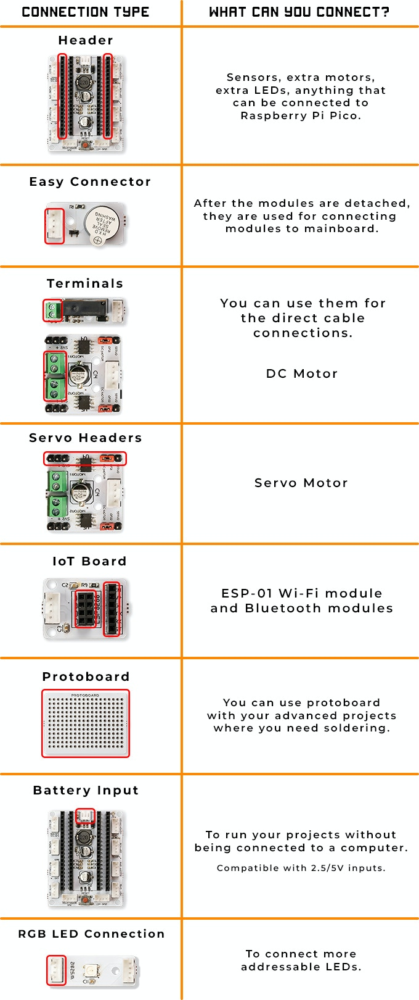

Bağlantı Yöntemleri
====================

.. image:: /../_static/cable.gif

PicoBricks ile devrelerinizi kablo karmaşası olmadan oluşturabilirsiniz. Aynı şekilde MicroBlocks programı ile kodlama yaparak kod karmaşasından kurtulabilirsiniz. Bu özelliği ile sıradan bir robotik kodlama eğitimi dersine başlarken karşılaşabileceğimiz birçok sorunu PicoBricks'in modüler yapısı sayesinde ortadan kaldırmış oluyoruz. Robotik kodlama eğitimine girdikten sonra PicoBricks üzerindeki modülleri gerekli yerlerden koparıp Raspberry Pi Pico'ya **Connector Kablolar** ile bağlayarak daha fazla proje yapma imkanı buluyoruz.

    
    
    
Lehimleme yok! Sınırsız bağlantı yöntemi var.
--------------------------------------------------------

.. figure:: ../_static/cable2.jpg
    :align: center
    :width: 720
    :figclass: align-center
