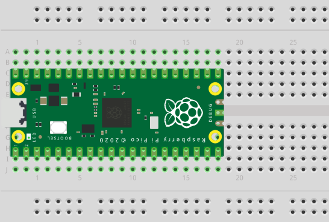
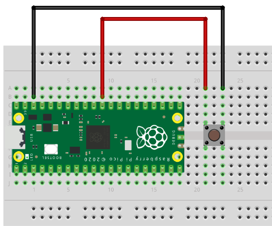

###############
Bootloader
###############

BOOTSEL
--------

Pico'nun BOOTSEL modu, RP2040 içindeki salt okunur bellekte bulunur ve yanlışlıkla üzerine yazılamaz. Ne olursa olsun, Pico'nuzu prize taktığınızda BOOTSEL düğmesini basılı tutarsanız, üzerine yeni bir UF2 dosyası sürükleyebileceğiniz bir sürücü olarak görünecektir. Kartı programlamanın başka bir yolu yoktur. Ancak, Flash belleğinizin boş olduğundan emin olmak isteyebileceğiniz bazı durumlar vardır. Bunu, toplu depolama modundayken özel bir UF2 ikili dosyasını Pico'nuza sürükleyip bırakarak yapabilirsiniz.

* Raspberry Pi web sitesinden MicroPython ``UF2 dosyasını`` indirin 
* Pico'nuzdaki ``BOOTSEL`` düğmesini basılı tutun ve bilgisayarınızın USB portuna takın. 
* Explorer'ı açın ve diğer herhangi bir sabit sürücüde yaptığınız gibi ``RPI-RP2 dizinini`` açın 
* ``UF2 dosyasını`` sürükleyip ``RPI-RP2 dizinine`` bırakın

Flash Belleği Sıfırlama
------------------------

Raspberry Pi Pico harika bir teknoloji ürünü ama bir kusuru var: ``sıfırlama düğmesi yok``. Bu ihmal ne kadar önemli? Bazen kodumuz kaybolabilir veya Pico'muza yeni aygıt yazılımı yüklememiz gerekir.

Bu olduğunda, sıfırlamak için Pico'nun fişini çekip tekrar takmamız gerekir. Sınırlı sayıda yerleştirme için derecelendirilen mekanik bir bağlantı olan mikro USB kablosunu çok fazla çıkarırsak, onu yıpratabiliriz. Açma/kapama butonlarıyla elektrikli bir USB hub'ına bağlı Pico'muz varsa, bunun üzerindeki düğmeye basabiliriz, ama ya basmazsak.

.. tip::
  Çok az ekipman ve sıfır kodla, Pico'muzu bir sonraki projeye hazır hale getirmek için basit bir buton oluşturabiliriz.
  
Sıfırlama Butonu Projesi
-------------------------

+---------------+---------------+
| Gerekli olanlar               | 
+===============+===============+
|   Raspberry Pi Pico           | 
+---------------+---------------+
| 2 x Erkek-Erkek Jumper Kablo  | 
+---------------+---------------+
| Breadboard                    | 
+---------------+---------------+
| Buton                         | 
+---------------+---------------+

1) Raspberry Pi Pico'yu mikro USB bağlantı noktası ``breadboardun ucunda`` asılı kalacak şekilde devre tahtasına yerleştirin.

    
2) Görselde gördüğünüz gibi bir ``buton`` yerleştirin.

.. figure:: ../_static/pico2.png
    :align: center
    :width: 520
    :figclass: align-center

    
3) Jumper kablolardan birini GND pinine ve butonun sağ ayağına, diğerini RUN pinine ve butonun sol ayağına bağlayın.

    
.. note::
  Sıfırlama butonumuz kullanıma hazır.
  
.. tip::
  Daha fazla bilgi için  `Raspberry Pi Websitesini <https://www.raspberrypi.com/documentation/microcontrollers/raspberry-pi-pico.html#resetting-flash-memory>`_ ziyaret edebilirsiniz.
   

