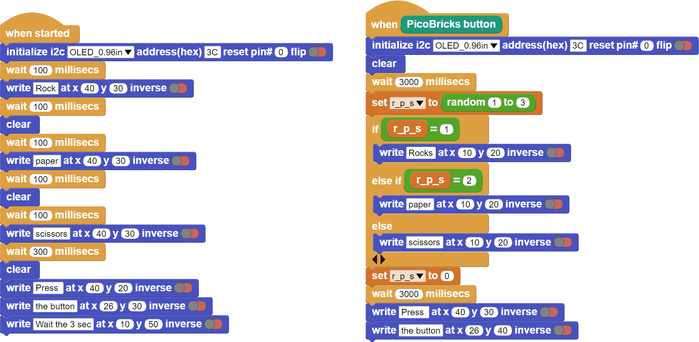

###########
Rock-Paper-Scissor
###########

Giriş
-------------
Bu projemizde, PicoBricks'i kullanarak basit ve elektronik bir taş-kağıt-makas oyunu yapacağız.

Projenin Detayları ve Algoritması
------------------------------
Bu proje sadece PicoBricks gerektirdiği için, başlangıç seviyesindeki kullanıcılar için harika!

Kurallar:

- Makas, kağıdı keser.

- Kağıt, taşı sarar.

- Taş, makası kırar.

Bu proje nasıl daha iyi yapılabilir?

Bir düşünelim:

- Daha büyük bir buton eklenebilir

- Daha büyük bir OLED ekran eklenebilir

- Yazı yerine görseller kullanılabilir

Hayal gücünü kullan...
    

Projenin MicroBlocks Kodu
------------------------------------
+---------------------+
||rock-paper-scissors||     
+---------------------+

.. note::
  MicroBlocks ile kodlama yapmak için yukarıdaki görüntüyü MicroBlocks Run sekmesine sürükleyip bırakmanız yeterlidir.

