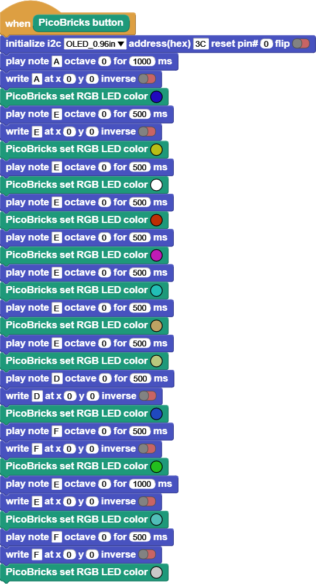

###########
Colourful Music
###########

Projenin Detayları ve Algoritması
------------------------------
Öğrendiğimiz bilgileri kullanarak eğlenceli bir proje yapalım. Projemizde OLED ekran, buton, buzzer ve RGB LED kullanacağız.

Butona basıldığında buzzer ile aşağıda verilen notalar çalınacak, aynı anda hangi notanın çalıştığı OLED ekrana yazılacak ve notalarla eş zamanlı olarak RGB LED'in rengi değişecektir.

Projenin MicroBlocks Kodu
------------------------------------
+-----------------+
||colourful-music||     
+-----------------+

.. note::
  MicroBlocks ile kodlama yapmak için yukarıdaki görüntüyü MicroBlocks Run sekmesine sürükleyip bırakmanız yeterlidir.

