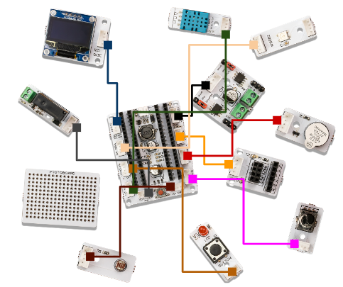
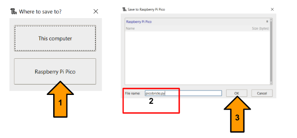

Sık Sorulan Sorular
===========================

PicoBricks'i, kırdıktan sonra nasıl çalıştıracağım?
--------------------------------------------------

PicoBricks üzerindeki 12 adet modülü kırılma noktalarından ayırıp PicoBricks ana kartı üzerindeki doğru yerlere konektör bir kablo ile bağlayıp kullanabiliriz.

    
    
Thonny ile bir proje yaparken picobricks.py kütüphanesini eklemem gerekir mi?
------------------------------------------------------------------------------

Farklı kütüphaneleri kullanarak projeler geliştirebilirsiniz ancak picobricks.py kütüphanesini kullanmanız gerekmektedir. Ayrıca e-kitapta yer alan 25 projede picobricks.py kütüphanesi kullanılmaktadır.

PicoBricks GitHub sayfasından, picobricks.py kütüphanesine aşağıdaki adımları takip ederek ulaşabilirsiniz.

`PicoBricks/Software/Pre-Installed Code/picobricks.py <https://github.com/Robotistan/PicoBricks/blob/main/Software/Pre-Installed%20Code/picobricks.py>`_

* Nasıl eklenir?

Kütüphaneyi indirdikten sonra aşağıdaki resimde anlatıldığı gibi ctrl+shift+s tuş kombinasyonuna basarak picobricks.py kütüphanesini Raspberry Pi Pico içerisine yüklemeniz gerekmektedir.

PicoBricks'i her kullandığımda BOOTSEL yapmalı mıyım?
-------------------------------------------------------

Her seferinde BOOTSEL yapmanıza gerek yok, kodlama platformları arasında geçiş yapmıyorsanız, PicoBricks'i son projeyi geliştirdiğiniz kodlama platformuna yeniden bağladığınızda BOOTSEL yapmanıza gerek yok. Ancak farklı bir platforma geçerseniz, kartınızı BOOTSEL yapmanız gerekir.

PicoBricks kartını ve modüllerini nasıl test edebilirim?
---------------------------------------------------------

Modülleri Picobricks üzerinde test etmek için Ar-Ge ekibi Thonny ve MicroBlocks platformlarını kullanarak 2 farklı test kodu oluşturdu. Bu test kodlarını kullanarak test edebilirsiniz.

`Thonny için <https://github.com/Robotistan/PicoBricks/blob/main/Software/Pre-Installed%20Code/test.py>`_;

.. tip::
  Eğer test.py kodunun adını main.py yaparsanız, kodunu her boot sonrasında çalışacaktır.

.. code-block:: bash

    from utime import sleep
    import time
    from machine import Pin, I2C, PWM, ADC
    from picobricks import SSD1306_I2C, WS2812, DHT11
    import framebuf
    import random

    WIDTH  = 128   # oled display width
    HEIGHT = 64    # oled display height

    def button_push(event):
        if button.value() == 1:
            oled.text("BUTTON : 1", 0, 10)
            oled.show()        
            motor_1.high()
            motor_2.high()
            time.sleep(0.5)
            motor_1.low()
            motor_2.low()
        
    i2c = I2C(0, scl=Pin(5), sda=Pin(4), freq=200000)   # Init I2C using pins (default I2C0 pins)
    oled = SSD1306_I2C(WIDTH, HEIGHT, i2c, addr=0x3c)   # Init oled display
    buzzer = PWM(Pin(20))
    buzzer.duty_u16(0)  
    relay = Pin(12, Pin.OUT)
    button = Pin(10, Pin.IN)
    motor_1 = Pin(21, Pin.OUT)
    motor_2 = Pin(22, Pin.OUT)
    pot = ADC(26)
    light_level = ADC(27)
    conversion_factor = 3.3 / (65535) 
    dht_sensor = DHT11(Pin(11))
    led = Pin(7, Pin.OUT)
    ws = WS2812(6, brightness=0.4)
    RED = (255, 0, 0)
    GREEN = (0, 255, 0)
    BLUE = (0, 0, 255)
    COLORS = (RED, GREEN, BLUE)

    for color in COLORS:
            ws.pixels_fill(color)
            ws.pixels_show()
            time.sleep(0.1)
    ws.pixels_fill((0,0,0))
    ws.pixels_show()

    buzzer.duty_u16(2000)
    buzzer.freq(831)
    time.sleep(0.5)
    buzzer.duty_u16(0)
    time.sleep(0.5)
    relay.high()
    time.sleep(0.5)
    relay.low()
    time.sleep(0.5)
    led.high()
    time.sleep(0.5)
    led.low()
    time.sleep(0.5)

    dht_read_time = time.time()
    button.irq(trigger=Pin.IRQ_RISING, handler=button_push)

    while True:
        if time.time() - dht_read_time >= 3:
            dht_read_time = time.time()
            try:
                dht_sensor.measure()
            except Exception as e:
                print("Warning: could not measure: " + str(e))

        oled.fill(0)
        oled.text("POT:      {0:.2f}V".format(pot.read_u16() * conversion_factor),0,20) # round(pot.read_u16() * conversion_factor, 2)
        oled.text("LIGHT:    {0:.2f}%".format((65535.0 - light_level.read_u16())/650.0),0,30)
        oled.text("TEMP:     {0:.2f}C".format(dht_sensor.temperature),0,40)
        oled.text("HUMIDITY: {0:.1f}%".format(dht_sensor.humidity),0,50)
        oled.show()
        time.sleep(1)
        oled.fill(0)

`MicroBlocks için <https://github.com/Robotistan/PicoBricks/tree/main/Software/Pre-Installed%20Code/Microblocks%20Test%20Code>`_;

.. figure:: ../_static/faq5.png      
    :align: center
    :width: 720
    :figclass: align-center
    
    
.. tip::
 Görseli MicroBlocks Run sekmesine sürükleyerek MicroBlocks test koduna erişebilirsiniz.

 

PicoBricks'i kaç farklı platformda kodlayabilirim?
-------------------------------------------------------

PicoBricks, MicroBlocks, Arduino ve Thonny olmak üzere 3 farklı platformda kodlanabilen bir geliştirme kartıdır.

 .. figure:: ../_static/main.png      
    :align: center
    :width: 200
    :figclass: align-center
    
MicroBlocks ile kod bloklarını sürükle-bırak yöntemi ile proje sayfamıza taşıyıp projeler geliştirebiliyoruz. MicroBlocks, blok tabanlı bir programlama platformudur ve genellikle kodlama bilgisi az olan kullanıcılar, genç kullanıcılar veya hızlı bir şekilde proje geliştirmek isteyen kullanıcılar tarafından tercih edilir.

MicroBlocks online editöre gitmek için `buraya <https://github.com/Robotistan/PicoBricks/tree/main/Software/Pre-Installed%20Code/Microblocks%20Test%20Code>`_ tıkla.

 .. figure:: ../_static/main1.png      
    :align: center
    :width: 200
    :figclass: align-center
    

Thonny kodlama platformu ile MicroPython dilini kullanarak projeler geliştirebiliriz. MicroPython, kodlama platformlarında sıklıkla yapılan noktalama (syntax) hatalarını olabildiğince ortadan kaldıran bir programlama dilidir.

 .. figure:: ../_static/main2.png      
    :align: center
    :width: 200
    :figclass: align-center

Arduino IDE platformu, fiziksel programlama için kullanılan en yaygın programlardan biridir. C programlama dilini kullanarak proje geliştirmemizi sağlar.

PicoBricks Community üzerinde nasıl yeni bir tartışma oluşturabilirim?
---------------------------------------------------------------

PicoBricks Community sayfasına ulaşmak için `buraya <https://community.robotistan.com/>`_ tıklayın. Yeni Tartışma sekmesine tıkladıktan sonra başlığı ve yazmak istediklerinizi yazıp paylaşabilirsiniz. Sorunuzun daha doğru bir şekilde değerlendirilmesi için, paylaşmadan önce bir kategori de seçebilirsiniz.

PicoBricks projelerine nereden ulaşabilirim?
-----------------------------------------

25 adet proje PicoBricks Ekibi tarafından hazır olarak PicoBricks kullanıcılarına sunulmaktadır.

PicoBricks GitHub sayfasından bu adımları `PicoBricks/Software/Examples/ <https://github.com/Robotistan/PicoBricks>`_ takip edefrek ulaşabilirsiniz.

Ek olarak, bu projelere PicoBricks Websitesinden, Robotistan INC YouTube kanalından ve PicoBricks e-kitaptan ulaşabilirsiniz.
 
 
PicoBricks'i kırmaya başladığımda, tüm modülleri kırmalı mıyım yoksa sadece birkaç tanesini mi kırmalıyım?
----------------------------------------------------------------------------------------------------------------
 
Picobricks modüllerini doğru şekilde çalıştırmak için tüm modülleri kırmanız gerekmez. Yalnızca bir veya birkaç modülü böldükten sonra, bölünmüş modülleri Raspberry Pi Pico modülü üzerindeki ilgili yere konektör kablolarla takarak kullanabilirsiniz.

PicoBricks motor sürücülerinin gerilim aralığı nedir?
-----------------------------------------------------------------

The voltage range of the motor driver is 2.5-7.5V. Motor sürücülerinin gerilim aralığı 2.5-7.5V'tur.
 
 

