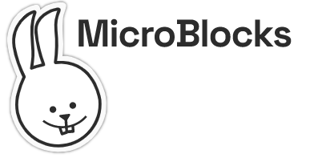
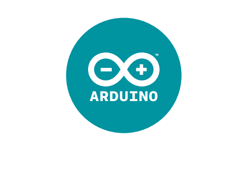

########################
Geliştirme Ortamları
########################

MicroBlocks Blok Tabanlı Programlama
---------------------------------------
 
MicroBlocks, micro:bit, Adafruit Circuit Playground Express ve diğerleri gibi eğitici mikrodenetleyici kartlarıyla fiziksel hesaplamayı öğrenmek için ücretsiz, Scratch benzeri blok programlama dilidir. MicroBlocks canlı bir ortamdır. Bir bloğa tıklayın ve hemen panoda çalışır. Komutları deneyin. Sensör değerlerini gerçek zamanlı olarak görün ve grafiklendirin. Artık kodun derlenmesi ve indirilmesi için beklemenize gerek yok.

Başlangıç Seviyesi için Thonny(MicroPython) IDE
---------------------------------------
 
 PicoBricks'in kalbi Raspberry Pi Pico'dur. Thonny, Raspberry Pi Pico ve PicoBricks'i kodlamak için harika bir seçimdir. 

.. figure:: ../_static/main1.png
    :align: center
    :width: 320
    :figclass: align-center

.. tip::
     Eğer kodunuzu main.py adıyla keydederseniz, her boot yaptığınızda çalışacaktır.
     
Arduino IDE 
-------------

Picobricks bize Arduino C ile kodlama fırsatı sunuyor. Picobricks'in kalbinde yer alan Raspberry Pi Pico'yu yaygın olarak kullanılan Arduino IDE ile kodlamaya başlamak oldukça kolay.

