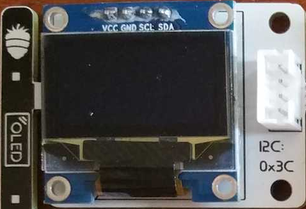
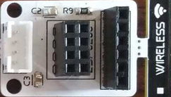

MicroBlocks Kılavuzu
========================================

Blokların Özeti
------------------

Her blok için kısa bir açıklama girişi ve ayrıntılı bir blok ve komponent açıklaması vardır. Detaylara ve örnek kodlara ulaşmak için kısa açıklama tablosundaki blok resimlerine tıklayabilirsiniz.

Blokların nasıl kullanılacağına dair örnek kodlar verilmiştir. Bunları denemek için tek yapmanız gereken MicroBlocks IDE'de bir tarayıcı oturumu açmak ve bunları düzenleyici programlama alanına sürükleyip bırakmaktır. Ardından üzerlerine tıklayıp sonuçları görebilirsiniz.

.. tip::

    Aşağıdaki örnek kodlardan herhangi birini test etmek için, bunları MicroBlocks IDE'ye sürükleyip bırakmanız yeterlidir.

+--------------------------------------+-----------------------------------+
|  |linux-logo3|                       | |macos-logo3|                     |
+--------------------------------------+-----------------------------------+
|RGB LED'in rengini belirler           |Santigrat cinsinden sıcaklığı verir|
+--------------------------------------+-----------------------------------+

+------------------------------------+----------------------------------+
||windows-logo|                      | |linux-logo|                     | 
+------------------------------------+----------------------------------+
|Hoparlörden beep sesi çıkarır       | Butonun durumunu 1/0 olarak verir| 
+------------------------------------+----------------------------------+

.. |windows-logo| image:: _static/pb_beep.png
.. |linux-logo| image:: _static/pb_button.png

+--------------------------------------+-----------------------------------+
||windows-logo1|                       |  |macos-logo1|                    |
+--------------------------------------+-----------------------------------+
|Nemin yüzde değerini verir            | Potansiyometre değerini verir     |
+--------------------------------------+-----------------------------------+

.. |windows-logo1| image:: _static/pb_humidity.png
.. |linux-logo1| image:: _static/pb_lightsensorr.png

+------------------------------------+--------------------------------+
| |windows-logo2|                    | |linux-logo2|                  | 
+------------------------------------+--------------------------------+
|RGB LED için rastgele renk belirler |Kırmızı Led'i 1/0 olarak ayarlar|
+------------------------------------+--------------------------------+

.. |windows-logo2| image:: _static/pb_randomcolor.png
.. |linux-logo2| image:: _static/pb_redled.png

.. |windows-logo3| image:: _static/pb_setmotor.png

.. |macos-logo3| image:: _static/pb_temperature.png

.. |linux-logo4| image:: _static/pb_initpins.png

+-------------------------+---------------------------+
| |windows-logo3|         | |macos-logo2|             |
+-------------------------+---------------------------+
|DC motorları kontrol eder| Röleyi 1/0 olarak ayarlar |
+-------------------------+---------------------------+

+--------------------------+-----------------------------------------------+
||macos-logo|              ||linux-logo1|                                  |
+--------------------------+-----------------------------------------------+
|RGB renk değerini verir   | Işık seviyesini yüzde değeri olarak verir     |
+--------------------------+-----------------------------------------------+

+---------------------+
||windows-logo4|      |
+---------------------+
| RGB LED'i kapatır   | 
+---------------------+

Kütüphane Blokları ile Çalışmak
-----------------------------

Kitaplık, kullanıcının PicoBricks Board ve üzerindeki modüller üzerinde tam denetime sahip olmasına izin veren bir dizi basit hizmetten oluşur.

PicoBricks Kitaplığı'nda iki farklı blok şekli vardır:

* oval: Bir tür bilgiyi geri döndüren ``reporter bloklarıdır``. Kullanıcı normalde bunları bir proje değişkenine atar veya diğer blokların uygun bir giriş yuvasında kullanır. Dönüş bilgisi türü, desteklenen veri türlerinden herhangi biri olabilir. 

* dikdörtgen: Programlanmış bir işlevi yerine getiren ve herhangi bir bilgi döndürmeyen ``komut bloklarıdır``.

Kütüphane Bileşenleri Üzerine Notlar
----------------------------

PicoBricks kartı, önceden monte edilmiş on bileşen içerir. Ancak Kütüphane'de yalnızca yedi tanesi için blok vardır; OLED ekranı, Motor Kontrolü ve Kablosuz İletişim bileşenleri kütüphane tarafından ``doğrudan kapsanmaz``.

Bu bölümde, bu bileşenlerden nasıl yararlanılabileceğini ve bunlarla ilgili bazı bilgileri açıklayacağız.

* OLED ekran modülü, OLED Graphics adı verilen MicroBlocks grafik kütüphanesi kullanılarak programlanmıştır. IDE'de ``Libraries+ / Graphics / OLED Graphics.ubl`` altında bulunur.

.. note::
    Kitaplık bloklarının ve işlemlerinin ayrıntıları için, `OLED Kütüphane <https://wiki.microblocks.fun/extension_libraries/oled>`_ bölümüne bakın.

.. tip::
    Kütüphanenin gelişmiş kullanımını ve veri aktarımını açıklayan bir proje için lütfen `SNAP to MicroBlocks <https://wiki.microblocks.fun/snap/snap2mb_img_code>`_ bölümüne bakın.

* Motor modülü, Servo Motorları ve DC Motorları kontrol etmek için kullanılır. DC motor direkt olarak kütüphane tarafından desteklenir. Ancak bir uyarı var: motor bağlantıları yalnızca tel kablo üzerinden yapıldığından, DC motorların yönünü programlı olarak tersine çevirmek mümkün değildir. DC motorların yönünü değiştirmenin tek yolu, kabloların bağlanma şeklini değiştirmektir. 

.. figure:: ../_static/pb_motor_module.png
    :align: center
    :width: 320
    :figclass: align-center

.. warning::
    Servo motorların programlanması MicroBlocks servokütüphanesi tarafından desteklenmektedir. Servo motor kütüphanesi, IDE içinde Libraries+ / Servo.ubl'de yer almaktadır.
    
.. note::
   DC Motor ve Servo Motor kontrolünün detaylı projesini incelemek için `PicoBricks Servo ve DC Motor Kontrol <https://wiki.microblocks.fun/picobricks/motorservo>`_ bölümüne bakınız.

* Kablosuz Haberleşme Modülü, PicoBricks'in bir WiFi modülü veya bir Bluetooth modülü kullanarak diğer ortamlarla iletişim kurmasını sağlar ve Pico'nun Seri IO bağlantı noktalarına bağlanır.

MicroBlocks ile Projeler
----------------------------

.. image:: /../_static/pb.gif

| **MicroBlocks, sizi keşfetmeye davet eden canlı bir programlama sistemidir. Metnin görünmesini görmek için MicroBlocks IDE'de bir bloğa tıklayın.**
.. image:: /../_static/pb1.gif

| **Hem yeni başlayanlar hem de uzmanlar, MicroBlocks'un PicoBricks'in her yönünü keşfeden harika bir araç olduğunu göreceklerdir.** 

.. image:: /../_static/pb2.gif

