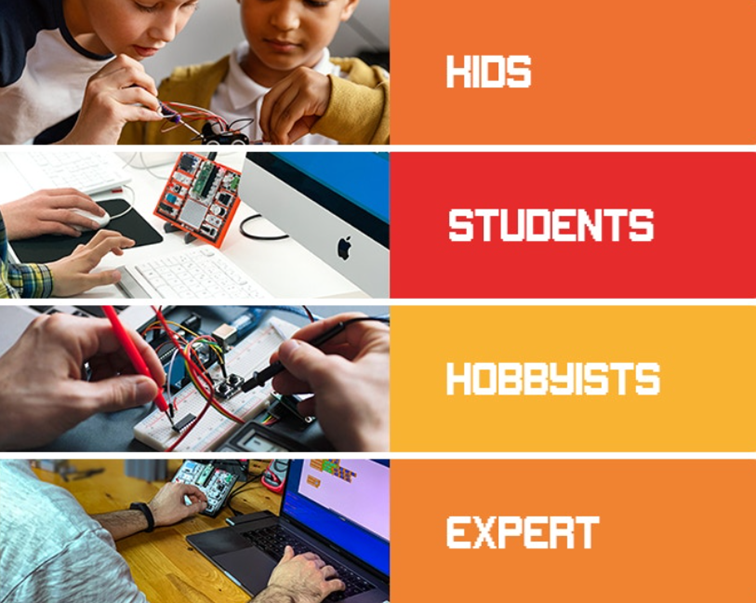

PicoBricks Nedir?
====================

.. image:: /../_static/wtb.gif

PicoBricks
-----------

PicoBricks, maker projelerinde kullanılmak üzere tasarlanmış bir elektronik geliştirme ``kart + yazılımı``dır. On ayrılabilir modül dahil, PicoBricks çok çeşitli projeler oluşturmak için kullanılabilir. Ayrıca kendi modüllerinizi eklemek için kullanabileceğiniz bir protokol içerir! 

PicoBricks, elektronik ve kodlama ile ilgilenen herkes içindir. Modüler donanım tasarımı, Scratch benzeri blok kodlama ortamı ve simülatör sayesinde daha önce deneyimi olmayan yeni başlayanlar, başlamayı kolay bulacaktır. Tecrübesi olanlar elektroniği daha derinlemesine inceleyebilir veya Python'da kodlamayı keşfedebilir. Ve en uzman makerlar bile PicoBricks ile fikirleri ne kadar çabuk keşfedebileceklerini ve prototipler oluşturabileceklerini takdir edeceklerdir. Diğer kartların aksine, PicoBricks her seviyedeki makerlar için inanılmaz bir esnekliğe sahiptir! Bricks IDE, farklı senaryolar için örnek kodlara sahiptir. ``MicroBlocks`` veya Pico Bricks'in sürükle-bırak, blok kodlama oluşturucusu ile sıfırdan kahramana kodlamayı öğrenin. MicroBlocks, şimdiye kadar oluşturulmuş en kolay kodlama deneyimidir ve maker endüstrisinde yaygın olarak bilinir.

+------------+
||picobricks||     
+------------+

.. |picobricks| image:: _static/picobricks.png

Her Seviye İçin Geliştirme Ortamı Desteği

-----------------------------------------------

Modüler donanım tasarımı, Scratch benzeri blok kodlama ortamı ve simülatör sayesinde daha önce deneyimi olmayan yeni başlayanlar, başlamayı kolay bulacaktır. Tecrübesi olanlar elektroniği daha derinlemesine inceleyebilir veya Python'da kodlamayı keşfedebilir. Ve en uzman yapımcılar bile Pico Bricks ile fikirleri ne kadar çabuk keşfedebileceklerini ve prototipler oluşturabileceklerini takdir edeceklerdir.PicoBricks, elektronik ve kodlamayla ile ilgilenen herkes içindir.

    
PicoBricks Modülleri Ayrılabilirdir
-----------------------------------------------

PicoBricks modüllerini keşfettikten sonra, bazılarını bir projede kullanmak isteyebilirsiniz. PicoBricks kompakt olmasına rağmen, her şeyi projenize dahil etmenize gerek yoktur. PicoBricks modüllerini ayırarak, standart, kullanımı kolay konektörlü kabloları kullanarak yalnızca ihtiyacınız olan modülleri bağlayabilirsiniz.

.. image:: /../_static/detachable.gif

Ayrılabilen Modüller Tekrar Bir Araya Gelebilir
-----------------------------------------------

After dividing the Pico Bricks into modules, you can easily reassemble them again on the specially designed base plate.PicoBricks modüllerini ayırdıktan sonra özel olarak tasarlanmış plaka üzerinde tekrar kolayca monte edebilirsiniz.

.. image:: /../_static/detachable1.gif
