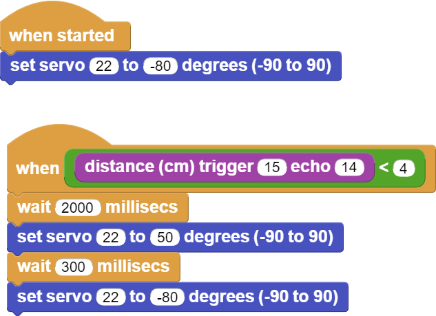

###########
Obur Kumbara
###########

Giriş
-------------
Bu projede, kendimiz için eğlenceli bir kumbara yapacağız. Servo motor ve ultrasonik mesafe sensörüne ihtiyacımız olacak.

Proje Detayları ve Algoritma
------------------------------

Ultrasonik sensörler ses dalgalarından etkilenerek elektriksel değişim gösteren sensörlerdir. Bu sensörler kulağımızın algılayamayacağı frekansta ses dalgaları gönderirler ve yansıyan ses dalgalarının geri geliş süresinin hesaplanması ile mesafe bilgisi üretirler. Biz programcılar ise ölçülen mesafeyi ve mesafedeki değişimleri anlamlandırarak projeler geliştiririz. Otomobillerin ön ve arkasında bulunan park sensörleri ultrasonik sensörlerin günlük yaşamda en çok karşımıza çıktığı yerlerdir. Doğada  bu yöntemle yönünü bulan canlıyı biliyor musun? Yarasalar kör oldukları için çıkardıkları seslerin yansımalarından yollarını bulurlar.
Bir çoğumuz para biriktirmeyi severiz. Azar azar biriktirdiğimiz paraların ihtiyaç halinde işe yaraması çok güzel bir duygudur. Bu projede kendine çok eğlenceli ve sevecen bir kumbara yapacaksın. Kumbarayı yaparken servo motor ve ultrasonik mesafe sensörünü kullanacaksın.

Bu projede HC-SR04 ultrasonic mesafe sensörü ve SG90 servo motor kullanılacaktır. Kumbaranın haznesine kullanıcı parak bıraktığında mesafe sensörü yakınlığı algılayacak ve Picobrickse gönderecektir. Picobricks de bu bilgiye göre servo motor çalıştırarak kolu yukarı kaldıracak, parayı kumbaranın içine atacak ve kol tekrar aşağı inecektir. 

Bağlantı Diyagramı
--------------

.. figure:: ../_static/piggy-bank.png      
    :align: center
    :width: 400
    :figclass: align-center
    

Picobricks modüllerini herhangi bir kablo bağlantısı olmadan programlayabilir ve çalıştırabilirsiniz. Modülleri karttan ayırarak kullanacaksanız modül bağlantılarını verilen konektör kablolar ile yapmalısınız.

Projenin MicroPython Kodu
--------------------------------
.. code-block::

    from machine import Pin, PWM
    import utime
    #define the libraries

    servo=PWM(Pin(21,Pin.OUT))
    trigger = Pin(15, Pin.OUT)
    echo = Pin(14, Pin.IN)
    #define the input and output pins

    servo.freq(50)
    servo.duty_u16(6750)

    def getDistance():
    trigger.low()
    utime.sleep_us(2)
    trigger.high()
    utime.sleep_us(5)
    trigger.low()
    while echo.value() == 0:
       signaloff = utime.ticks_us()
    while echo.value() == 1:
       signalon = utime.ticks_us()
    timepassed = signalon - signaloff
    distance = (timepassed * 0.0343) / 2
    print("The distance from object is ",distance,"cm")
    return distance
    #calculate distance
    while True:
    utime.sleep(0.01)
    if int(getDistance())<=5:  #if the distance variable is less than 5
        servo.duty_u16(4010) 
        utime.sleep(0.3)  #wait
        servo.duty_u16(6750)  

.. tip::
  Eğer kodunuzun adını main.py olarak kaydederseniz, kodunuz her ``BOOT`` yaptınızda çalışacaktır.
   
Projenin Arduino C Kodu
-------------------------------

.. code-block::

    #include <Servo.h>
    #define trigPin 15
    #define echoPin 14
    //define the libraries
    Servo servo;
    void setup() {
    Serial.begin (9600);
    pinMode(trigPin, OUTPUT);
    pinMode(echoPin, INPUT);
    //define the input and output pins
    servo.attach(21); //define the servo pin
        }
    void loop() {
    long duration, distance;
    digitalWrite(trigPin, LOW);
    delayMicroseconds(2);
    digitalWrite(trigPin, HIGH);
    delayMicroseconds(10);
    digitalWrite(trigPin, LOW);
    duration = pulseIn(echoPin, HIGH);
    distance = (duration/2) / 29.1;
    //calculate distance
    if (distance < 5) {    //if the distance variable is less than 5
    Serial.print(distance);
    Serial.println(" cm");
    servo.write(179);
        }
    else if (distance>5) {   // if the distance variable is greater than 5
    Serial.print(distance);
    Serial.println(" cm");
    servo.write(100);
        }
    }

Projenin MicroBlocks Kodu
------------------------------------
+-------------+
||piggy-bank1||     
+-------------+

Not
-----  
  MicroBlocks ile kodlama yapmak için yukarıdaki görüntüyü MicroBlocks RUN sekmesine sürükleyip bırakmanız yeterlidir.
  

    
