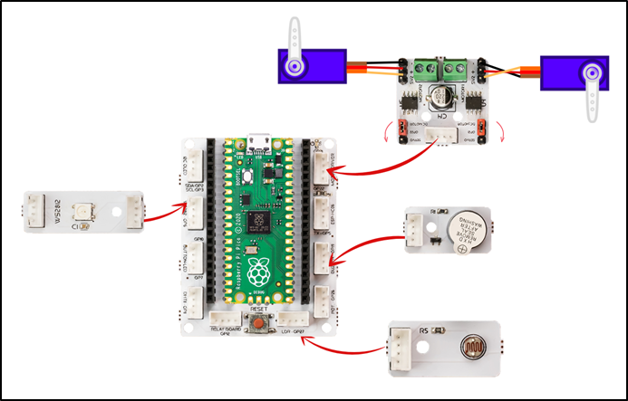
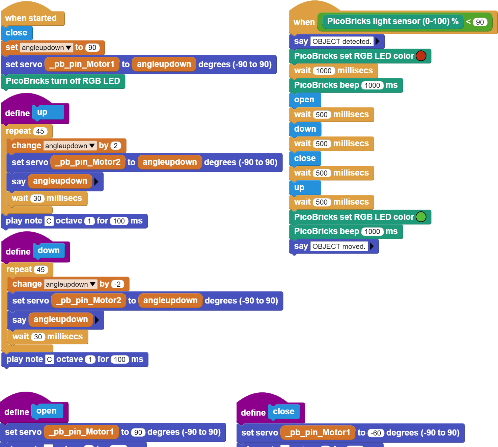

###########
İki Eksen Robot Kol
###########

Giriş
-------------
Bu projede, PicoBricks ile iki eksenli robot kol yapımını öğreneceğiz.

Proje Detayları ve Algoritması
------------------------------

Robot kollar endüstriyel alanda insan gücünün yerini almıştır. Bir insanın taşıyamayacağı ağırlık ve büyüklükteki yükleri taşıma ve döndürme işlerini fabrikalarda robot kollar üstlenmektedir. Milimetrenin binde biri hassasiyetinde konumlandırılabilmeleri de insan elinin sergileyebileceği hassasiyetin üzerindedir. Otomobil fabrikalarının üretim videolarını izlediğinde robot kolların ne kadar hayati bir öneme sahip olduğunu göreceksin. Robot denmesinin sebebi programlanarak sonsuz tekrarla aynı işi yapabilmelerinden kaynaklanmaktadır. Kol denmesinin sebebi ise bizim kollarımız gibi eklemli bir yapıya sahip olmasından kaynaklanmaktadır. Bir robot kolun kaç farklı doğrultuda dönme ve hareket etme kabiliyeti varsa o kadar eksenli olarak ifade edilmektedir. Robot kollar alüminyum ve çeşitli metalleri oyma ve şekil verme işlerinde de kullanılmaktadır. 7 eksenli CNC Router olarak geçen bu cihazlar bir heykeltraşın çamura şekil vermesi gibi metallere şekil verebilmektedirler.
Robot kollarda kullanılma amacına göre bir tür elektrik motoru olan step motor ve servo motorlar kullanılmaktadır. PicoBricks servo motorlarla projeler yapmanıza olanak sağlamaktadır.

Kuruluma hazırlık amacıyla öncelikle servo motorları 0 dereceye ayarlamak için kodlarını yazıp yükleyeceğiz. LDR sensörünün üzerine bir cisim konulduğunda robot kol aşağı eğilecek ve açık olan kıskacını kapatacak. Kıskaç kapandıktan sonra robot kol tekrar yukarı kalkacak. Robot kolun her hareketinin sonucunda buzzer dan kısa bir bip sesi çıkacak. LDR sensörünün üzerine cisim yerleştirildiğinde RGB LED kırmızı renkte yanacak. Cisim robot kol tarafından tutulup havaya kaldırıldığında ise RGB LED yeşil renkte yanacak.
Servo motorun hareketleri çok hızlıdır. Hareketi yavaşlatmak için 30 milisaniye aralıklarla 2 şer derece toplamda 90 derece hareket ile servo motorları kodlayacağız. Kıskacın kapanması için bunu yapmayacağız.

Bağlantı Diyagramı
--------------

    

Picobricks modüllerini herhangi bir kablo bağlantısı olmadan programlayabilir ve çalıştırabilirsiniz. Modülleri karttan ayırarak kullanacaksanız modül bağlantılarını verilen konektör kablolar ile yapmalısınız.

Projenin MicroPython Kodu
--------------------------------
.. code-block::

    from machine import Pin, PWM, ADC
    from utime import sleep
    from picobricks import WS2812
    #define libraries

    ws = WS2812(6, brightness=0.3)
    ldr=ADC(27)
    buzzer=PWM(Pin(20, Pin.OUT))
    servo1=PWM(Pin(21))
    servo2=PWM(Pin(22))
    #define LDR, buzzer and servo motors pins

    servo1.freq(50)
    servo2.freq(50)
    buzzer.freq(440)
    #define frequencies of servo motors and buzzer

    RED = (255, 0, 0)
    GREEN = (0, 255, 0)
    BLACK = (0, 0, 0) # RGB color settings
    angleupdown=4770
    angleupdown2=8200

    def up():
    global angleupdown
    for i in range (45):
        angleupdown +=76 
        servo2.duty_u16(angleupdown)
        sleep(0.03)
    buzzer.duty_u16(2000)
    sleep(0.1)
    buzzer.duty_u16(0)
    # servo2 goes up at specified intervals
    def down():
    global angleupdown
    for i in range (45):
        angleupdown -=76
        servo2.duty_u16(angleupdown)
        sleep(0.03)
    buzzer.duty_u16(2000)
    sleep(0.1)
    buzzer.duty_u16(0)
    # servo2 goes down at specified intervals

    def open():
    global angleupdown2
    for i in range (45):
        angleupdown2 +=500
        servo1.duty_u16(angleupdown2)
        sleep(0.03)
    buzzer.duty_u16(2000)
    sleep(0.1)
    buzzer.duty_u16(0)
    # servo1 works for opening the clamps
    def close():
    global angleupdown2
    for i in range (45):
        angleupdown2 -=500
        servo1.duty_u16(angleupdown2)
        sleep(0.03)
    buzzer.duty_u16(2000)
    sleep(0.1)
    buzzer.duty_u16(0)
    # servo1 works for closing the clamps
    open()
    servo2.duty_u16(angleupdown)
    ws.pixels_fill(BLACK)
    ws.pixels_show()
    while True:
    if ldr.read_u16()>20000:
        ws.pixels_fill(RED)
        ws.pixels_show()
        sleep(1)
        buzzer.duty_u16(2000)
        sleep(1)
        buzzer.duty_u16(0)
        open()
        sleep(0.5)
        down()
        sleep(0.5)
        close()
        sleep(0.5)
        up()
        ws.pixels_fill(GREEN)
        ws.pixels_show()
        sleep(0.5)
        # According to the data received from LDR, RGB LED lights red and green and servo motors move
            

.. tip::
  Eğer kodunuzun adını main.py olarak kaydederseniz, kodunuz her ``BOOT`` yaptınızda çalışacaktır.
   
Projenin Arduino C Kodu
-------------------------------

.. code-block::

    #include <Adafruit_NeoPixel.h>
    #ifdef __AVR__
    #include <avr/power.h>
    #endif
    #define PIN        6
    #define NUMPIXELS 1
    Adafruit_NeoPixel pixels(NUMPIXELS, PIN, NEO_GRB + NEO_KHZ800);
    #define DELAYVAL 500
    // define required libraries
    #include <Servo.h>
    Servo myservo1;
    Servo myservo2;

    int angleupdown;

    void setup() {

    pinMode(20,OUTPUT);
    pinMode(27,INPUT);
    // define input and output pins

    pixels.begin();
    pixels.clear();

    myservo1.attach(21);
    myservo2.attach(22); // define servo motor pins
    Open();
    angleupdown=180;
    myservo2.write(angleupdown);
  
        }

    void loop() {
    if(analogRead(27)>150){

    pixels.setPixelColor(0, pixels.Color(255, 0, 0));
    pixels.show();
    delay(1000);
    tone(20,700);
    delay(1000);
    noTone(20);

    Open();
    delay(500);
    Down();
    delay(500);
    Close();
    delay(500);
    Up();
    pixels.setPixelColor(0, pixels.Color(0, 255, 0));
    pixels.show();
    delay(10000);
    pixels.setPixelColor(0, pixels.Color(0, 0, 0));
    pixels.show();
    Open();
    angleupdown=180;
    myservo2.write(angleupdown);
    // If the LDR data is greater than the specified limit, the buzzer will sound, the RGB will turn red and servo motors will work
    // The RGB will turn green when the movement is complete
    
        }
    }

    void Open(){
    myservo1.write(180);
        }

    void Close(){
    myservo1.write(30);
        }

    void Up(){

    for (int i=0;i<45;i++){

    angleupdown = angleupdown+2;
    myservo2.write(angleupdown);
    delay(30);
    }
    }

    void Down(){

    for (int i=0;i<45;i++){

    angleupdown = angleupdown-2;
    myservo2.write(angleupdown);
    delay(30);
        }
        }

Projenin MicroBlocks Kodu
------------------------------------
+---------------------+
||two-axis-robot-arm2||     
+---------------------+

Not
-----
  MicroBlocks ile kodlama yapmak için yukarıdaki görüntüyü MicroBlocks RUN sekmesine sürükleyip bırakmanız yeterlidir.  

    
