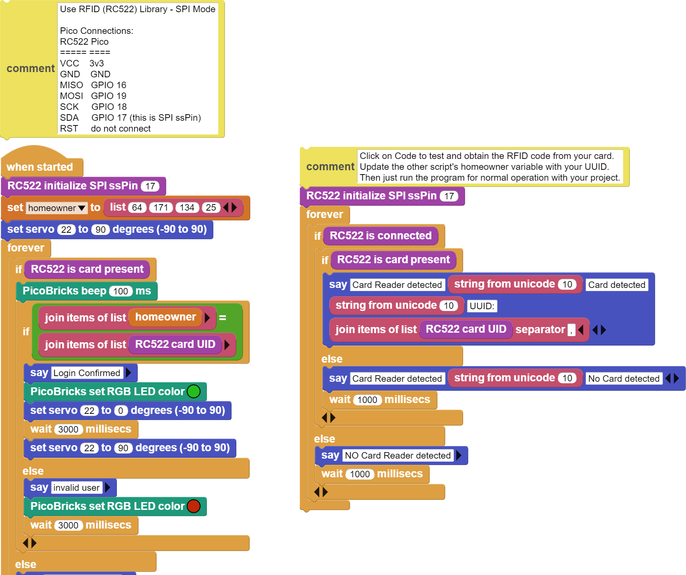

###########
NFC Akıllı Kapı
###########

Giriş
-------------
Bu projede, kartlı giriş sistemi olan bir model ev yapacağız.

Proje Detayları ve Algoritması
------------------------------

``Güvenlik sistemlerinin`` kapsamına bina ve oda girişlerinde yetkileri kontrol edebilen  teknolojiler de girmektedir. Hastanelerin ameliyathanelerine sadece görevli personellerin girebildiği kartlı giriş sistemleri ilk akla gelen örneklerden biridir. Ayrıca askeri güvenlik merkezlerinde her düzeyden kişi veya personelin girmemesi gereken alanların giriş kapıları kartlı ve şifreli giriş teknolojileriyle donatılmaktadır. Bina ve oda girişlerinde kullanılan bu elektronik sistemler yetkisiz kişilerin girişini engellediği gibi giriş çıkış bilgilerinin kayıt altında tutulmasını da sağlamaktadır. Şifreli giriş, kartlı giriş, parmak izi tarama, yüz tarama, retina taraması ve ses tanıma teknolojileri elektronik giriş sistemlerinde kullanılan doğrulama yöntemleridir.
RFID ve NFC gibi sistemler bugün temassız ödeme teknolojilerinin temel halleridir. Kredi kartlarındaki temassız ödeme teknolojisi teknik olarak farklı olsa da çalışma mantığı aynıdır. Okuyucu ve kart arasında yer alacak maksimum mesafe, kullanılan teknolojileri birbirinden ayıran özelliklerin başında gelir. Alışveriş mağazalarından çıkarken özellikle giyim mağazalarında ürünlerin üzerindeki NFC etiketler girişteki okuyuculara takılırsa öterler. O sistemlerde de bir tür ``RFID teknolojisi`` kullanılmaktadır.
Bu projede maket ev üzerinde kartlı giriş sistemi hazırlayacağız. Kullanacağımız elektronik bileşenler MFRC522 RFID okuyucu ve 13.56 Mhz’lik kartlardır.

Bağlantı Diyagramı
--------------

.. figure:: ../_static/nfc-smart-door.png      
    :align: center
    :width: 400
    :figclass: align-center
    

Picobricks modüllerini herhangi bir kablo bağlantısı olmadan programlayabilir ve çalıştırabilirsiniz. Modülleri karttan ayırarak kullanacaksanız modül bağlantılarını verilen konektör kablolar ile yapmalısınız.

Projenin MicroPython Kodu
--------------------------------
.. code-block::

    from machine import I2C, Pin, SPI, PWM
    from mfrc522 import MFRC522
    from ws2812 import NeoPixel
    from utime import sleep 

    servo = PWM(Pin(21))
    servo.freq(50)
    servo.duty_u16(1350) #servo set 0 angle 8200 for 180.

    buzzer = PWM(Pin(20, Pin.OUT))
    buzzer.freq(440)

    neo = NeoPixel(6, n=1, brightness=0.3, autowrite=False)
    RED = (255, 0, 0)
    GREEN = (0, 255, 0)
    BLACK = (0, 0, 0)

    sck = Pin(18, Pin.OUT)
    mosi = Pin(19, Pin.OUT)
    miso = Pin(16, Pin.OUT)
    sda = Pin(17, Pin.OUT)
    rst = Pin(15, Pin.OUT)
    spi = SPI(0, baudrate=100000, polarity=0, phase=0, sck=sck, mosi=mosi, miso=miso)
    homeowner = "0x734762a3"
    rdr = MFRC522(spi, sda, rst)

    while True:
    
    (stat, tag_type) = rdr.request(rdr.REQIDL)
    if stat == rdr.OK:
        (stat, raw_uid) = rdr.anticoll()
        if stat == rdr.OK:
            buzzer.duty_u16(3000)
            sleep(0.05)
            buzzer.duty_u16(0)
            uid = ("0x%02x%02x%02x%02x" % (raw_uid[0], raw_uid[1], raw_uid[2], raw_uid[3]))
            print(uid)
            sleep(1)
            if (uid==homeowner):
                neo.fill(GREEN)
                neo.show()
                servo.duty_u16(6000)
                sleep(3)
                servo.duty_u16(1350)
                neo.fill(BLACK)
                neo.show()
               
            else:
                neo.fill(RED)
                neo.show()
                sleep(3)
                neo.fill(BLACK)
                neo.show()
                servo.duty_u16(1350)
                
MicroPyhton ID Kart Kodu
-------------
.. code-block::

    from machine import Pin, SPI
    from mfrc522 import MFRC522
    import utime
    #define libraries
    sck = Pin(18, Pin.OUT)
    mosi = Pin(19, Pin.OUT)
    miso = Pin(16, Pin.OUT)
    sda = Pin(17, Pin.OUT)
    rst = Pin(15, Pin.OUT)
    spi = SPI(0, baudrate=100000, polarity=0, phase=0, sck=sck, mosi=mosi, miso=miso)
    rdr = MFRC522(spi, sda, rst)
    #define MFRC522 pins

    while True:
    (stat, tag_type) = rdr.request(rdr.REQIDL)
    if stat == rdr.OK:
        (stat, raw_uid) = rdr.anticoll()
        if stat == rdr.OK:
            uid = ("0x%02x%02x%02x%02x" % (raw_uid[0], raw_uid[1], raw_uid[2], raw_uid[3]))
            print(uid)
            utime.sleep(1)
            #read the card and give the serial number of the card

.. tip::
  Eğer kodunuzun adını main.py olarak kaydederseniz, kodunuz her ``BOOT`` yaptınızda çalışacaktır.
   
Projenin Arduino C Kodu
-------------------------------

.. code-block::

    #include <SPI.h>
    #include <MFRC522.h>
    #include <Servo.h>
    #include <Adafruit_NeoPixel.h>
    //Define libraries.

    #define RST_PIN    26
    #define SS_PIN     17
    #define servoPin   22
    #define PIN        6 
    #define NUMPIXELS  1
    #define buzzer     20
    //define pins of servo,buzzer,neopixel and rfid.

    Adafruit_NeoPixel pixels(NUMPIXELS, PIN, NEO_GRB + NEO_KHZ800);
    Servo motor;
    MFRC522 rfid(SS_PIN, RST_PIN);

    byte ID[4] = {"Write your own ID."};

    void setup() { 
    pixels.begin();
    motor.attach(servoPin);
    Serial.begin(9600);
    SPI.begin();
    rfid.PCD_Init();
    pinMode(buzzer, OUTPUT);
  
        }
 
    void loop()
        {
    pixels.clear();
  
    if ( ! rfid.PICC_IsNewCardPresent())
    return;
    if ( ! rfid.PICC_ReadCardSerial())
    return;

    if 
    (rfid.uid.uidByte[0] == ID[0] &&
    rfid.uid.uidByte[1] == ID[1] &&
    rfid.uid.uidByte[2] == ID[2] &&
    rfid.uid.uidByte[3] == ID[3] ) 
    {
        Serial.println("Door Opened.");
        printid();
        tone(buzzer,523);
        delay(200);
        noTone(buzzer);
        delay(100);
        tone(buzzer,523);
        delay(200);
        noTone(buzzer);
        pixels.setPixelColor(0, pixels.Color(0, 250, 0));
        delay(200);
        pixels.show();
        pixels.setPixelColor(0, pixels.Color(0, 0, 0));
        delay(200);
        pixels.show();
        motor.write(180);
        delay(2000);
        motor.write(0);
        delay(1000);
     //RGB LED turns green and the door opens thanks to the servo motor if the correct card is read to the sensor.
        }
        else
        {
      Serial.println("Unknown Card.");
      printid();
      tone(buzzer,494);
      delay(200);
      noTone(buzzer);
      delay(100);
      tone(buzzer,494);
      delay(200);
      noTone(buzzer);
      pixels.setPixelColor(0, pixels.Color(250, 0, 0));
      delay(100);
      pixels.show();
      pixels.setPixelColor(0, pixels.Color(0, 0, 0));
      delay(100);
      pixels.show();
      //RGB LED turns red and the door does not open if the wrong card is read to the sensor
        }
    rfid.PICC_HaltA();
        }
    void printid()
        {
    Serial.print("ID Number: ");
    for(int x = 0; x < 4; x++){
    Serial.print(rfid.uid.uidByte[x]);
    Serial.print(" ");
        }
    Serial.println("");
        }
        
Arduino Kart ID Kodu
---------------------
.. code-block::

    #include <SPI.h>
    #include <MFRC522.h>
    //define libraries

    int RST_PIN = 26;
    int SS_PIN = 17;
    //define pins

    MFRC522 rfid(SS_PIN, RST_PIN);

    void setup()
        {
    Serial.begin(9600);
    SPI.begin();
    rfid.PCD_Init();
        }

    void loop() {

    if (!rfid.PICC_IsNewCardPresent())
    return;
    if (!rfid.PICC_ReadCardSerial())
    return;
    rfid.uid.uidByte[0] ;
    rfid.uid.uidByte[1] ;
    rfid.uid.uidByte[2] ;
    rfid.uid.uidByte[3] ; 
    printid();
    rfid.PICC_HaltA();
        //Reading your ID.
        }
    void printid() 
        {
    Serial.print("Your ID: ");
    for (int x = 0; x < 4; x++) {
    Serial.print(rfid.uid.uidByte[x]);
    Serial.print(" ");
        }
    Serial.println("");
        }

Projenin MicroBlocks Kodu
------------------------------------
+-----------------+
||nfc-smart-door1||     
+-----------------+

Not
-----
MicroBlocks ile kodlama yapmak için yukarıdaki görüntüyü MicroBlocks RUN sekmesine sürükleyip bırakmanız yeterlidir.
  

    
