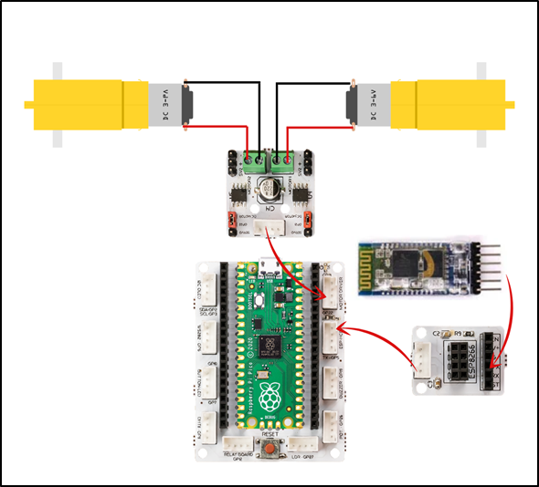

###########
Ses Kontrollü Araba
###########

Giriş
-------------
Bu projede, setin içinden çıkan robot araba kiti montajlayıp cep telefonu üzerinden kontrol edeceğiz. 

Proje Detayları ve Algoritması
------------------------------

Gelişen ve gelişmeye devam eden ``yapay zeka`` uygulamaları insan özelliklerini tanımakta, öğrenmekte ve onun gibi davranmaya çalışmaktadır. Yapay zekayı en kısa haliyle öğrenebilen yazılımlar olarak ifade edebiliriz. Bazen görüntüyü bazen sesi bazen ise sensörlerden topladığı verileri kullanarak öğrenirler. Geliştiricilerinin belirlediği algoritmalar sayesinde bunu yaparlar ve elde ettikleri sonuçlara göre kullanıdıkları alanlarda karar verme süreçlerinde yardımcı olurlar. Kısaca karar verme sürecinin hızlı ve hatasız yapılması gereken durumlarda artık yapay zeka uygulamaları kullanılmaktadır. Pazarlama alanından savunma sanayisine, eğitimden sağlığa, ekonomiden eğlenceye her alanda yapay zeka verimi arttırıp maliyetleri düşürmektedir.

PicoBricks ile yapacağımız bu projede konuşarak kontrol edebileceğiniz 2WD araba yapacağız. PicoBricks 2 adet 6V DC motoru ve bluetooth ile kablosuz iletişim kurmanızı sağlamaktadır. 

HC05 bluetooth modülü PicoBricks ile cep telefonu arasında kablosuz olarak iletişim kurabilmemizi sağlayan bir modüldür. Projede cep telefonuna yüklenen mobil uygulama sayesinde telefondan gönderilen komutlar HC05 modülü üzerinden PicoBrickse iletilecek ve bu verilere göre de robot araba hareket edecektir. Cep telefonundan ileri, geri, sağ, sol butonları ile robot arabayı yönlendirebileceğimiz gibi sesli komutla da PicoBrickse veriler gönderebiliriz. Projede robot arabanın hareketlerini kontrol etmek için sesli komutlar vereceğiz.  

Bağlantı Diyagramı
--------------

    

Picobricks modüllerini herhangi bir kablo bağlantısı olmadan programlayabilir ve çalıştırabilirsiniz. Modülleri karttan ayırarak kullanacaksanız modül bağlantılarını verilen konektör kablolar ile yapmalısınız.

Projenin MicroPython Kodu
--------------------------------
.. code-block::

    from machine import Pin, UART
    from utime import sleep

    uart = UART(0,9600) #If connection cannot be established, try 115200.
    m1 = Pin(21, Pin.OUT)
    m2 = Pin(22, Pin.OUT)

    m1.low()
    m2.low()

    while True:
    sleep(0.05)
    if uart.any():
        cmd = uart.readline()
    if cmd==b'F':
        m1.high()
        m2.high()
    elif cmd==b'R':
        m1.high()
        m2.low()
    elif cmd==b'L':
        m1.low()
        m2.high()
    elif cmd==b'S':
        m1.low()
        m2.low()
    cmd=""
            

.. tip::
  Eğer kodunuzun adını main.py olarak kaydederseniz, kodunuz her ``BOOT`` yaptınızda çalışacaktır.
   
Projenin Arduino C Kodu
-------------------------------

.. code-block::

    void setup() {
    Serial1.begin(9600);
        }

    void loop() {
    if (Serial1.available() > 0) {
 
      char sread = Serial1.read();
      Serial.println(sread);
      
      if (sread == 'f') {
      Forward();
        } 
      else if(sread == 'r'){
      Turn_Right();
        } 
      else if(sread == 'l'){
      Turn_Left();
        } 
      else if(sread == 's'){
      Stop();
        }
        }
        }

      void Forward(){
      digitalWrite(21,HIGH);
      digitalWrite(22,HIGH);
      delay(1000);
      digitalWrite(21,LOW);
      digitalWrite(22,LOW);
        }
      void Turn_Left(){
      digitalWrite(21,LOW);
      digitalWrite(22,HIGH);
      delay(500);
      digitalWrite(21,LOW);
      digitalWrite(22,LOW);
        }
      void Turn_Right(){
      digitalWrite(21,HIGH);
      digitalWrite(22,LOW);
      delay(500);
      digitalWrite(21,LOW);
      digitalWrite(22,LOW);
        }
      void Stop(){
      digitalWrite(21,LOW);
      digitalWrite(22,LOW);
      delay(1000);
        }

Projenin MicroBlocks Kodu
------------------------------------

+-----------------------+
||voice-controlled-car2||     
+-----------------------+

.. |voice-controlled-car2| image:: _static/voice-controlled-car2.png

.. note::
    MicroBlocks ile kodlama yapmak için yukarıdaki görseli MicroBlocks Run sekmesine sürükleyip bırakmanız yeterlidir.
  

    
