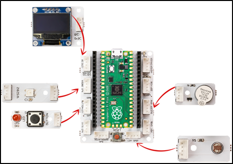

###########
Alarm Clock
###########

Giriş
-------------
Bu projede Picobricks’teki ışık sensörünü kullanarak gün ışığına göre ayarlanan bir saat alarmı hazırlayacağız.
Bu projede basit bir alarm uygulaması yapacağız. Tasarlayacağımız alarm sistemi sabah olduğunda otomatik olarak çalacak şekilde kurgulanmıştır. Bunun için projede LDR sensör kullanacağız. 

Proje Detayları ve Algoritması
------------------------------

Küresel ısınma dünyamızın iklimini her geçen gün daha kötü etkiliyor. Ülkeler küresel ısınmanın etkilerini azaltmak için birçok tedbiri devreye sokuyor ve anlaşmalar imzalıyorlar. Yenilenebilir enerji kaynaklarının kullanılması ve enerjinin verimli kullanılması fabrikalardan evimizin odalarına kadar her yerde dikkat edilmesi gereken bir konudur. Şehirlerde yol ve park aydınlatmalarının insan hatasından dolayı açık kalması, yüksek enerji tüketen aydınlatma araçlarının kullanılması gibi birçok sebep enerji verimliliğini düşürmektedir. Ortamın ışık, sıcaklık ve nem değerlerini ölçerek sadece gerek duyulduğunda ve doğru miktarlarda kullanılmasını sağlayan birçok elektronik ve dijital sistem mühendisler tarafından geliştirilmekte ve programlanmaktadır.

Gece olduğunda OLED ekranda kullanıcıya iyi geceler mesajı görüntülenecek, sabah olduğunda ise buzzer sesi ile alarm çalacak, ekranda kullanıcıya günaydın mesajı gösterilecek ve ışıklı bildirim amacıyla RGB LED beyaz renkte yanacak. Kullanıcının alarmı durdurması için ise Picobricks’in butonuna basması gerekecek. Alarm durdurulana kadar devam eden bu işlemlerden sonra butona basıldığında buzzer ve RGB LED kapanacak ve OLED ekranda kullanıcıya iyi günler mesajı gösterilecek.

Bağlantı Diyagramı
--------------

    

Picobricks modüllerini herhangi bir kablo bağlantısı olmadan programlayabilir ve çalıştırabilirsiniz. Modülleri karttan ayırarak kullanacaksanız modül bağlantılarını verilen konektör kablolar ile yapmalısınız.

Projenin MicroPython Kodu
--------------------------------
.. code-block::

    from machine import Pin, I2C, ADC, PWM#to access the hardware on the pico
    from picobricks import SSD1306_I2C#OLED Screen Library
    import utime
    from picobricks import WS2812#ws8212 library

    #OLED Screen Settings
    WIDTH  = 128                                            
    HEIGHT = 64

    sda=machine.Pin(4)
    scl=machine.Pin(5)
    #initialize digital pin 4 and 5 as an OUTPUT for OLED Communication

    i2c=machine.I2C(0,sda=sda, scl=scl, freq=1000000)
    neo = WS2812(pin_num=6, num_leds=1, brightness=0.3)#initialize digital pin 6 as an OUTPUT for NeoPixel

    oled = SSD1306_I2C(WIDTH, HEIGHT, i2c)
    ldr = ADC(Pin(27))#initialize digital pin 6 as an OUTPUT for NeoPixel
    button = Pin(10,Pin.IN,Pin.PULL_DOWN)#initialize digital pin 10 as an INPUT for button
    buzzer = PWM(Pin(20, Pin.OUT))#initialize digital pin 20 as an OUTPUT for buzzer
    buzzer.freq(1000)

    BLACK = (0, 0, 0)
    WHITE = (255, 255, 255)
    #RGB black and white color code
    oled.fill(0)
    oled.show()

    neo.pixels_fill(BLACK)
    neo.pixels_show()

    if ldr.read_u16()<4000:
    wakeup = True
        else:
    wakeup = False
    
    while True:
    while wakeup==False:
        oled.fill(0)
        oled.show()
        oled.text("Good night",25,32)
        oled.show()
        #Show on OLED and print "Good night"
        utime.sleep(1)
        if ldr.read_u16()<4000:
            while button.value()==0:
                oled.fill(0)
                oled.show()
                oled.text("Good morning",15,32)
                oled.show()
                #Print the minutes, seconds, milliseconds and "Goog morning" values ​​to the X and Y coordinates determined on the OLED screen.
                neo.pixels_fill(WHITE)
                neo.pixels_show()
                buzzer.duty_u16(6000)
                utime.sleep(1)
                #wait for one second
                buzzer.duty_u16(0)
                utime.sleep(0.5)
                #wait for half second
                wakeup=True
            neo.pixels_fill(BLACK)
            neo.pixels_show()
    oled.fill(0)
    oled.show()
    oled.text("Have a nice day!",0,32)
    #Print the minutes, seconds, milliseconds and "Have a nice day!" values ​​to the X and Y coordinates determined on the OLED screen.
    oled.show()
    if ldr.read_u16()>40000:
        wakeup= False
        
    utime.sleep(1)
    #wait for one second
            

.. tip::
  Eğer kodunuzun adını main.py olarak kaydederseniz, kodunuz her ``BOOT`` yaptınızda çalışacaktır.
   
Projenin Arduino C Kodu
-------------------------------

.. code-block::

    #include <Adafruit_NeoPixel.h>
    #ifdef __AVR__
    #include <avr/power.h> 
    #endif
    #define PIN        6 

    #define NUMPIXELS 1 
    Adafruit_NeoPixel pixels(NUMPIXELS, PIN, NEO_GRB + NEO_KHZ800);
    #include <Wire.h>
    #include "ACROBOTIC_SSD1306.h"
    int button;
    void setup() {
    // put your setup code here, to run once:
    Wire.begin();  
    oled.init();                      
    oled.clearDisplay(); 
  
    #if defined(__AVR_ATtiny85__) && (F_CPU == 16000000)
    clock_prescale_set(clock_div_1);
    #endif
    pinMode(10,INPUT);
    pinMode(27,INPUT);
    pinMode(20,OUTPUT);
  
    pixels.begin();
    pixels.setPixelColor(0, pixels.Color(0, 0, 0));
    pixels.show();

        }

    void loop() {
    // put your main code here, to run repeatedly:
    oled.setTextXY(4,3);              
    oled.putString("Good night");
    
    if (analogRead(27)<200){

      while(!(button == 1)){
        
        button=digitalRead(10);
       
        oled.setTextXY(4,2);              
        oled.putString("Good morning");
        pixels.setPixelColor(0, pixels.Color(255, 255, 255));
        pixels.show();
        tone(20,494);
      }
        oled.clearDisplay();
        oled.setTextXY(4,1);              
        oled.putString("Have a nice day");
        noTone(20);
        pixels.setPixelColor(0, pixels.Color(0, 0, 0));
        pixels.show();
        delay(10000);
    }

    }

Projenin MicroBlocks Kodu
------------------------------------

+--------------+
||alarm-clock2||     
+--------------+

.. |alarm-clock2| image:: _static/alarm-clock2.png

.. note::
    MicroBlocks ile kodlama yapmak için yukarıdaki görseli MicroBlocks Run sekmesine sürükleyip bırakmanız yeterlidir.
  

    
