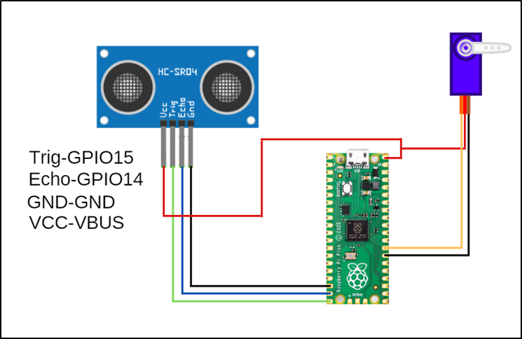

###########
Automatic Trash Bin
###########

Giriş
-------------
Bu projemizde PicoBricks ile ultrasonik sensör ve servo motor kullanarak odanıza mobil ve otomatik şık bir çöp kutusu yapacaksınız.

Proje Detayları ve Algoritması
------------------------------

Covid-19 pandemisi insanların günlük yaşamdaki rutinlerini bir çok alanda değiştirdi. Temizlik, çalışma, alışveriş, sosyal hayat gibi bir çok alanda insanlar uymak zorunda olduğu bir dizi yeni kurallarla tanıştı. Covid-19 yeni iş alanlarının doğmasına  ve gelişmesine zemin oluşturduğu gibi bazı ürünlerinde ön plana çıkmasını sağlamıştır. El hijyenin çok önemsendiği bir dönemde kimse çöpünü atmak için çöp kovasının kapağına dokunmak istemezdi. Yanına yaklaşıldığında kapağı otomatik açılan dolduğunda ise tek bir hareketle içindeki poşeti büzüp çıkarıp atmaya hazır hale getiren çöp kovaları maliyetinin çok üstünde fiyatlara alıcı buldu. Ayrıca otomatik dezenfektan makineleri elimizi altına tuttuğumuzda belirli bir miktar sıvıyı avucumuzun içine boşaltmakla temassız bir hijyen sağlıyordu. Otomatik dezenfektan sıkıcılarda maliyetinin çok üzerindeki fiyatlara raflarda yer aldı. Bu iki üründe çalışma sistemi açısından benzerlikler yer almaktadır. Otomatik dezenfektan sıkıcılarda doğrudan elektrik motorlu bir pompa sıvıyı dışarı aktardığı gibi bazı modellerde de servo motorun gücü ile pompalanma sistemine dayanan cihazlar bulunmaktaydı. Otomatik çöp kovalarında ise kapağı açan servo motor kullanılmakta el hareketini algılamak için ise kızılötesi ya da ultrasonic sensörler kullanılmaktaydı.

Bu projede HC-SR04 ultrasonic mesafe sensörü ve SG90 servo motor kullanılacaktır. Çöp kutusunun kapağının önüne kullanıcı elini yaklaştırdığında mesafe sensörü yakınlığı algılayacak ve Picobrickse gönderecektir. Picobricks de bu bilgiye göre servo motor çalıştırarak çöp kovasının kapağını açacak kısa bir süre sonra tekrar aşağı indirecektir. 

Bağlantı Diyagramı
--------------

    

Picobricks modüllerini herhangi bir kablo bağlantısı olmadan programlayabilir ve çalıştırabilirsiniz. Modülleri karttan ayırarak kullanacaksanız modül bağlantılarını verilen konektör kablolar ile yapmalısınız.

Projenin MicroPython Kodu 
--------------------------------
.. code-block::

    from machine import Pin, PWM
    from utime import sleep

    servo=PWM(Pin(21,Pin.OUT))
    trigger = Pin(15, Pin.OUT)
    echo = Pin(14, Pin.IN)

    servo.freq(50)
    servo.duty_u16(1920) #15 degree

    def getDistance():
    trigger.low()
    utime.sleep_us(2)
    trigger.high()
    utime.sleep_us(5)
    trigger.low()
    while echo.value() == 0:
       signaloff = utime.ticks_us()
    while echo.value() == 1:
       signalon = utime.ticks_us()
    timepassed = signalon - signaloff
    distance = (timepassed * 0.0343) / 2
    print("The distance from object is ",distance,"cm")
    return distance

    while True:
    sleep(0.01)
    if int(getDistance())<=10:
        servo.duty_u16(4010) #70 degree
        utime.sleep(0.3)
        servo.duty_u16(1920)
        

.. tip::
  Eğer kodunuzun adını main.py olarak kaydederseniz, kodunuz her ``BOOT`` yaptığınızda çalışacaktır.
   
Projenin Arduino C Kodu
-------------------------------

.. code-block::

    #include <Servo.h>
    #define trigPin 14
    #define echoPin 15
    Servo servo;
    void setup() {
    Serial.begin (9600);
    pinMode(trigPin, OUTPUT);
    pinMode(echoPin, INPUT);
    servo.attach(21);
        }

    void loop() {
    long duration, distance;
    digitalWrite(trigPin, LOW);
    delayMicroseconds(2);
    digitalWrite(trigPin, HIGH);
    delayMicroseconds(10);
    digitalWrite(trigPin, LOW);
    duration = pulseIn(echoPin, HIGH);
    distance = (duration/2) / 29.1; 
    if (distance < 80) {
    Serial.print(distance);
    Serial.println(" cm");
    servo.write(179);
        }

    else if (distance<180) {
    Serial.print(distance);
    Serial.println(" cm");
    servo.write(100); 
        }
  

        }

Projenin MicroBlocks Kodu
------------------------------------
+----------------------+
||automatic-trash-bin1||     
+----------------------+

.. |automatic-trash-bin1| image:: _static/automatic-trash-bin1.png

.. note::
    MicroBlocks ile kodlama yapmak için yukarıdaki görseli MicroBlocks Run sekmesine sürükleyip bırakmanız yeterlidir.
  

    
