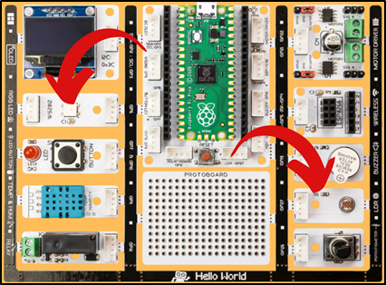
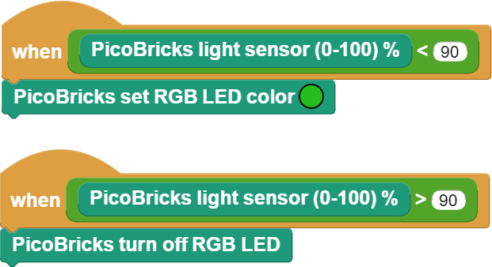

###########
Autonomous Lighting
###########

Giriş 
-------------
Bu projede PicoBricks ile hava karardığında aydınlatmanın otomatik yandığı sistemlerin çalışma sistemlerini anlamak için ışık miktarı düştüğünde LED’in yanmasını sağlayacağız.

   

Proje Detayları ve Algoritması
------------------------------

Elektronik sistemlerin verilen görevi, topladığı veriler doğrultusunda karar vererek otomatik olarak yapmasına otonom olma durumu denir. Elektronik sistemlerin çevresinden veri toplamasını sağlayan bileşenlerine sensör (algılayıcı) denir. Ortamdaki ışık seviyesinin hangi düzeyde olduğu, hava sıcaklığının kaç derece olduğu, su akış hızının kaç lt/dk olduğu, ses şiddetinin ne kadar olduğu gibi birçok veri sensörler tarafından toplanarak elektrik sinyalleri olarak yani veri olarak PicoBricks’e iletilir. Picobricks’te birçok sensör yer almaktadır. Sensörlerden verinin nasıl alındığını ve bu verilerin nasıl yorumlanılıp kullanılacağını bilmek, kitap okumanın kelime dağarcığını geliştirmesi gibi proje fikirlerini geliştirecektir.

Bağlantı Diyagramı
--------------

.. figure:: ../_static/autonomous-lighting.png      
    :align: center
    :width: 500
    :figclass: align-center
    

Picobricks modüllerini herhangi bir kablo bağlantısı olmadan programlayabilir ve çalıştırabilirsiniz. Modülleri karttan ayırarak kullanacaksanız modül bağlantılarını verilen konektör kablolar ile yapmalısınız.

Projenin MicroPython Kodu
--------------------------------
.. code-block::

   import time
   from machine import Pin, ADC
   from picobricks import  WS2812
   #define the library

   ldr = ADC(Pin(27))
   ws = WS2812(6, brightness=0.4)
   #define the input and output pins

   #define colors
   RED = (255, 0, 0)
   GREEN = (0, 255, 0)
   BLUE = (0, 0, 255)

   COLORS = (RED, GREEN, BLUE)
   #RGB color Code

   while True:#while loop
    print(ldr.read_u16()) #print the value of the LDR sensor to the screen.
    
    if(ldr.read_u16()>10000):#let's check the ldr sensor
        for color in COLORS:
            
            #turn on the LDR
            ws.pixels_fill(color)
            ws.pixels_show()
                
    else:
        ws.pixels_fill((0,0,0))  #turn off the RGB
        ws.pixels_show()

.. tip::
  Eğer kodunuzun adını main.py olarak kaydederseniz, kodunuz her ``BOOT`` yaptınızda çalışacaktır.
   
Projenin Arduino C Kodu
-------------------------------

.. code-block::

   #include <Adafruit_NeoPixel.h>
   #define PIN            6
   #define NUMLEDS        1
   #define LIGHT_SENSOR_PIN 27

   Adafruit_NeoPixel leds = Adafruit_NeoPixel(NUMLEDS, PIN, NEO_GRB + NEO_KHZ800);
   //define the libraries

   int delayval = 250; // delay for half a second

      void setup() 
      {
      leds.begin(); 
      }

      void loop() 
      {
      int analogValue = analogRead(LIGHT_SENSOR_PIN);
      for(int i=0;i < NUMLEDS;i++)
      {
      if (analogValue > 200) {
          // pixels.Color takes RGB values, from 0,0,0 up to 255,255,255
          leds.setPixelColor(i, leds.Color(255,255,255));
          leds.show(); // This sends the updated pixel color to the hardware.
          delay(delayval); 
      }
       else {
         leds.setPixelColor(i, leds.Color(0,0,0));  //white color code.
         leds.show(); // This sends the updated pixel color to the hardware.
      }
    }
    delay(10);
   }

Projenin MicroBlocks Kodu
------------------------------------

+----------------------+
||autonomous-lighting2||     
+----------------------+

.. note::
    MicroBlocks ile kodlama yapmak için yukarıdaki görseli MicroBlocks Run sekmesine sürükleyip bırakmanız yeterlidir.
  

    
