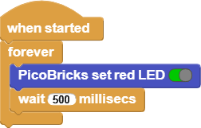

###########
Blink
###########

Giriş
-------------

Gerçek hayatta işi yeni öğrenmeye başlayan çalışan, önce en temel görevi üstlenir. Temizlik görevlisi ise süpürgenin kullanımını, aşçı ise mutfak araç gereçlerini, garson ise tepsi taşımayı… Bu örnekleri arttırabiliriz. Yazılım geliştirmeye yeni başlayanların ilk yazdıkları kod ``“Hello World”`` olarak bilinir. Kullandıkları dil de ekrana ya da konsol penceresine program başlar başlamaz ``“Hello World”`` yazdırmak, programlamaya atılan ilk adımdır. Bir bebeğin emeklemeye başlaması gibi… 

.. doctest::
   :hide:
   
  >>> print("Hello World")
  >>> Hello World
   
Robotik kodlamaya diğer adıyla fiziksel programlamaya atılan ilk adım ise Blink uygulamasıdır. Robotik kodlamaya göz kırpmak anlamını taşır. Basit olarak bir LED’in bağlantısını devre kartına yaparak yapılan kodlama ile LED’in sürekli yanıp sönmesini sağlanır. Robotik kodlama alanında kendini geliştirmiş kişilere bu seviyeye nasıl geldiklerini sorun. Size verecekleri cevap şöyle başlar; her şey bir LED yakmak ile başladı!

LED’ler elektronik cihazların dilidir. LED’ler sayesinde programcı cihazın görevin hangi aşamasında olduğunu, varsa sorunun ne olduğunu, hangi seçeneklerin aktif olduğunu kullanıcılara ifade eder. Bu projede Picobricks ile üzerinde yer alan LED’lerin çeşitlerini öğrenip onları nasıl yakıp söndüreceğini öğreneceksin.

Proje Detayları ve Algoritması
------------------------------

Picobricks üzerinde 1 adet 5mm kırmızı LED, 1 adet WS2812B RGB LED bulunmaktadır. Normal LED’ler tek renk yanabilirken RGB renkler hem ana hem ara renkler olmak üzere farklı renklerde yanabilmektedir. Bu projede Picobricks üzerindeki kırmızı LED kullanacağız.

Projede Picobricks üzerindeki kırmızı LED yakılması, belirli bir süre geçtikten sonra söndürülmesi,  tekrar belirli bir süre geçtikten sonra yakılması ve bu işlemlerin sürekli tekrarlanması için gerekli kodlar yazacağız. 

Bağlantı Diyagramı
--------------

.. figure:: ../_static/blink1.png      
    :align: center
    :width: 520
    :figclass: align-center
    
.. figure:: ../_static/blink2.png      
    :align: center
    :width: 520
    :figclass: align-center

Picobricks modüllerini herhangi bir kablo bağlantısı olmadan programlayabilir ve çalıştırabilirsiniz. Modülleri karttan ayırarak kullanacaksanız modül bağlantılarını verilen konektör kablolar ile yapmalısınız.

Projenin MicroPython Kodu
--------------------------------
.. code-block::

   from machine import Pin #to access the hardware 
   on the pico
   import utime #time library
   led = Pin(7,Pin.OUT) #initialize digital pin 7 as an output for LED
   while True: #while loop
       led.toggle() #LED on&off status
       utime.sleep(0.5) #wait for a half second

.. tip::
  Eğer kodunuzun adını main.py olarak kaydederseniz, kodunuz her ``BOOT`` yaptığınızda çalışacaktır.
   
Projenin Arduino C Kodu
-------------------------------

.. code-block::

 void setup() {
  // put your setup code here, to run once:
 pinMode(7,OUTPUT); // initialize digital pin 7 as an output
  }
  void loop() {
   // put your main code here, to run repeatedly:
     digitalWrite(7,HIGH); //turn the LED on by making the voltage HIGH  
     delay(500); //wait for a half second                   
     digitalWrite(7,LOW); //turn the LED on by making the voltage LOW
     delay(500); //wait for a half second                    
  }

Projenin MicroBlocks Kodu
------------------------------------

1) ``Kontrol`` kategorisinden ``When started`` bloğunu Scripting alanına sürükleyip bırakın. Bu blok, ``Start`` butonuna her tıklandığında altındaki kodu çalıştırır.

.. figure:: ../_static/blink33.png      
    :align: center
    :width: 220
    :figclass: align-center
2) Ardından, ``Kontrol`` kategorisinden ``forever`` bloğunu sürükleyin ve ``when started`` bloğunun altına ekleyin.
   ``Forever`` bloğu, içine yerleştirilen blokları durmadan çalıştırır.

3) PicoBricks ``set red LED block`` öğesini sürükleyin ve ``forever`` bloğunun içine bırakın. Bloktaki boolean DOĞRU(yeşil) seçimi, LED'in yanmasını sağlar. Alternatif olarak, YANLIŞ(kırmızı) seçimi LED'in sönmesine neden olur.

"Start" butonuna basarak kırmızı LED'in yanıp yanmadığını test edin.

    
4) Şimdi, kırmızı LED'i kapatmak için bloktaki boolean kontrolüne bir kez tıklayarak kırmızıya ayarlayın. Bu ayar YANLIŞ anlamına gelir ve LED'i kapatmalıdır.

Start butonuna tekrar basarak LED'in sönüp sönmediğini test edin.
    
.. figure:: ../_static/blink6.png      
    :align: center
    :width: 220
    :figclass: align-center    
    
    
5) Şimdi LED'in belirli zaman aralıklarında kendi kendine yanıp sönmesi için kodumuzu değiştireceğiz.

``500 milisaniye bekleyin`` bloğunu "Kontrol" kategorisinden sürükleyin ve ``PicoBricks set red LED`` bloğunun altına ekleyin.

6) Daha sonra ``500 milisaniye bekle`` bloğunun altına tekrar ``Picobricks set red LED block`` ekleyin ve boolean kontrolünü False olarak ayarlayın.

En alta başka bir ``500 milisaniye bekle`` bloğu ekleyin.

``Start`` butonuna bastığınızda kırmızı LED'in 500 milisaniye aralıklarla yanıp söndüğünü göreceksiniz. ``500 milisaniye bekle`` bloğundaki 500 sayısı milisaniyeyi temsil eder. Bu sayıyı istediğiniz gibi değiştirebilirsiniz. Bir saniye 1000 milisaniyedir.

    
