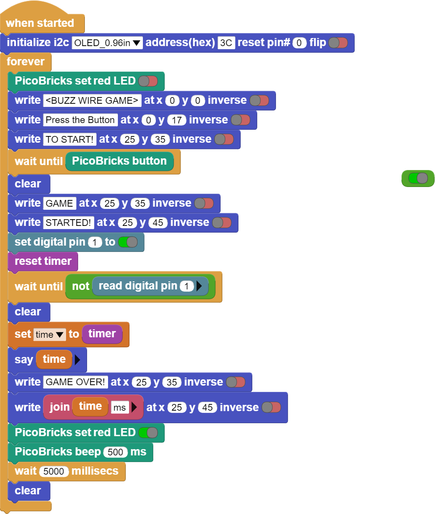

###########
Buzz Wire Game
###########

Giriş
-------------
Bu projede Picobricks ile buzzer ve LED modül kullanarak dikkat ve konsantrasyon geliştirici Buzz Wire Game'i iletken bir tel yardımıyla elektronik olarak hazırlayacağız. Bu projeyi hazırlarken bir buton değil, ``button`` gibi kullanılacak bir giriş tekniği öğrenmiş olacaksınız.

Proje Detayları ve Algoritması
------------------------------

Projeler her zaman sorunları çözmek ve işleri kolaylaştırmakla ilgili olmak zorunda değildir. Siz de eğlenmek ve kendinizi geliştirmek için projeler hazırlayabilirsiniz. Dikkat ve konsantrasyon, birçok insanın geliştirmek istediği özelliklerdir. Bununla yapabileceğimiz uygulamalar oldukça ilgi çekici. Picobricks ile Buzz Wire Oyunu yapmaya ne dersiniz? Bilgisayarların 0'lar ve 1'lerle çalıştığı tabirini duymuşsunuzdur. 0 elektriğin yokluğunu, 1 ise varlığını temsil eder. 0 ve 1'ler belirli sayıda ve dizilişle bir araya gelerek anlamlı veriler oluşturur. Elektronik sistemlerde, bir durumu doğrudan kontrol etmek için 0'lar ve 1'ler kullanılabilir. Kapı kapalı mı değil mi? Işık açık mı kapalı mı? Sulama sistemi açık mı, değil mi? Bu tür bilgileri elde etmek için bir durum kontrolü yapılır. Bu projemizde Picobricks ile buzzer ve LED modül kullanarak dikkat ve konsantrasyon geliştirici Buzz Wire Game'i iletken bir tel yardımıyla elektronik olarak hazırlayacağız. Bu projeyi hazırlarken buton olmayan, buton gibi kullanılacak bir giriş tekniği öğrenmiş olacaksınız.

Projeyi hazırlamak için 2 adet erkek-erkek jumper kablo ve 15 cm uzunluğunda iletken bükülebilir tele ihtiyacın var. Oyuncu hazır olduğunda oyunu başlatmak için butona basması istenecek. Butona basıldığında oyuncunun elinde jumper kablo iletken tele değerse Picobricks bunu algılayıp sesli ve yazılı uyarı verecek. Oyun başladıktan bitene kadar geçen sürede OLED ekranda gösterilecek.
Kullanıcı butona bastıktan sonra timer’ı resetliyoruz. Daha sonra Picobricks’in GPIO1 nolu pinine bağlı iletken tel’e 3.3V’luk gerilim vereceğiz. Oyuncunun elinde tuttuğu kablonun bir ucu Picobricks üzerinde GND pinine bağlı olacak. Eğer oyuncu elindeki jumper kabloyu iletken tele dokundurursa GPIO1 nolu pin Pasif/Kapalı/0 konumuna düşecektir. Daha sonra Oyunun bittiğini bildirir ışıklı, yazılı ve sesli geri bildirimde bulunulacak ardından OLED ekran üzerinde geçen süre milisaniye cinsinden gösterilecek. 5 saniye sonunda oyuncunun yeniden başlamak için butona basması istenecek.

Bağlantı Diyagramı
--------------

.. figure:: ../_static/buzz-wire-game.png      
    :align: center
    :width: 400
    :figclass: align-center
    

Picobricks modüllerini herhangi bir kablo bağlantısı olmadan programlayabilir ve çalıştırabilirsiniz. Modülleri karttan ayırarak kullanacaksanız modül bağlantılarını verilen konektör kablolar ile yapmalısınız.

Projenin MicroPthon Kodu
--------------------------------
.. code-block::

    from machine import Pin, I2C, Timer #to access the hardware on the pico
    from picobricks import SSD1306_I2C #OLED Screen Library
    from utime import sleep # time library

    #OLED Screen Settings
    WIDTH  = 128                                            
    HEIGHT = 64

    sda=machine.Pin(4)#initialize digital pin 4 and 5 as an OUTPUT for OLED Communication
    scl=machine.Pin(5)
    i2c=machine.I2C(0,sda=sda, scl=scl, freq=1000000)
    oled = SSD1306_I2C(WIDTH, HEIGHT, i2c)

    wire=Pin(1,Pin.OUT)#initialize digital pin 1 as an OUTPUT 
    led = Pin(7,Pin.OUT)#initialize digital pin 7 and 5 as an OUTPUT for LED
    buzzer=Pin(20, Pin.OUT)#initialize digital pin 20 as an OUTPUT for Buzzer
    button=Pin(10,Pin.IN,Pin.PULL_DOWN)#initialize digital pin 10 as an INPUT for button
    endtime=0

    while True:
    led.low()
    oled.fill(0)
    oled.show()
    oled.text("<BUZZ WIRE GAME>",0,0)
    oled.text("Press the button",0,17)
    oled.text("TO START!",25,35)
    oled.show()
    #When button is '0', OLED says 'GAME STARTED'
    while button.value()==0:
        print("press the button")
    oled.fill(0)
    oled.show()
    oled.text("GAME",25,35)
    oled.text("STARTED",25,45)
    oled.show()
    wire.high()
    timer_start=utime.ticks_ms()
     #When wire is '1', OLED says 'GAME OVER'
    while wire.value()==1:
        print("Started")
    endtime=utime.ticks_diff(utime.ticks_ms(), timer_start)
    print(endtime)
    oled.fill(0)
    oled.show()
    oled.text("GAME OVER!",25,35)
    oled.text(endtime + "ms" ,25,45)
    oled.show()
    led.high()#LED On
    buzzer.high()#Buzzer On
    sleep(5)#Delay
            

.. tip::
  Eğer kodunuzun adını main.py olarak kaydederseniz, kodunuz her ``BOOT`` yaptığınızda çalışacaktır.
   
Projenin Arduino C Kodu
-------------------------------

.. code-block::

    #include <Wire.h>
    #include "ACROBOTIC_SSD1306.h"

    int Time=0;
    unsigned long Old_Time=0;

    void setup() {
    // put your setup code here, to run once:
    pinMode(20,OUTPUT);
    pinMode(7,OUTPUT);
    pinMode(1,OUTPUT);
    pinMode(10,INPUT);

    Wire.begin();  
    oled.init();                      
    oled.clearDisplay();
   
    #if defined(__AVR_ATtiny85__) && (F_CPU == 16000000)
    clock_prescale_set(clock_div_1);
    #endif  

        }

    void loop() {
    // put your main code here, to run repeatedly:
    digitalWrite(7,LOW);

    oled.setTextXY(2,1);              
    oled.putString("BUZZ WIRE GAME"); 
    oled.setTextXY(4,2);              
    oled.putString("Press Button"); 
    oled.setTextXY(5,3);              
    oled.putString("TO START!");

    while (!(digitalRead(10)==1)){
    
        }

    oled.clearDisplay();
    oled.setTextXY(3,6);              
    oled.putString("GAME"); 
    oled.setTextXY(5,4);              
    oled.putString("STARTED");

    digitalWrite(1,HIGH);
    Old_Time=millis();
  
    while(!(digitalRead(1)==0)){

    Time=millis()-Old_Time;   
        }

    String(String_Time)=String(Time);
  
    oled.clearDisplay();
    oled.setTextXY(3,4);              
    oled.putString("GAME OVER"); 
    oled.setTextXY(5,4);              
    oled.putString(String_Time);
    oled.setTextXY(5,10);              
    oled.putString("ms"); 

    digitalWrite(7,HIGH);
    digitalWrite(20,HIGH);
    delay(500);
    digitalWrite(20,LOW);
    delay(5000);
  
    Time=0;
    Old_Time=0;
    oled.clearDisplay();

        }

Projenin MicroBlocks Kodu
------------------------------------

+-----------------+
||buzz-wire-game1||     
+-----------------+

.. note::
    MicroBlocks ile kodlama yapmak için yukarıdaki görseli MicroBlocks Run sekmesine sürükleyip bırakmanız yeterlidir.
  

    
