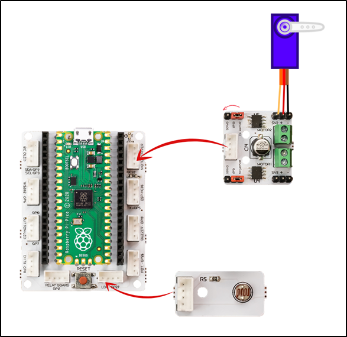

###########
Dinosaur Game
###########

Giriş
-------------
Bu projede PicoBricks ile Servo motorların nasıl kontrol edilebildiğini öğreneceksin. Proje kodlarını yazarken öncelikle LDR sensörü bilgisayar ekranına sabitleyerek beyaz ve siyah zemindeki sensör verilerine okuyacak daha sonra bu verilere göre servo motorun hareket etmesi için gerekli kodları yazacağız.

Projenin Detayları ve Algoritması
------------------------------

Geliştirilecek elektronik sistemler görevini itme, çekme, döndürme, kaldırma, indirme gibi hareketle sonuçlanan işlerle yerine getireceklerse projede aktuatör olarak pnomatik sistemler ya da elektrik motorlu sistemler kullanılır. Picobricks, projelerinde yazdığın kodları harekete geçirebilecek sistemler üretebilmen için iki farklı motor tipini desteklemektedir. DC motor ve DC motorların elektronik olarak hareketlerinin düzenlendiği Servo motorlar. Servo motorlar dönüş açısı değeri verildiğinde o açıya dönen motorlardır. Model uçakların kanatlarında, uçağa yön verebilmek için kanat uçlarındaki yaprakları servo motorlar ile hareket ettirilmektedir. RC teknelerde aracın yönünü değiştirmek için de aynı mantıkla servo motorlar kullanılmaktadır. Ayrıca tam tur dönebilen, akıllı sürekli servo olarak bilinen gelişmiş servo motorlar, evlerimizde kullandığımız akıllı süpürgelerin tekerleklerinde de kullanılmaktadır.

Bu projede Google Chrome offline dinasour game’i otomatik olarak Picobricks’e oynatacağız. Oyunda Picobricks engelleri algılayarak otomatik olarak dinazorun hareketlerini kontrol edecek. Oyun esnasında dinazorun karşısına çıkan engelleri algılamak için picobricks LDR sensör kullanacağız. LDR sensör yüzeyine temas eden ışık miktarını ölçerek analog sinyaller gönderebilmektedir. Sensörü bilgisayar ekranına sabitleyerek beyaz ve siyah renkler arasındaki ışık miktarı farkından yararlanarak dinazorun önüne engel gelip gelmediğini algılayabiliriz. Engel algılandığında ise servo motor kullanarak klavyedeki boşluk tuşuna otomatik olarak basılmasını sağlayabiliriz. Bu sayede dinazor engelleri kolaylıkla aşacaktır.

Bağlantı Diyagramı
--------------

    

Picobricks modüllerini herhangi bir kablo bağlantısı olmadan programlayabilir ve çalıştırabilirsiniz. Modülleri karttan ayırarak kullanacaksanız modül bağlantılarını verilen konektör kablolar ile yapmalısınız.

Projenin MicroPython Kodu
--------------------------------
.. code-block::

    from machine import Pin, ADC, PWM#to access the hardware on the pico
    from utime import sleep #time library

    ldr=ADC(27) #initialize digital pin 27 for LDR
    servo=PWM(Pin(21)) #initialize digital PWM pin 27 for Servo Motor
    servo.freq(50)

    while True:
    sleep(0.01)
    #When LDR data higher than 40000
    if ldr.read_u16()>4000:
        servo.duty_u16(2000)# sets position to 180 degrees
        sleep(0.1)#delay
        servo.duty_u16(1350) # sets position to 0 degrees
        sleep(0.5)#delay
            

.. tip::
  Eğer kodunuzun adını main.py olarak kaydederseniz, kodunuz her ``BOOT`` yaptınızda çalışacaktır.
   
Projenin Arduino C Kodu
-------------------------------

.. code-block::

    #include <Servo.h>
    Servo myservo;

    void setup() {
    // put your setup code here, to run once:
    myservo.attach(22);
    myservo.write(20);
    pinMode(27,INPUT);

  

        }

    void loop() {
    // put your main code here, to run repeatedly:
    int light_sensor=analogRead(27);

    if(light_sensor>100){

    int x=45;
    int y=20;
    
    myservo.write(x);
    delay(100);
    myservo.write(y);
    delay(500);
        }

    }

Projenin MicroBlocks Kodu
------------------------------------
+----------------+
||dinosaur-game1||     
+----------------+

.. |dinosaur-game1| image:: _static/dinosaur-game1.png

.. note::
    MicroBlocks ile kodlama yapmak için yukarıdaki görseli MicroBlocks Run sekmesine sürükleyip bırakmanız yeterlidir.
  

    
