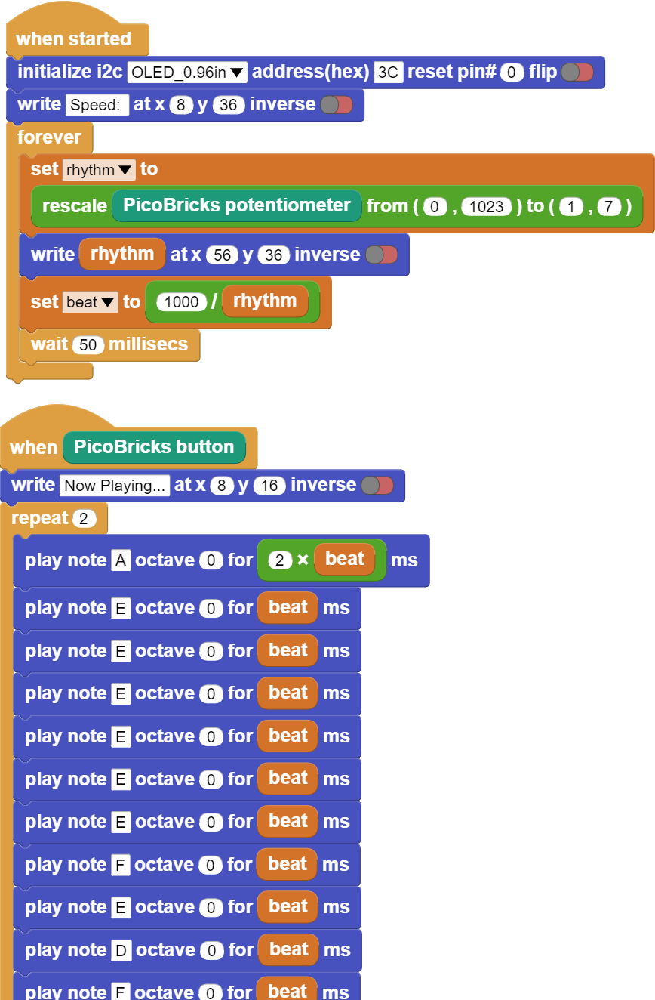

###########
Dominate The Rhythm
###########

Giriş
-------------
Kullanıcı şarkıyı başlatmak için butona bastığında, rthm değişkenine göre hesaplanan süre boyunca notaların çalmasını sağlayacak nota kodlarını hazırlayacağız.

Projenin Detayları ve Algoritması
------------------------------

Hayatımızdaki birçok olgu dijitalleştirilmiştir. Bunlardan biri de seslerdir. Sesin tonu ve şiddeti elektriksel olarak işlenebilmektedir. Yani notaları elektronik olarak çıkarabiliriz. Müziği oluşturan seslerin en küçük birimine nota denir. Her notanın bir frekansı ve şiddeti vardır. Yazacağımız kodlarla frekans ve şiddet uygulayarak hangi notanın çalınmasını ve ne kadar sürmesi gerektiğini ayarlayabiliriz. 

Bu projede PicoBricks ile bir şarkının melodisini buzzer modülünü kullanarak çalacak, potansiyometre modülü ile ritmi ayarlayabilecek bir müzik sistemi hazırlayacağız. Programlama terminolojisinde önemli bir yere sahip değişken kullanımını da bu projede öğreneceksin. Notalarını bildiğimiz her şarkıyı Picobricks ile çalabilirsin. Şarkıyı başlatmak için buton-LED modülünü, şarkının hızını ayarlayabilmek için potansiyometre modülünü notaları çalabilmek için buzzer modülünü kullanacağız. Potansiyometre analog giriş modülüdür. Değişken dirençtir. Üzerinden geçen akım miktarı çevrildikçe bir musluğun açılıp kapatılması gibi artar ve azalır. Bu akım miktarını kodlarla kontrol ederek şarkının hızını ayarlayacağız. Buzzer’lar üzerlerinden geçen akımın şiddetine göre ses seviyelerini, gerilim frekansına göre ses tonlarını değiştirmektedirler. MicroBlocks ile kolayca buzzer modülünden istediğimiz notaları, tonlarını ve sürelerini ayarlayarak kodlayabiliriz.

Projede butona basılma durumunu kontrol edeceğiz. Butona basıldığında melodinin çalmaya başlamasını sağlayacağız. Melodinin çalması sırasında notaların çalınma sürelerini aynı oranda artırıp azaltabilmek için rithm adında bir değişken kullanacağız. Picobricks başladıktan sonra kullanıcının potansiyometre ile ister melodi çalarken ister çalmadan önce rithm değişkenini ayarlayabilmesini sağlayacağız. Picobricks açık olduğu sürece potansiyometre değerini (0-1023) 128’e bölüp rithm değişkene atayacağız. Değişkenler, kullanıcı tarafından ya da sensörler tarafından değiştirilebilecek değerleri kodlarımızda kullanmak istediğimizde kullandığımız veri yapılarıdır. Kullanıcı şarkıyı başlatmak için butona bastığında ise notaların süreleri rithm değişkenine göre hesaplanan süre boyunca çalmasını sağlayacak nota kodlarını hazırlayacağız.

Bağlantı Diyagramı
--------------

.. figure:: ../_static/dominate-rhythm.png      
    :align: center
    :width: 500
    :figclass: align-center
    
.. figure:: ../_static/dominate-rhythm1.png      
    :align: center
    :width: 520
    :figclass: align-center

Picobricks modüllerini herhangi bir kablo bağlantısı olmadan programlayabilir ve çalıştırabilirsiniz. Modülleri karttan ayırarak kullanacaksanız modül bağlantılarını verilen konektör kablolar ile yapmalısınız.

Projenin MicroPython Kodu
--------------------------------
.. code-block::

   from machine import Pin,PWM,ADC,I2C #to acces the hardware picobricks
   from utime import sleep #time library
   from picobricks import SSD1306_I2C
   import utime

   WIDTH=128
   HEIGHT=64
   #define the weight and height picobricks

   sda=machine.Pin(4)
   scl=machine.Pin(5)
   #we define sda and scl pins for inter-path communication
   i2c=machine.I2C(0, sda=sda, scl=scl, freq=2000000)#determine the frequency values
   oled=SSD1306_I2C(WIDTH, HEIGHT, i2c)

   button= Pin(10,Pin.IN,Pin.PULL_DOWN)
   pot=ADC(Pin(26))
   buzzer= PWM(Pin(20))
   #determine our input and output pins
   pressed = False
   rithm = 0

   tones = {
   "A3": 220,
   "D4": 294,
   "E4": 330,
   "F4": 349
      }
   #define the tones

   mysong = ["A3","E4","E4","E4","E4","E4","E4","F4","E4","D4","F4","E4"]#let's define the tones required for our song in the correct order into a sequence
   noteTime = [1,0.5,0.5,0.5,0.5,0.5,0.5,0.5,0.5,0.5,0.5,1]#define wait times between tones into an array

        
   def playtone(frequency):
    buzzer.duty_u16(6000)
    buzzer.freq(frequency)
   #define the frequencies of the buzzer
   def playsong(pin):
    global pressed
    pressed = True
   #play the tones with the right cooldowns
   #An finally we need to tell the pins when to trigger, and the function to call when they detect an event:       
   button.irq(trigger=Pin.IRQ_RISING, handler=playsong)
   note_count = 9999
   played_time = 0
   while True:
    current_time = utime.ticks_ms()
    oled.show()
    oled.text("Press the button",0,0)
    
    if (note_count < len(mysong)):
        oled.fill(0)
        oled.text("Dominate ",30,10)
        oled.text("the ",45,25)
        oled.text("Rhythm ",35,40)
        rithm=((pot.read_u16()/65535.0)*20) +1
        if (current_time - played_time)/1000.0 >= noteTime[note_count]/rithm:
            played_time = utime.ticks_ms()
            playtone(tones[mysong[note_count]])
            note_count += 1
    else:
        buzzer.duty_u16(0)
        
    if pressed:
        
        note_count = 0
        pressed = False
        
        
        

.. tip::
  Eğer kodunuzun adını main.py olarak kaydederseniz, kodunuz her ``BOOT`` yaptığınızda çalışacaktır.
   
Projenin Arduino C Kodu
-------------------------------

.. code-block::

   #include <Wire.h>
   #include "ACROBOTIC_SSD1306.h"

   int buzzer = 20;
   int pot =26;
   int button= 10;
   //define the buzzer, pot and button 

   int Re = 294;
   int Mi = 330;
   int Fa = 349;
   int La = 440;
   //DEFİNE THE TONES
   void setup()
      {
   Wire.begin();  
   oled.init();                      
   oled.clearDisplay();              

   pinMode(buzzer,OUTPUT);
   pinMode(26,INPUT);
   pinMode(button,INPUT);
   //determine our input and output pins
      }

   void loop()
      {
   int rithm = (analogRead(pot))/146;
   String char_rithm = String(rithm);
   oled.setTextXY(3,4);              
   oled.putString("Speed: ");
   oled.setTextXY(3,10);              
   oled.putString(char_rithm);
  
   //print "Speed: "  and speed value on the OLED at x=3 y=4

   delay(10); 

   if (digitalRead(button) == 1){

    oled.clearDisplay(); 
    oled.setTextXY(3,2);              
    oled.putString("Now playing...");
    //print "Speed: "  and speed value on the OLED at x=3 y=4
    tone(buzzer, La); delay (1000/(rithm+1));
    tone(buzzer, Mi); delay (500/(rithm+1));
    tone(buzzer, Mi); delay (500/(rithm+1));
    tone(buzzer, Mi); delay (500/(rithm+1));
    tone(buzzer, Mi); delay (500/(rithm+1));
    tone(buzzer, Mi); delay (500/(rithm+1));
    tone(buzzer, Mi); delay (500/(rithm+1));
    tone(buzzer, Fa); delay (500/(rithm+1));
    tone(buzzer, Mi); delay (500/(rithm+1));
    tone(buzzer, Re); delay (500/(rithm+1));
    tone(buzzer, Fa); delay (500/(rithm+1));
    tone(buzzer, Mi); delay (1000/(rithm+1));
    
    //play the notes in the correct order and time when the button is pressed

    oled.clearDisplay();
    //clear the screen
      }
    noTone(buzzer);
    //stop the buzzer
   }

Projenin MicroBlocks Kodu
------------------------------------
+------------------+
||dominate-rhythm2||     
+------------------+

.. note::
    MicroBlocks ile kodlama yapmak için yukarıdaki görseli MicroBlocks Run sekmesine sürükleyip bırakmanız yeterlidir.
  

    
