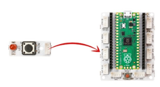
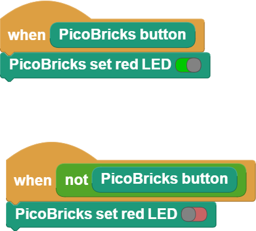

###########
Etki-Tepki
###########

Giriş
-------------
Bu projede Picobricks’in buton-LED modülünü kodlayarak projelerinde kullanıcıdan bir komutun nasıl alınacağını ve bu komuta nasıl tepki verileceğini öğreneceksin.

Newton hareket yasalarında açıkladığı gibi her etkiye karşı bir tepki oluşur. Elektronik sistemler kullanıcılardan komutlar alırlar ve görevlerini yerine getirirler. Genellikle bu iş için  bir tuş takımı, dokunmatik ekran veya bir  buton kullanılır. Elektronik cihazlar görevlerinin sona erdiğini ve görev süresince olan bitenden kullanıcıyı haberdar etmek için sesli, yazılı veya görsel olarak tepki verirler. Bu tepkilerin kullanıcıyı haberdar etmenin yanı sıra olası arızada hatanın nerede olabileceğinin anlaşılmasında yardımcı olabilmektedir.

Proje Detayları ve Algoritması
------------------------------

Picobricks'te 1 buton var ve ``anahtar`` gibi çalışır, basıldığında akım iletir ve serbest bırakıldığında akım vermez.

Bağlantı Diyagramı
--------------

    
.. figure:: ../_static/action-reaction-1.png      
    :align: center
    :width: 520
    :figclass: align-center

Picobricks modüllerini herhangi bir kablo bağlantısı olmadan programlayabilir ve çalıştırabilirsiniz. Modülleri karttan ayırarak kullanacaksanız modül bağlantılarını verilen konektör kablolar ile yapmalısınız.

Projenin MicroPython Kodu
--------------------------------
.. code-block::

   from machine import Pin#to acces the hardware picobricks
   led = Pin(7,Pin.OUT)#initialize digital pin as an output for led
   push_button = Pin(10,Pin.IN,Pin.PULL_DOWN)#initialize digital pin 10 as an input
   while True:#while loop
    logic_state = push_button.value();#button on&off status
    if logic_state == True:#check the button and if it is on
        led.value(1)#turn on the led
    else:
        led.value(0)#turn off the led

.. tip::
  Eğer kodunuzun adını main.py olarak kaydederseniz, kodunuz her ``BOOT`` yaptınızda çalışacaktır.
   
Projenin Arduino C Kodu
-------------------------------

.. code-block::

   void setup() {
  // put your setup code here, to run once:
  pinMode(7,OUTPUT);//initialize digital pin 7 as an output
  pinMode(10,INPUT);//initialize digital pin 10 as an input
  

   }
      void loop() {
  // put your main code here, to run repeatedly:
  if(digitalRead(10)==1){//check the button and if it is on
    digitalWrite(7,HIGH);//turn the LED on by making the voltage HIGH
  }
  else{
    digitalWrite(7,LOW);//turn the LED off by making the voltage LOW 
  }
  delay(10);//wait for half second

      }

Projenin MicroBlocks Kodu
------------------------------------
+------------------+
||action-reaction3||     
+------------------+

    

Not
-----
MicroBlocks ile kodlama yapmak için yukarıdaki görüntüyü MicroBlocks RUN sekmesine sürükleyip bırakmanız yeterlidir.
  

    
