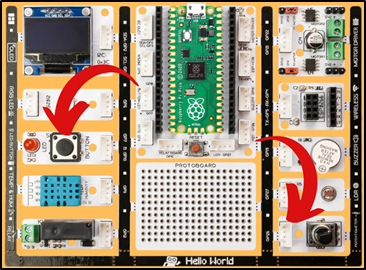
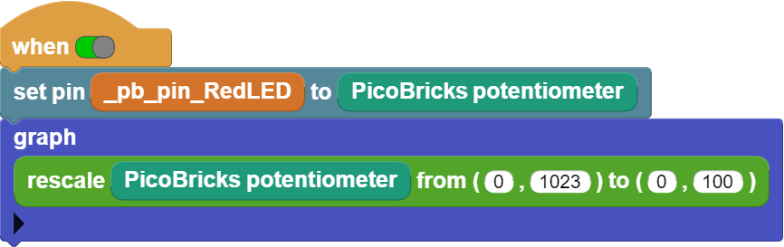

###########
Graphic Monitor
###########

Giriş
-------------

Bu projede potansiyometre ile kırmızı LED’in parlaklığı artırıp azalttığımız bir proje hazırlayacağız. Ayrıca bu işlem sırasında meydana gelen elektriksel değişimi Microblocks grafik monitöründen eş zamanlı olarak takip edeceğiz. Picobricks başladığında potansiyometre değeri sürekli okunarak LED’in parlaklık değerini ayarlanacaktır. Elektrik sinyalinin frekansının değiştirilerek etkisinin azaltıldığı uygulamalara ``PWM`` denmektedir. Potansiyometreden okuduğumuz analog değerleri PWM sinyalleri olarak kırmızı LED’e göndereceğiz ve aydınlatma şiddetini ayarlayabileceğiz.

Proje Detayları ve Algoritması
------------------------------
Çevremizdeki elektronik eşyalara baktığımızda değiştirilebilir birçok özelliklerinin olduğunu mühendisler tarafından kullanıcının en çok işine yarayacak şekilde tasarlandıklarını fark edersin. Aydınlatma sistemleri, pişirme sistemleri, ses sistemleri, temizlik sistemleri gibi. bir çok sistem kullanıcısı tarafından çalışma şekli , miktarı, yöntemi  vb. özellikleri değiştirilebilir şekilde programlanır.
Robotik projelerde ses seviyesini değiştirme, motor hızını değiştirme , ışığın parlaklığını değiştirme işlemlerinde elektrik geriliminin daha düşük veya yüksek etki yaratacak şekilde gönderilmesi sağlanır. Bileşene giden elektrik sinyalinin sıklığı azaltılarak daha düşük seviyede çalışması giden elektrik sinyallerinin sıklığı artırılarak yüksek seviyede çalışması sağlanabilir.

Ekranı olmayan sistemlerde bazı sensörleri ve sistemin çalışmasında görev alan değişkenleri takip etmek için gerçek zamanlı grafik monitörler kullanılır. Arızanın tespit edilmesi için grafik monitörler oldukça kolaylık sağlamaktadır.

Bağlantı Diyagramı
--------------

.. figure:: ../_static/graphic-monitor.png      
    :align: center
    :width: 500
    :figclass: align-center
    

Picobricks modüllerini herhangi bir kablo bağlantısı olmadan programlayabilir ve çalıştırabilirsiniz. Modülleri karttan ayırarak kullanacaksanız modül bağlantılarını verilen konektör kablolar ile yapmalısınız.

Projenin MicroPython Kodu
--------------------------------
.. code-block::

   from machine import Pin,ADC,PWM
   from utime import sleep
   #define libraries

   led=PWM(Pin(7))
   pot=ADC(Pin(26,Pin.IN))
   #define the value we get from the led and pot.
   led.freq(1000)

   while True:#while loop
    
    led.duty_u16(int((pot.read_u16())))
    print(str(int((pot.read_u16()))))
    #Turn on the LED according to the value from the potentiometer.
    
    sleep(0.1)#delay
                 

.. tip::
  Eğer kodunuzun adını main.py olarak kaydederseniz, kodunuz her ``BOOT`` yaptığınızda çalışacaktır.
   
Projenin Arduino C Kodu
-------------------------------

.. code-block::

   void setup() {
   // put your setup code here, to run once:
   pinMode (7,OUTPUT);//initialize digital pin 7 as an output
   pinMode (26,INPUT);//initialize digital pin 26 as an input
   Serial.begin(9600);//start serial communication

      }

   void loop() {
   // put your main code here, to run repeatedly:
   int pot_val = analogRead(26);
   int led_val = map(pot_val, 0, 1023, 0, 255);
   analogWrite(7, led_val);
   Serial.println(led_val);
   //turn on the LED according to the value from the potentiometer
  
   delay(100);//wait

   }

Projenin MicroBlocks Kodu
------------------------------------

+------------------+
||graphic-monitor2||     
+------------------+

.. note::
    MicroBlocks ile kodlama yapmak için yukarıdaki görseli MicroBlocks Run sekmesine sürükleyip bırakmanız yeterlidir.
  

    
