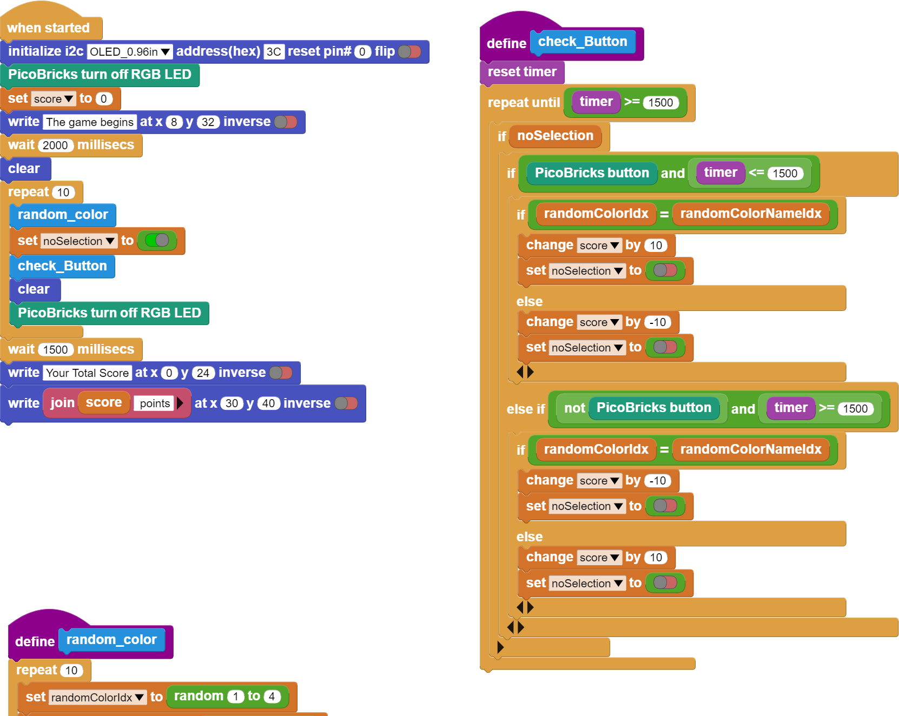
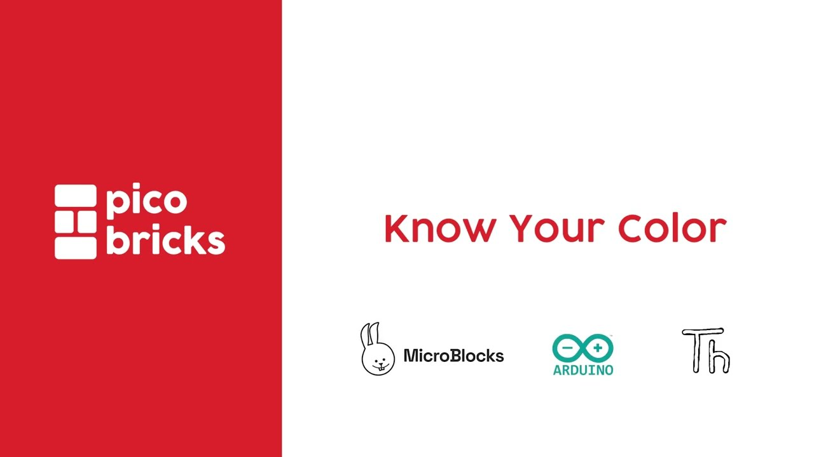

###########
Know Your Color
###########

Giriş
-------------
Bu projede her programlama dilinde kullanılan rastgelelik durumunu öğreneceksin. Picobricks’in RGB LED, OLED ekran ve buton modülü ile eğlenceli bir oyun hazırlayacağız. Projede inşa edeceğimiz oyun kullanıcının renkleri doğru veya yanlış bilmesi üzerine kurgulanacaktır.

Proje Detayları ve Algoritması
------------------------------

Elektronik sistemler üzerinde LED’ler sıklıkla kullanılır. Her butonun her seçeneğin yanında küçük LED’ler bulunabilmektedir. Tek bir LED’i değişik renklerde yanmasını sağlayarak birden fazla LED’in yaptığı işi tek bir LED ile yapılması sağlanabilmektedir. Bu türde çalışan LED’lere RGB LED denir. Adını Red, Green, Blue renk isimlerinin baş harflerinden alır. Bu LED’in diğer avantajı da 3 ana rengin karışımlarında da yanabilmesidir. Mor, turkuaz, turuncu…

PicoBricks üzerindeki RGB LED’de kırmızı, yeşil, mavi ve beyaz renklerden birisi rastgele olarak yanacak, aynı anda OLED ekranda yine bu dört renkten birisinin adı rastgele olarak yazılacaktır. Kullanıcı cevap hakkını kullanmak için 1,5 saniye içerisinde Picobricks’in butonuna basmalıdır. Oyun 10 kere tekrarlanacak, her tekrarda renkler eşlediğinde kullanıcı butona basarsa ya da eşleşmediğinde kullanıcı butona basmazsa 10 puan alacaktır. Renkler eşleşmediği halde kullanıcı butona basarsa 10 puan kaybedecektir. On tekrar sonunda kullanıcının aldığı puan OLED ekranda gösterilecektir. Kullanıcı dilerse butona basmayarak cevap hakkını kullanmayabilir. 

Bağlantı Diyagramı
--------------

.. figure:: ../_static/know-your-color.png      
    :align: center
    :width: 400
    :figclass: align-center
    
.. figure:: ../_static/know-your-color1.png      
    :align: center
    :width: 520
    :figclass: align-center

Picobricks modüllerini herhangi bir kablo bağlantısı olmadan programlayabilir ve çalıştırabilirsiniz. Modülleri karttan ayırarak kullanacaksanız modül bağlantılarını verilen konektör kablolar ile yapmalısınız.

Projenin MicroPython Kodu
--------------------------------
.. code-block::

    from machine import Pin, I2C
    from picobricks import SSD1306_I2C
    import utime
    import urandom
    import _thread
    from picobricks import WS2812

    WIDTH  = 128                                            
    HEIGHT = 64                                          
    sda=machine.Pin(4)
    scl=machine.Pin(5)
    i2c=machine.I2C(0,sda=sda, scl=scl, freq=1000000)
    ws = WS2812(pin_num=6, num_leds=1, brightness=0.3)

    oled = SSD1306_I2C(WIDTH, HEIGHT, i2c)

    button = Pin(10,Pin.IN,Pin.PULL_DOWN)
    RED = (255, 0, 0)
    GREEN = (0, 255, 0)
    BLUE = (0, 0, 255)
    WHITE = (255, 255, 255)
    BLACK = (0, 0, 0)

    oled.fill(0)
    oled.show()

    ws.pixels_fill(BLACK)
    ws.pixels_show()

    global button_pressed
    score=0
    button_pressed = False

    def random_rgb():
    global ledcolor
    ledcolor=int(urandom.uniform(1,4))
    if ledcolor == 1:
        ws.pixels_fill(RED)
        ws.pixels_show()
    elif ledcolor == 2:
        ws.pixels_fill(GREEN)
        ws.pixels_show()
    elif ledcolor == 3:
        ws.pixels_fill(BLUE)
        ws.pixels_show()
    elif ledcolor == 4:
        ws.pixels_fill(WHİTE)
        ws.pixels_show()

    def random_text():
    global oledtext
    oledtext=int(urandom.uniform(1,4))
    if oledtext == 1:
        oled.fill(0)
        oled.show()
        oled.text("RED",45,32)
        oled.show()
    elif oledtext == 2:
        oled.fill(0)
        oled.show()
        oled.text("GREEN",45,32)
        oled.show()
    elif oledtext == 3:
        oled.fill(0)
        oled.show()
        oled.text("BLUE",45,32)
        oled.show()
    elif oledtext == 4:
        oled.fill(0)
        oled.show()
        oled.text("WHITE",45,32)
        oled.show()

    def button_reader_thread():
    while True:
        global button_pressed
        if button_pressed == False:
            if button.value() == 1:
                button_pressed = True
                global score
                global oledtext
                global ledcolor
                if ledcolor == oledtext:
                    score += 10
                else:
                    score -= 10
        utime.sleep(0.01)

    _thread.start_new_thread(button_reader_thread, ())

    oled.text("The Game Begins",0,10)
    oled.show()
    utime.sleep(2)

    for i in range(10):
    random_text()
    random_rgb()
    button_pressed=False
    utime.sleep(1.5)
    oled.fill(0)
    oled.show()
    ws.pixels_fill(BLACK)
    ws.pixels_show()
    utime.sleep(1.5)
    oled.fill(0)
    oled.show()
    oled.text("Your total score:",0,20)
    oled.text(str(score), 30,40)
    oled.show()
            

.. tip::
  Eğer kodunuzun adını main.py olarak kaydederseniz, kodunuz her ``BOOT`` yaptığınızda çalışacaktır.
   
Projenin Arduino C Kodu
-------------------------------

.. code-block::

    #include <Adafruit_NeoPixel.h>
    #define PIN        6 
    #define NUMPIXELS 1
    Adafruit_NeoPixel pixels(NUMPIXELS, PIN, NEO_GRB + NEO_KHZ800);
    #define DELAYVAL 500
    #include <Wire.h>
    #include "ACROBOTIC_SSD1306.h" //define libraries
    int OLED_color;
    int RGB_color;
    int score = 0;
    int button = 0;

    void setup() {
    // put your setup code here, to run once:
    Wire.begin();  
    oled.init();                      
    oled.clearDisplay(); 

    pixels.begin();
    pixels.clear(); 
    randomSeed(analogRead(27));

        }

    void loop() {
    // put your main code here, to run repeatedly:
    oled.clearDisplay();
    oled.setTextXY(3,1);              
    oled.putString("The game begins");
    pixels.setPixelColor(0, pixels.Color(0, 0, 0));
    pixels.show();
    delay(2000);
    oled.clearDisplay();
  
    for (int i=0;i<10;i++){
    button = digitalRead(10);
    random_color();
    pixels.show();
    unsigned long start_time = millis();
    while (button == 0) {
        button = digitalRead(10);
        if (millis() - start_time > 2000)
          break;
    }
    if (button == 1){
  
        if(OLED_color==RGB_color){
          score=score+10;
        }
        if(OLED_color!=RGB_color){
          score=score-10;
        }
        delay(200);
    }
    oled.clearDisplay();
    pixels.setPixelColor(0, pixels.Color(0, 0, 0));
    pixels.show();
        }

    String string_scrore=String(score);
    oled.clearDisplay();
    oled.setTextXY(2,5);              
    oled.putString("Score: ");
    oled.setTextXY(4,7);              
    oled.putString(string_scrore);
    oled.setTextXY(6,5);              
    oled.putString("points");
    // print final score on OLED screen
  
    delay(10000);
        }

    void random_color(){

    OLED_color = random(1,5);
    RGB_color = random(1,5); 
    // generate numbers between 1 and 5 randomly and print them on the screen
    if (OLED_color == 1){
      oled.setTextXY(3,7);              
      oled.putString("red");
        }
    if (OLED_color == 2){
      oled.setTextXY(3,6);              
      oled.putString("green");
        }
    if (OLED_color == 3){
      oled.setTextXY(3,6);              
      oled.putString("blue");
        }
    if (OLED_color == 4){
      oled.setTextXY(3,6);              
      oled.putString("white");
        } 
    if (RGB_color == 1){
      pixels.setPixelColor(0, pixels.Color(255, 0, 0));
        }
    if (RGB_color == 2){
      pixels.setPixelColor(0, pixels.Color(0, 255, 0));
        }
    if (RGB_color == 3){
      pixels.setPixelColor(0, pixels.Color(0, 0, 255));
        }
    if (RGB_color == 4){
      pixels.setPixelColor(0, pixels.Color(255, 255, 255));
    }

    }

Projenin MicroBlocks Kodu
------------------------------------
+------------------+
||know-your-color2||     
+------------------+

.. note::
    MicroBlocks ile kodlama yapmak için yukarıdaki görseli MicroBlocks Run sekmesine sürükleyip bırakmanız yeterlidir.
  

   
Projenin Videosu
------------------------------------

 
