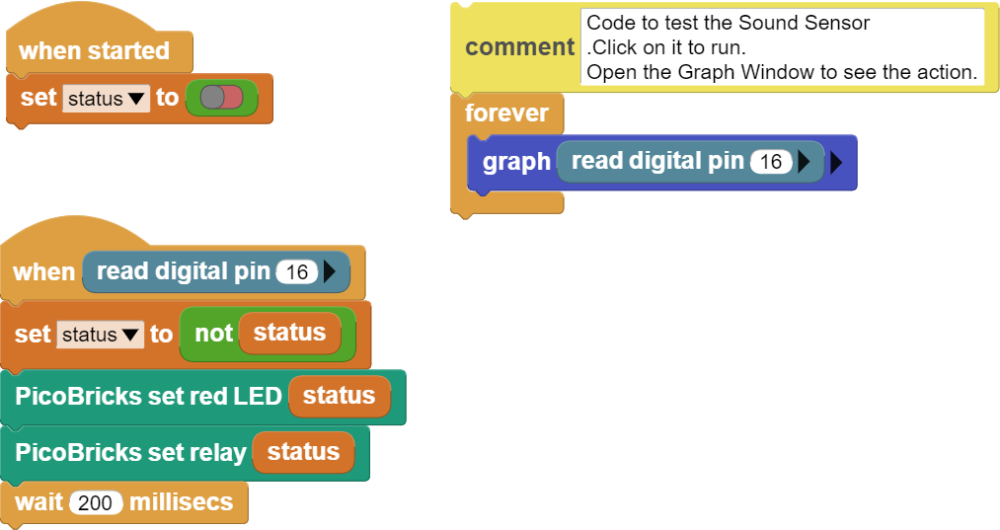

###########
Magic Lamp
###########

Giriş
-------------
Bu projede PicoBricks kartı üzerindeki LED modülünü sesle açıp kapatacağız. PicoBricks ses seviyesi sensörü kullanarak inşa edeceğimiz projemizde alkış sesi çıkararak açma-kapama işlemlerini gerçekleştireceğiz. Önceki projelerde olduğu gibi sensörlerin kullanıldığı projelerde kodları yazmaya başlamadan önce sadece sensörü çalıştırarak yapmak istediğimiz işlemlerde sensörün hangi değerleri gönderdiğini görmek daha sonra bu değerleri baz alarak projenin kodlarını yazmak ilerlemenizi kolaylaştıracaktır. 

Proje Detayları ve Algoritması
------------------------------

Çoğumuz, filmlerde alkış sesiyle sihirliymişçesine yanıp sönen lambaları veya açılıp kapanan kapıları görmüşüzdür. Çekimlerde bu kapıları kapatan , lambaları söndüren set yardımcıları bulunmaktadır. Peki ya biz bunu otomatik olarak gerçekleştirsek nasıl olur? Ortamda meydana gelmesini beklediğimiz ses şiddeti değişikliğini elektrik sinyaline dönüştüren sensörler vardır. Bunlara ses sensörü denmektedir. 
Bu projede alkış ile yanıp sönebilen bir aydınlatma lambası düzeneği hazırlarken PicoBricks buton modülü ve ses seviyesi sensörünü kullanmayı kontrolünü öğreneceksin.

Bağlantı Diyagramı
--------------

    
.. figure:: ../_static/magic-lamp1.png      
    :align: center
    :width: 520
    :figclass: align-center

PicoBricks modüllerini herhangi bir kablo bağlantısı olmadan programlayabilir ve çalıştırabilirsiniz. Modülleri karttan ayırarak kullanacaksanız modül bağlantılarını verilen konektör kablolar ile yapmalısınız.

Projenin MicroPython Kodu
--------------------------------
.. code-block::

    from machine import Pin #to access the hardware on the pico
    sensor=Pin(1,Pin.IN) #initialize digital pin 1 as an INPUT for Sensor
    led=Pin(7,Pin.OUT)#initialize digital pin 7 as an OUTPUT for LED
    while True:
    #When sensor value is '0', the relay will be '1'
    print(sensor.value())
    if sensor.value()==1:  
        led.value(1)  
    else:
        led.value(0)
            

.. tip::
  Eğer kodunuzun adını main.py olarak kaydederseniz, kodunuz her ``BOOT`` yaptığınızda çalışacaktır.
   
Projenin Arduino C Kodu
-------------------------------

.. code-block::

    void setup() {
    // put your setup code here, to run once:
    pinMode(1,INPUT);
    pinMode(7,OUTPUT);
    //define the input and output pins
        }

    void loop() {
    // put your main code here, to run repeatedly:
  
  
    Serial.println(digitalRead(1));

    if(digitalRead(1)==1){
    digitalWrite(7,HIGH);
    delay(3000);
        }
    else{
    digitalWrite(7,LOW);
    delay(1000);
    }
    }
    
 

Projenin MicroBlocks Kodu
------------------------------------
+-------------+
||magic-lamp2||     
+-------------+

.. note::
    MicroBlocks ile kodlama yapmak için yukarıdaki görseli MicroBlocks Run sekmesine sürükleyip bırakmanız yeterlidir.
  

    
