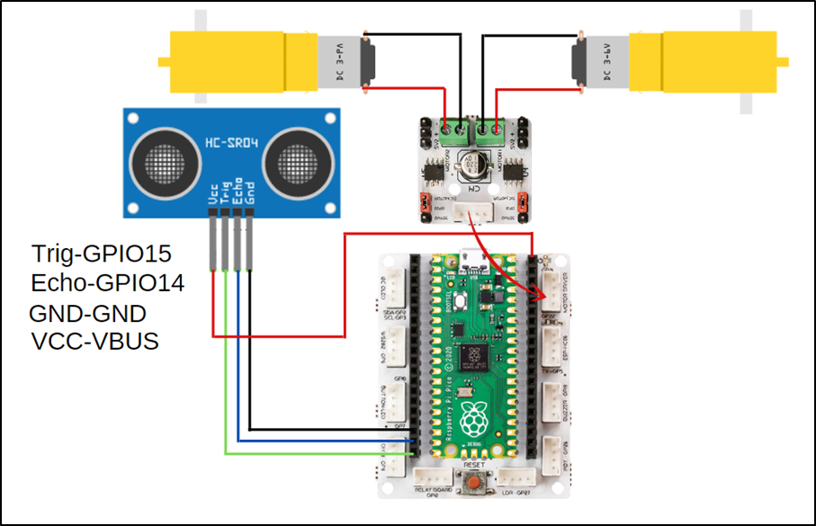
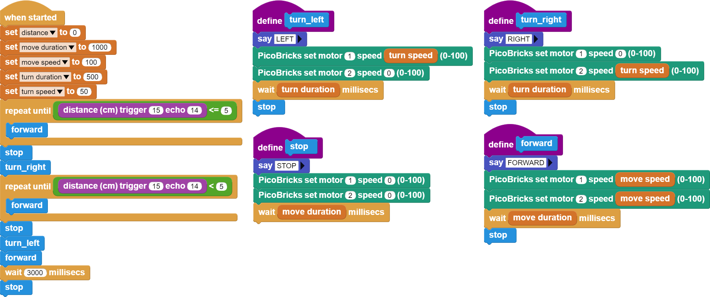

###########
Maze Solver Robot
###########

Giriş
-------------
Maze solver robot projesinde setin içerisinden çıkan 2WD robot araba kitini kullanacağız.

Projenin Detayları ve Algoritması
------------------------------

Kodlama eğitimi programlama dillerinin tarihi kadar eskidir. Günümüzde kodlama eğitimini yaygınlaştırmak, heyecanlı ve eğlenceli hale getirmek için farklı ürünler kullanılmaktadır. Bunların başında eğitsel robotlar gelmektedir. Robotları hazırlamak ve kodlamak çocukların ``mühendislik`` ve ``kodlama`` becerilerini geliştirmektedir. Kodlama eğitimini yaygınlaştırmak, öğretmen ve öğrencileri teşvik etmek için kurum ve kuruluşlar tarafından robotik yarışmalar düzenlenmektedir. Bu yarışmalardan biri de Labirent Çözen Robot yarışmalarıdır. Bu robotlar önce labirentte dolanarak varış noktasını öğrenir ve başlangıç noktasına geri dönerler. Daha sonra labirente tekrar başladıklarında en kısa yoldan en hızlı şekilde varış noktasına ulaşmaya çalışırlar. Robotlar labirenti öğrenirken mesafe sensörlerinden faydalanırlar. Kızılötesi ya da ultrasonik sensörler bu robotlarda görev almaktadır.
Ev ve işyerlerinde kullanılan akıllı robot süpürgeler de labirent çözen robotların algoritmalarına yakın mantıkla çalışmaktadır. Engelleri sürekli kontrol edip haritalayan algoritmaları sayesinde süpürme işini eksiksiz ve çarpmadan yapmaya çalışırlar. Akıllı süpürgelerin çoğunda mesafe ölçme ve engel algılamak için lazer ile yüksek hassasiyetli ölçüm yapan LİDAR ve kızılötesi sensörler görev almaktadır.
Bu projede PicoBricks ile labirent çözen robot yarışmalarına hazırlanabileceğiniz basit bir robot yapacağız. 

Robotun önündeki mesafeyi algılayarak hareketlerine kendi kendine karar verebilmesi için HC-SR04 ultrasonic mesafe sensörü kullanacağız. Labirent içerisinde robot araba önündeki mesafeyi algılayarak önü boş ise ilerleyecek. Eğer mesafe 5 cm den küçük ise araba sağa dönecek, tekrar mesafeyi ölçecek eğer sağ taraftaki mesafe 5 cm den büyük ise ilerleyerek yoluna devam edecek, küçükse sola dönerek ilerleyecek. Bu şekilde sağa ve sola dönerek labirent içerisinde boş olan yollardan aracın ilerlemesini ve labirentten çıkmasını sağlayacağız.

Bağlantı Diyagramı
--------------

    

Picobricks modüllerini herhangi bir kablo bağlantısı olmadan programlayabilir ve çalıştırabilirsiniz. Modülleri karttan ayırarak kullanacaksanız modül bağlantılarını verilen konektör kablolar ile yapmalısınız.

Projenin MicroPython Kodu
--------------------------------
.. code-block::

    from machine import Pin
    from utime import sleep
    import utime
    #define libraries

    trigger = Pin(15, Pin.OUT)
    echo = Pin(14, Pin.IN)
    #define sensor pins

    m1 = Pin(21, Pin.OUT)
    m2 = Pin(22, Pin.OUT)
    #define dc motor pins

    m1.low()
    m2.low()
    signaloff = 0
    signalon = 0

    def getDistance():
    trigger.low()
    utime.sleep_us(2)
    trigger.high()
    utime.sleep_us(5)
    trigger.low()
    while echo.value() == 0:
       signaloff = utime.ticks_us()
    while echo.value() == 1:
       signalon = utime.ticks_us()
    timepassed = signalon - signaloff
    distance = (timepassed * 0.0343) / 2
    return distance
    #calculate distance

    measure=0
    while True:
    
    measure=int(getDistance())
    print(measure)
    if measure>5:
        m1.high()
        m2.high()
        sleep(1) #if the distance is higher than 5, the wheels go straight
    else:
        m1.low()
        m2.low()
        sleep(0.5)
        m1.high()
        m2.low()
        sleep(0.5)
        measure=int(getDistance())
        if measure<5:
            m1.low()
        m2.low()
        sleep(0.5)
        m1.low()
        m2.high()
        sleep(0.5)
        #If the distance is less than 5, wait, move in any direction; if the distance is less than 5, move in the opposite direction

.. tip::
  Eğer kodunuzun adını main.py olarak kaydederseniz, kodunuz her ``BOOT`` yaptığınızda çalışacaktır.
   
Projenin Arduino C Kodu
-------------------------------

.. code-block::

    #include <NewPing.h>

    #define TRIGGER_PIN  15
    #define ECHO_PIN     14
    #define MAX_DISTANCE 400
    //define sensor pins

    NewPing sonar(TRIGGER_PIN, ECHO_PIN, MAX_DISTANCE);

    void setup() {
    pinMode(21,OUTPUT);
    pinMode(22,OUTPUT); //define dc motor pins
        }

    void loop() {
  
    delay(50);
    int distance=sonar.ping_cm();
    Forward();

    if(distance<5){

    Stop();
    delay(1000);
    Turn_Right();
    delay(1000);
    int distance=sonar.ping_cm();

    if(distance<5){
      Stop();
      delay(1000);
      Turn_Left();
      delay(500);
      // If the distance is less than 5, wait, turn right; if the distance is less than 5 again, move in the opposite direction
            }
        }
    }

    void Forward(){
    digitalWrite(21,HIGH);
    digitalWrite(22,HIGH); //if the distance is higher than 5, go straight
    }
    void Turn_Left(){
    digitalWrite(21,LOW);
    digitalWrite(22,HIGH); //turn left
    }
    void Turn_Right(){
    digitalWrite(21,HIGH);
    digitalWrite(22,LOW);  //turn right
    }
    void Stop(){
    digitalWrite(21,LOW);
    digitalWrite(22,LOW); //wait
    }
   
    
Projenin MicroBlocks Kodu
------------------------------------
+--------------------+
||maze-solver-robot1||     
+--------------------+

.. note::
    MicroBlocks ile kodlama yapmak için yukarıdaki görseli MicroBlocks Run sekmesine sürükleyip bırakmanız yeterlidir.
  

    
