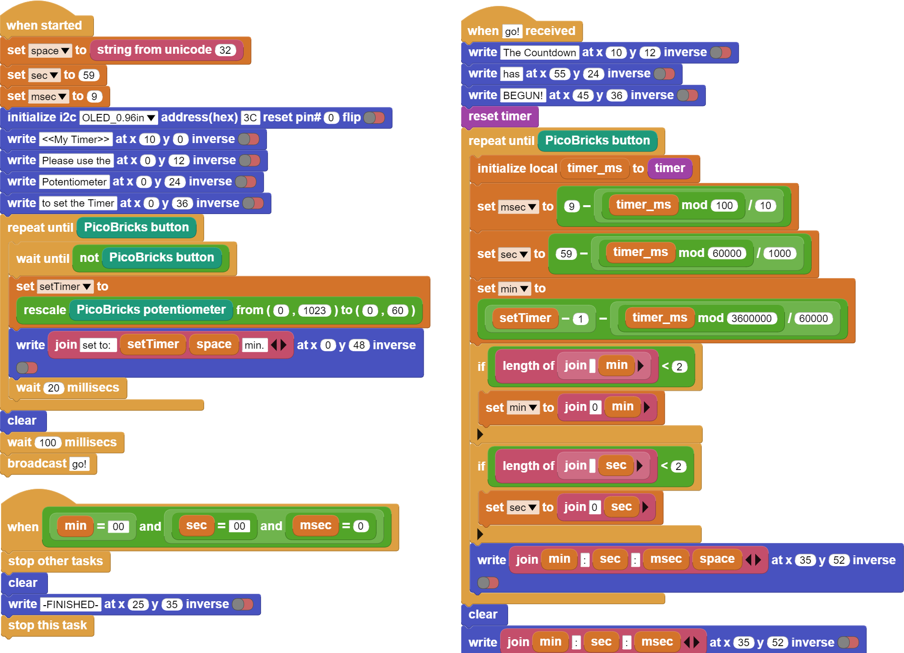

###########
My Timer
###########

Giriş
-------------
Bu projede Picobircks ile OLED ekran, buton ve potansiyometre modüllerini kullanarak kendi zaman ölçme aygıtını yapacaksın.  Bir Timer… 

Projenin Detayları ve Algoritması
------------------------------

Zaman ölçmek günlük hayatımızda farkına varmadan yaptığımız basit ama önemli bir iştir. Ameliyattaki cerrah, toplantısına yetişmeye çalışan bir iş insanı, kazanmaya çalışan sporcu, sınavı bitirmeye çalışan bir öğrenci ya da satranç müsabakası… Zaman ölçmek için akıllı kol saatleri, telefonlar hatta profesyonel kronometreler kullanılmaktadır. Elektronik sistemler içinde zaman oldukça doğru kullanılması gereken bir değişkendir. Örneğin bir  Çamaşır makinesi; tamburun ne kadar süre saat yönünde ne kadar saat yönü tersine döneceği, deterjanı eritip alabilmek için kaç sn su akması gerektiği hep zaman ölçerek yapılan görevlerdir. Zamanın önemli olduğu projeler geliştirmek için onu nasıl kullanacağını bilmelisin.

PicoBricks başladığında ekrana projeyi tanıtan ve yönerge içeren bir ifade yerleştirelim. Kullanıcı potansiyometreyi çevirdikce ``0-60 dakika`` aralığında bir süre belirleyecek. Kullanıcı potansiyometre ile süreye karar verdikten sonra Picobricks’in butonuna bastığında dakika saniye ve salise ekranda geri doğru saymaya başlayacak. Eğer zaman geriye doğru akarken butona basılırsa Timer duracak ve kalan süreyi ekranda gösterecek. Butona basılmadan dakika, saniye ve salise sıfır değerine ulaşırsa ekrana sürenin dolduğunu ifade eden bildirim gösterilecek ve program durdurulacak.

Bağlantı Diyagramı
--------------

.. figure:: ../_static/my-timer.png      
    :align: center
    :width: 500
    :figclass: align-center
    

Picobricks modüllerini herhangi bir kablo bağlantısı olmadan programlayabilir ve çalıştırabilirsiniz. Modülleri karttan ayırarak kullanacaksanız modül bağlantılarını verilen konektör kablolar ile yapmalısınız.

Projenin MicroPython Kodu
--------------------------------
.. code-block::

   from machine import Pin, I2C, ADC, Timer #to acces the hardware picobricks
   from picobricks import SSD1306_I2C #oled library
   import utime #time library

   WIDTH  = 128                                            
   WEIGHT = 64
   #define the width and height values

   sda=machine.Pin(4)
   scl=machine.Pin(5)
   #we define sda and scl pins for inter-path communication
   i2c=machine.I2C(0,sda=sda, scl=scl, freq=1000000)#determine the frequency values

   oled = SSD1306_I2C(128, 64, i2c)
   pot = ADC(Pin(26))
   button = Pin(10,Pin.IN,Pin.PULL_DOWN)
   #determine our input and output pins

   oled.fill(0)
   oled.show()
   #Show on OLED

   time=Timer()
   time2=Timer()
   time3=Timer()
   #define timers

   def minute(timer):
    global setTimer
    setTimer -=1
    
   def second(timer):
    global sec
    sec-=1
    if sec==-1:
        sec=59
        
   def msecond(timer):
    global msec
    msec-=1
    if msec==-1:
        msec=99
   #We determine the increments of the minute-second and millisecond values.
   sec=59
   msec=99

   global setTimer

   while button.value()==0:
    setTimer=int((pot.read_u16()*60)/65536)+1
    oled.text("Set timer:" + str(setTimer) + " min",0,12)
    oled.show()
    utime.sleep(0.1)
    oled.fill(0)
    oled.show()
   #If the button is not pressed, the value determined by the potentiometer is printed on the OLED screen.
    
   setTimer-=1

   time.init(mode=Timer.PERIODIC,period=60000, callback=minute)
   time2.init(mode=Timer.PERIODIC,period=1000, callback=second)
   time3.init(mode=Timer.PERIODIC,period=10, callback=msecond)
   #We determine the periods of minutes, seconds and milliseconds.
   utime.sleep(0.2)#wait for 0.2 second

   while button.value()==0:
    oled.text("min:" + str(setTimer),50,10)
    oled.text("sec:" + str(sec),50,20)
    oled.text("ms:" + str(msec),50,30)
    oled.show()
    utime.sleep(0.008)
    oled.fill(0)
    oled.show()
    if(setTimer==0 and sec==0 and msec==99):
        utime.sleep(0.1)
        msec=0
        break;
    #When the button is pressed, it prints the min-sec-ms values ​​to the OLED screen in the determined x and y coordinates.
    
    oled.text(str(setTimer),60,10)
    oled.text(str(sec),60,20)
    oled.text(str(msec),60,30)
    oled.text("Time is Over!",10,48)
    oled.show()
    #Print the minutes, seconds, milliseconds and "Time is Over" values ​​to the X and Y coordinates determi
            

.. tip::
  Eğer kodunuzun adını main.py olarak kaydederseniz, kodunuz her ``BOOT`` yaptığınızda çalışacaktır.
   
Projenin Arduino C Kodu
-------------------------------

.. code-block::

  #include <Wire.h>
  #include "ACROBOTIC_SSD1306.h"

  int minute;
  int second = 59;
  int milisecond = 9;
  int setTimer;

  void setup() {
  // put your setup code here, to run once:
  pinMode(10,INPUT);
  pinMode(26,INPUT);

  Wire.begin();  
  oled.init();                      
  oled.clearDisplay(); 

    }

  void loop() {
  // put your main code here, to run repeatedly:
  oled.setTextXY(1,2);              
  oled.putString("<<My Timer>>");
  oled.setTextXY(3,1);              
  oled.putString("Please use the");
  oled.setTextXY(4,1);              
  oled.putString("Potantiometer");
  oled.setTextXY(5,0);              
  oled.putString("to set the Timer");
  delay(3000);
  oled.clearDisplay(); 
  
    while(!(digitalRead(10) == 1))
    {
    setTimer = (analogRead(26)*60)/1023;
    oled.setTextXY(3,1);              
    oled.putString("set to:");
    oled.setTextXY(3,8);              
    oled.putString(String(setTimer));
    oled.setTextXY(3,11);              
    oled.putString("min.");
    }
    oled.clearDisplay(); 
    oled.setTextXY(1,1);              
    oled.putString("The Countdown");
    oled.setTextXY(2,3);              
    oled.putString("has begin!");
    
    while(!(digitalRead(10) == 1))
        {
    milisecond = 9- (millis()%100)/10;
    second = 59-(millis()%60000)/1000;
    minute = (setTimer-1)-((millis()%360000)/60000);
    
    oled.setTextXY(5,3);              
    oled.putString(String(minute));
    oled.setTextXY(5,8);              
    oled.putString(String(second));
    oled.setTextXY(5,13);              
    oled.putString(String(milisecond));
    oled.setTextXY(5,6);              
    oled.putString(":");
    oled.setTextXY(5,11);              
    oled.putString(":");
        }
    oled.setTextXY(5,3);              
    oled.putString(String(minute));
    oled.setTextXY(5,8);              
    oled.putString(String(second));
    oled.setTextXY(5,13);              
    oled.putString(String(milisecond));
    oled.setTextXY(5,6);              
    oled.putString(":");
    oled.setTextXY(5,11);              
    oled.putString(":");
    delay(10000);

    if (minute==0 & second==0 & milisecond==0){

    oled.setTextXY(5,3);              
    oled.putString(String(minute));
    oled.setTextXY(5,8);              
    oled.putString(String(second));
    oled.setTextXY(5,13);              
    oled.putString(String(milisecond));
    oled.setTextXY(5,6);              
    oled.putString(":");
    oled.setTextXY(5,11);              
    oled.putString(":");  
    oled.putString("-finished-");
    oled.setTextXY(7,5); 
    delay(10000);
    }

        }

Projenin MicroBlocks Kodu
------------------------------------
+-----------+
||my-timer2||     
+-----------+

.. note::
    MicroBlocks ile kodlama yapmak için yukarıdaki görseli MicroBlocks Run sekmesine sürükleyip bırakmanız yeterlidir.
  

    
