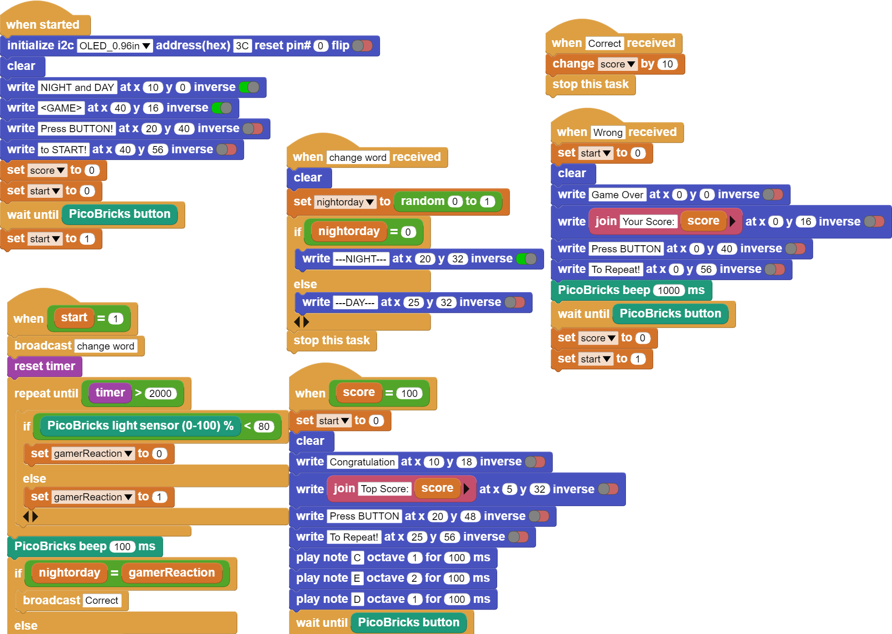

###########
Night and Day
###########

Giriş
-------------
Bu oyun dikkatini ve refleksini kullanacağın bir oyun olacak.

Projenin Detayları ve Algoritması
------------------------------

Okulda oynadığınız Gece Gündüz oyununu elektronik olarak oynamaya ne dersin? Öğretmen gece dediğinde kafamızı öne eğip masanın üzerindeki kolumuza yasladığımız, gündüz dediğinde başımızı kaldırdığımız bir oyundur gece-gündüz oyunu. Bu projede 0,96” 128x64 piksel I2C OLED ekranı kullanacağız. OLED ekranlar yapay ışık kaynağı olarak kullanılabildikleri için ekran üzerindeki karakterleri mercek ve ayna kullanarak büyütebilir ve istediğiniz düzleme yansıtabilirsin. Akıllı gözlükler ve otomobil camlarına bilgilendirme, yol ve trafik bilgisi yansıtabilen sistemler OLED ekranlar kullanılarak yapılabilmektedir.
Işık sensörleri bulundukları ortamın ışık seviyelerini ölçebilen, fotodiyot da denilen sensörlerdir. Işığa maruz kalan sensörün elektrik geçirgenliği değişmektedir. Biz de kodlayarak ışık sensörünü  kontrol edip, ışık miktarının etkilediği elektronik sistemler geliştirebilmekteyiz.

Önce oyuncunun oyuna başlaması için butona basmasını isteyeceğiz. Ardından  PicoBricks’in OLED ekranında  NIGHT ve DAY ifadelerini rastgele olarak 2’şer saniye boyunca gösterilmesini sağlayacağız. Oyuncu, eğer OLED ekranda yazan kelime NIGHT ise 2 saniye içinde LDR sensörünün üzerini eliyle kapatmalı, eğer OLED ekranda GÜNDÜZ kelimesi yazıyorsa LDR sensörünün üzerinden elini kaldırmalı. Oyuncunun her doğru tepkisi 10 puan kazanmasını sağlayacak, yanlış tepkide ise oyun bitecek ve ekranda oyunun bitmesini bildiren yazılı ifade yer alacak, buzzerdan farklı tonda bir ses çalacak ve OLED ekranda puan bilgisi yer alacaktır. Eğer oyuncu toplam 10 doğru tepki verip 100 puan elde ederse “Congratulation” yazısı ile oyuna yeniden başlayabilmek için RESET butonuna basılmasını bildiren ifade OLED ekranda gösterilip buzzerdan farklı tonda notalar çalacaktır.

Bağlantı Diyagramı
--------------

.. figure:: ../_static/night-and-day.png      
    :align: center
    :width: 400
    :figclass: align-center
    

Picobricks modüllerini herhangi bir kablo bağlantısı olmadan programlayabilir ve çalıştırabilirsiniz. Modülleri karttan ayırarak kullanacaksanız modül bağlantılarını verilen konektör kablolar ile yapmalısınız.

Projenin MicroPython Kodu
--------------------------------
.. code-block::

    from machine import Pin, I2C, Timer, ADC, PWM
    from picobricks import SSD1306_I2C
    import utime
    import urandom
    #define the libraries
    WIDTH = 128
    HEIGHT = 64
    #OLED Screen Settings
    sda=machine.Pin(4)
    scl=machine.Pin(5)
    #initialize digital pin 4 and 5 as an OUTPUT for OLED Communication
    i2c=machine.I2C(0,sda=sda, scl=scl, freq=1000000)
    oled = SSD1306_I2C(WIDTH, HEIGHT, i2c)
    buzzer = PWM(Pin(20))
    buzzer.freq(440)
    ldr=ADC(Pin(27))
    button=Pin(10,Pin.IN,Pin.PULL_DOWN)
    #define the input and output pins
    oled.text("NIGHT and DAY", 10, 0)
    oled.text("<GAME>", 40, 20)
    oled.text("Press the Button", 0, 40)
    oled.text("to START!", 40, 55)
    oled.show()
    #OLED Screen Texts Settings
    def changeWord():
    global nightorday
    oled.fill(0)
    oled.show()
    nightorday=round(urandom.uniform(0,1))
    #when data is '0', OLED texts NIGHT
    if nightorday==0:
        oled.text("---NIGHT---", 20, 30)
        oled.show()
    else:
        oled.text("---DAY---", 20, 30)
        oled.show()
    #waits for the button to be pressed to activate
        
    while button.value()==0:
    print("Press the Button")
    sleep(0.01)
    
    oled.fill(0)
    oled.show()
    start=1
    global score
    score=0
    while start==1:
    global gamerReaction
    global score
    changeWord()
    startTime=utime.ticks_ms()
    #when LDR's data greater than 2000, gamer reaction '0'
    while utime.ticks_diff(utime.ticks_ms(), startTime)<=2000:
        if ldr.read_u16()>20000:
            gamerReaction=0
        #when LDR's data lower than 2000, gamer reaction '1'
        else:
            gamerReaction=1
        sleep(0.01)
    #buzzer working
    buzzer.duty_u16(2000)
    sleep(0.05)
    buzzer.duty_u16(0)
    if gamerReaction==nightorday:
        score += 10
    #when score is 10, OLED says 'Game Over'
    else:
        oled.fill(0)
        oled.show()
        oled.text("Game Over", 0, 18, 1)
        oled.text("Your score " + str(score), 0,35)
        oled.text("Press RESET",0, 45)
        oled.text("To REPEAT",0,55)
        oled.show()
        buzzer.duty_u16(2000)
        sleep(0.05)
        buzzer.duty_u16(0)
        break;
    if score==100:
        #when score is 10, OLED says 'You Won'
        oled.fill(0)
        oled.show()
        oled.text("Congratulation", 10, 10)
        oled.text("Top Score: 100", 5, 35)
        oled.text("Press Reset", 20, 45)
        oled.text("To REPEAT", 25,55)
        oled.show()
        buzzer.duty_u16(2000)
        sleep(0.1)
        buzzer.duty_u16(0)
        sleep(0.1)
        buzzer.duty_u16(2000)
        sleep(0.1)
        buzzer.duty_u16(0)
        break;
            

.. tip::
  Eğer kodunuzun adını main.py olarak kaydederseniz, kodunuz her ``BOOT`` yaptığınızda çalışacaktır.
   
Projenin Arduino C Kodu
-------------------------------

.. code-block::

    #include <Wire.h>
    #include "ACROBOTIC_SSD1306.h"
    //define the library

    #define RANDOM_SEED_PIN     28
    int Gamer_Reaction=0;
    int Night_or_Day=0;
    int Score=0;
    int counter=0;

    double currentTime=0;
    double lastTime=0;
    double getLastTime(){
    return currentTime=millis()/1000.0-lastTime;
        }

    void _delay(float seconds){
    long endTime=millis()+seconds*1000;
    while (millis()<endTime) _loop();
        }

    void _loop(){
    }

    void loop(){
    _loop();
    }
    //define variable

    void setup() {
    // put your setup code here, to run once:
    pinMode(10,INPUT);
    pinMode(27, INPUT);
    pinMode(20,OUTPUT);
    randomSeed(RANDOM_SEED_PIN);
    Wire.begin();
    oled.init();
    oled.clearDisplay();
    //define the input and output pins

    oled.clearDisplay();
    oled.setTextXY(1,3);
    oled.putString("NIGHT and DAY");
    oled.setTextXY(2,7);
    oled.putString("GAME");
    oled.setTextXY(5,2);
    oled.putString("Press the BUTTON");
    oled.setTextXY(6,4);
    oled.putString("to START!");
    //write "NIGHT an DAY, GAME, Press the BUTTON, to START" on the x and y coordinates determined on the OLED screen

    Score=0;
    //define the score variable

    while(!(digitalRead(10)==1))  //until the button is pressed
        {
        _loop();
    }
    _delay(0.2);

    while(1){  //while loop
    if(counter==0){
      delay(500);
      Change_Word();
      lastTime=millis()/1000.0;
        }
    while(!(getLastTime()>2)){
      Serial.println(analogRead(27));
      if(analogRead(27)>200){
        Gamer_Reaction=0;

      }
      else{
        Gamer_Reaction=1;
      }
    }
    //determine the gamer reaction based on the value of the LDR sensor
    digitalWrite(20,HIGH);   //turn on the buzzer
    delay(250);  //wait
    digitalWrite(20,LOW);  //turn off the buzzer

    if(Night_or_Day==Gamer_Reaction){  //if the user's reaction and the Night_or_Day variable are the same
    Correct();
   
    }
    else{
    Wrong();
    }
    _loop();

    if(Score==100){
      oled.clearDisplay();
      oled.setTextXY(1,1);
      oled.putString("Congratulation");
      oled.setTextXY(3,1);
      oled.putString("Your Score");
      oled.setTextXY(3,13);
      String String_Score=String(Score);
      oled.putString(String_Score);
      oled.setTextXY(5,3);
      oled.putString("Press Reset");
      oled.setTextXY(6,3);
      oled.putString("To Repeat!");
      //write the "Congratulation, Your Score, press Reset, To Repeat!" and score variable on the x and y coordinates determined on the OLED screen
      for(int i=0;i<3;i++){
        digitalWrite(20,HIGH);
        delay(500);
        digitalWrite(20,LOW);
        delay(500);
     
    }
    //turn the buzzer on and off three times
    counter=1;

        }
        }
    }

    void Correct(){
    Score+=10;
    oled.clearDisplay();
    oled.setTextXY(3,4);
    oled.putString("10 Points");
    //increase the score by 10 when the gamer answers correctly
    }

    void Change_Word(){
  
    oled.clearDisplay();
    Night_or_Day=random(0,2);
    if(Night_or_Day==0){
    oled.setTextXY(3,6);
    oled.putString("NIGHT");

    }
    else{
    oled.setTextXY(3,7);
    oled.putString("DAY");
    }
 
    }
    //write "NIGHT" or "DAY" on random OLED screen

    void Wrong(){
    oled.clearDisplay();
    oled.setTextXY(1,3);
    oled.putString("Game Over");
    oled.setTextXY(3,1);
    oled.putString("Your Score");
    oled.setTextXY(1,13);
    String String_Score=String(Score);
    oled.putString(String_Score);
    oled.setTextXY(5,3);
    oled.putString("Pres Reset");
    oled.setTextXY(6,3);
    oled.putString("To Repeat");
    // write the score variable and the expressions is quotation marks to the coordinates determined on the OLED screen.

    digitalWrite(20,HIGH);  //turn on the buzzer
    delay(1000);   //wait
    digitalWrite(20,LOW); //turn off the buzzer
    counter=1;
    }

Projenin MicroBlocks Kodu
------------------------------------
+----------------+
||night-and-day1||     
+----------------+

.. note::
    MicroBlocks ile kodlama yapmak için yukarıdaki görseli MicroBlocks Run sekmesine sürükleyip bırakmanız yeterlidir.
  
  

    
