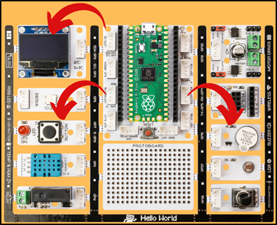

###########
Show Your Reaction
###########

Giriş
-------------
Bu projede her programlama dilinde kullanılan rastgelelik durumunu öğreneceksin. Picobricks ile OLED ekran, Buton-LED ve Buzzer modülünü kullanarak elektronik bir sistem geliştireceğiz. PicoBricks açılır açılmaz bir zamanlayıcı çalışmaya başlar. Bu zamanlayıcı ile saniyenin binde 1’ini ölçebiliriz. 

Projenin Detayları ve Algoritması
------------------------------

Şimdi de dikkat ve refleks geliştiren bir oyun hazırlayacağız. Hızlı hareket etmek ve dikkatin uzun süre sağlanabilmesi çocukların önemli gelişimsel özelliklerindendir. Okul öncesi ve ilkokul dönemindeki çocukların dikkat sürelerini ve reflekslerini artırıcı etkinlikler yapması çocukların hoşlarına gittiği gibi ebeveynlerinin ve öğretmenlerinin de istediği bir durumdur. Hazırlayacağımız elektronik sistemi dikkat artırıcı ve refleks geliştirici bir oyun olacak. Projeyi bitirdikten sonra siz de arkadaşlarınla yarışabilirsin. :)

Zamanlayıcılar günlük yaşamda birçok elektronik sistemde kullanılırlar. Zaman ayarlı aydınlatmalar, fırınlar, ütüler, mutfak robotları...

Projemiz çalışmaya başladığında OLED ekranda karşılama mesajı görüntüleyeceğiz. Ardından kullanıcıya oyuna başlaması için yapması gerekeni ekrana yazdıracağız. Oyuna başlayabilmek için butona basılacak butona basıldıktan sonra 3’ten geriye doğru ekranda sayılarak oyuncunun hazırlanmasını isteyeceğiz. Geri sayımın bitiminden sonra 2-10 saniye arasında rastgele bir süre içinde kırmızı LED yanacak. Kırmızı LED yandıktan sonra hemen zamanlayıcıyı sıfırlayacağız. Tekrar butona basılır basılmaz zamanlayıcıyı ölçeceğiz. Elde ettiğimiz bu değer milisaniye cinsinden olacak. Oyuncunun tepki süresi olarak bu değeri ekranda göstereceğiz.

Bağlantı Diyagramı
--------------

.. figure:: ../_static/show-your-reaction.png      
    :align: center
    :width: 500
    :figclass: align-center
    

Picobricks modüllerini herhangi bir kablo bağlantısı olmadan programlayabilir ve çalıştırabilirsiniz. Modülleri karttan ayırarak kullanacaksanız modül bağlantılarını verilen konektör kablolar ile yapmalısınız.

Projenin MicroPython Kodu
--------------------------------
.. code-block::

   from machine import Pin, I2C,Timer
   from picobricks import SSD1306_I2C
   import utime
   import urandom
   #define the library
   WIDTH=128
   HEIGHT=64
   #define the width and height values
   sda=machine.Pin(4)
   scl=machine.Pin(5)
   i2c=machine.I2C(0,sda=sda, scl=scl, freq=2000000)
   oled= SSD1306_I2C(WIDTH, HEIGHT, i2c)
   button = Pin(10,Pin.IN,Pin.PULL_DOWN)
   led=Pin(7,Pin.OUT)
   #define our input and output pins
   while True:
    led.value(0)
    oled.fill(0)
    oled.text("press the button",0,10)
    oled.text("TO START!",25,25)
    oled.show()
    #print "Press the button" and "TO START!" on the OLED screen
    while button.value()==0:
        pass
    oled.fill(0)
    oled.text("Wait For LED",15,30)
    oled.show()
    #write "wait for LED" on the screen when the button is pressed
    utime.sleep(urandom.uniform(1,5))
    led.value(1)
    timer_start=utime.ticks_ms()
    #wait for a rondom second and turn on the led
    while button.value()==0:
        pass
    timer_reaction=utime.ticks_diff(utime.ticks_ms(), timer_start)
    pressed=True
    oled.fill(0)
    oled.text("Your Time",25,25)
    oled.text(str(timer_reaction),50,50)
    oled.show()
    led.value(0)
    utime.sleep(1.5)
    #print the score and "Your Time" to the screen when the button is pressed.
            

.. tip::
  Eğer kodunuzun adını main.py olarak kaydederseniz, kodunuz her ``BOOT`` yaptığınızda çalışacaktır.
   
Projenin Arduino C Kodu
-------------------------------

.. code-block::

   #include <Wire.h>
   #include "ACROBOTIC_SSD1306.h"
   //define the library

   int buzzer=20;
   int button=10;
   int led=7;
   int La=440;

   int old_time=0;
   int now_time=0;
   int score=0;
   String string_score;
   //define our integer and string veriables

   void setup() {
   // put your setup code here, to run once:
   Wire.begin();
   oled.init();
   oled.clearDisplay();

   pinMode(led,OUTPUT);
   pinMode(buzzer,OUTPUT);
   pinMode(button,INPUT);
   Serial.begin(9600);
   //define the input and output pins

    }

   void loop() {
   // put your main code here, to run repeatedly:
   oled.setTextXY(3,0);
   oled.putString("Press the button");
   oled.setTextXY(5,4);
   oled.putString("TO START");

   if(digitalRead(button)==1){
    for(int i=3; i>0; i--){

      String string_i=String(i);
      oled.clearDisplay();
      oled.setTextXY(4,8);
      oled.putString(string_i);
      delay(1000);
      
    }
    //count backwards from three

    oled.clearDisplay();
    oled.setTextXY(4,6);
    oled.putString("GO!!!");
    //print "GO!!" on the OLED at x=4 y=6

    int random_wait= random(1000, 5000);
    delay(random_wait);
    //wait for a random second between 1 and 5

    digitalWrite(led, HIGH);
    old_time=millis();
    //turn on LED
    while(!(digitalRead(button)==1)){

      now_time=millis();
      score=now_time-old_time;
      string_score= String(score);
      //save score as string on button press
      
    }
    digitalWrite(led, HIGH);
    tone(buzzer, La);
    delay(200);
    noTone(buzzer);
    //turn on LED and buzzer

    oled.clearDisplay();
    oled.setTextXY(1,4);
    oled.putString("Press the");
    //print "Press the" on the OLED at x=1 Y=4

    oled.setTextXY(2,3);
    oled.putString("RESET BUTTON");
    //print "RESET BUTTON" on the OLED at X=1 Y=4

    oled.setTextXY(3,3);
    oled.putString("To Repeat!");
    //print "To Repeat!" on the OLED at X=3 Y=3

    oled.setTextXY(6,3);
    oled.putString("Score: ");
    oled.setTextXY(6,9);
    oled.putString(string_score);
    oled.setTextXY(6,13);
    oled.putString(" ms");
    Serial.println(score);
    //print score value to screen

    delay(10000);
    oled.clearDisplay();
    //wait ten seconds and clear the screen
    }

        }

Projenin MicroBlocks Kodu
------------------------------------
+---------------------+
||show-your-reaction2||     
+---------------------+

.. |show-your-reaction2| image:: _static/show-your-reaction2.png

.. note::
    MicroBlocks ile kodlama yapmak için yukarıdaki görseli MicroBlocks Run sekmesine sürükleyip bırakmanız yeterlidir.
  

    
