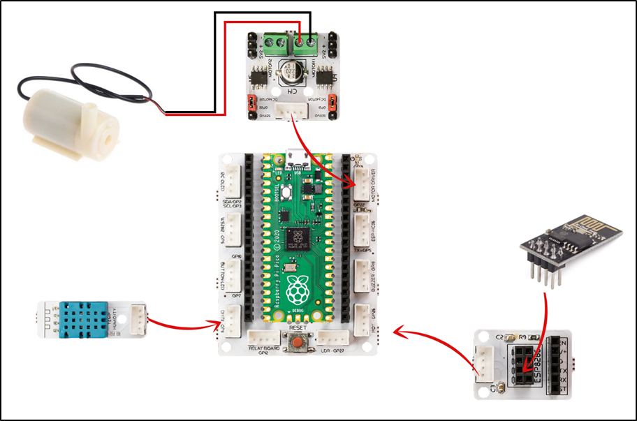
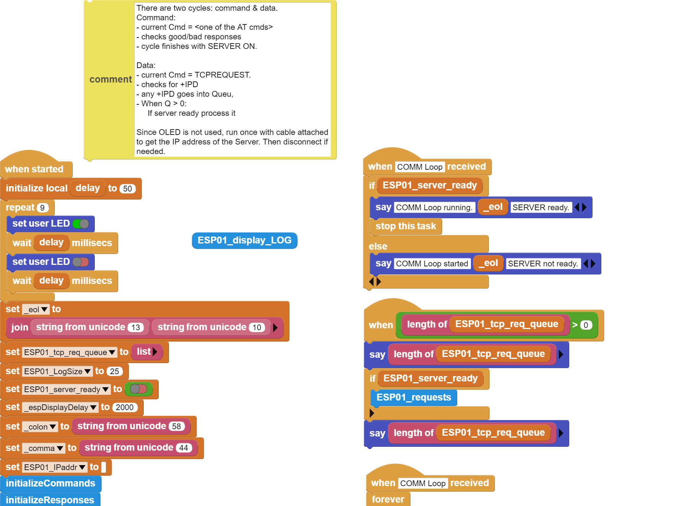

###########
Smart Greenhouse
###########

Giriş
-------------
Bu projede PicoBricks ile ``IOT teknolojisini`` barındıran basit bir sera hazırlayacağız. PicoBricks’i ESP8266 WiFi modülü ile bu serada kullanacağız. Bu sayede serayı  internet üzerinden takip edebildiğimiz bir nesne haline getireceğiz.

Projenin Detayları ve Algoritması
------------------------------

Küresel ısınmanın etkisiyle iklimlerde meydana gelen hızlı değişimler tarım alanındaki faaliyetlerde verimin düşmesine sebep olmaktadır. 1500’lü yıllarda Daniel Barbaro tarihte bilinen ilk serayı yaptı. Seralar kontrol edilebilen hava, su, ısı ve ışık koşulları sunabilen bitki yetiştirmeye elverişli ortamlardır. Seralarda ısıyı dengelemek için ısıtıcılar , sulama yapmak için elektrikli su motorları, nem oranını ayarlamak ve tozlaşmayı sağlayabilmek için fanlar kullanılmaktadır. Teknolojinin de gelişmesiyle üretici seranın durumunu istediği yerden telefonuyla takip edebilmekte ve yapılması gereken işleri yapabilmektedir. Bu teknolojinin genel adı Nesnelerin İnterneti (IOT) dir.

Seralarda sıcaklık, nem ve oksijen miktarını ölçmek için özel sensörler kullanılır. Ayrıca sulamaya karar vermek için toprak nemini ölçen özel sensörler kullanılmaktadır. Sulama verimliliğini artırmak için ise elektronik kontrollü damla sulama sistemleri kullanılmaktadır. 

Hazırlayacağın sera maketinin içinde toprak nemi sensörü, üstten asılı olarak DHT11 sıcaklık ve nem sensörü bulunacaktır. Maketin dışındaki su tankının içine dalgıç pompa konulacak, pompanın ucundan çıkan hortum ise seradaki toprağa gidecektir. Picoboard sera maketinin dışında uygun bir yere yerleştirilecektir. Picobricks başladığında ESP 8266 wifi modülü sayesinde WiFi yayını yapmaya başlar. Aynı ağa bağlı akıllı telefondan Esp8266’nın IP adresini girdiğimizde Serayı kontrol edeceğimiz web sayfası ile karşılaşırız. Burada sıcaklık ve nem değerlerini görebiliriz. Dilersek sulama komutu vererek sulama işlemini başlatabiliriz.

Bağlantı Diyagramı
--------------

    

Picobricks modüllerini herhangi bir kablo bağlantısı olmadan programlayabilir ve çalıştırabilirsiniz. Modülleri karttan ayırarak kullanacaksanız modül bağlantılarını verilen konektör kablolar ile yapmalısınız.

Projenin MicroPython Kodu
--------------------------------
.. code-block::

    import utime
    import uos
    import machine 
    from machine import Pin, ADC
    from picobricks import DHT11  
    from utime import sleep 

    dht_sensor = DHT11(Pin(11))
    smo_sensor=ADC(27)
    m1 = Pin(22, Pin.OUT)
    m1.low()

    print("Machine: \t" + uos.uname()[4])
    print("MicroPython: \t" + uos.uname()[3])

    uart0 = machine.UART(0, baudrate=115200)
    print(uart0)

    def Connect_WiFi(cmd, uart=uart0, timeout=5000):
    print("CMD: " + cmd)
    uart.write(cmd)
    utime.sleep(7.0)
    Wait_ESP_Rsp(uart, timeout)
    print()
    
    def Rx_ESP_Data():
    recv=bytes()
    while uart0.any()>0:
        recv+=uart0.read(1)
    res=recv.decode('utf-8')
    return res

    def Send_AT_Cmd(cmd, uart=uart0, timeout=2000):
    print("CMD: " + cmd)
    uart.write(cmd)
    Wait_ESP_Rsp(uart, timeout)
    print()

    def Wait_ESP_Rsp(uart=uart0, timeout=2000):
    prvMills = utime.ticks_ms()
    resp = b""
    while (utime.ticks_ms()-prvMills)<timeout:
        if uart.any():
            resp = b"".join([resp, uart.read(1)])
    print("resp:")
    try:
        print(resp.decode())
    except UnicodeError:
        print(resp)

    Send_AT_Cmd('AT\r\n')          #Test AT startup
    Send_AT_Cmd('AT+GMR\r\n')      #Check version information
    Send_AT_Cmd('AT+CIPSERVER=0\r\n')   
    Send_AT_Cmd('AT+RST\r\n')      #Check version information
    Send_AT_Cmd('AT+RESTORE\r\n')  #Restore Factory Default Settings
    Send_AT_Cmd('AT+CWMODE?\r\n')  #Query the WiFi mode
    Send_AT_Cmd('AT+CWMODE=1\r\n') #Set the WiFi mode = Station mode
    Send_AT_Cmd('AT+CWMODE?\r\n')  #Query the WiFi mode again
    Send_AT_Cmd('AT+CWJAP="ID","Password"\r\n', timeout=5000) #Connect to AP
    utime.sleep(3.0)
    Send_AT_Cmd('AT+CIFSR\r\n')    #Obtain the Local IP Address
    utime.sleep(3.0)
    Send_AT_Cmd('AT+CIPMUX=1\r\n')    
    utime.sleep(1.0)
    Send_AT_Cmd('AT+CIPSERVER=1,80\r\n')    #Obtain the Local IP Address
    utime.sleep(1.0)

    while True:
    res =""
    res=Rx_ESP_Data()
    utime.sleep(2.0)
    if '+IPD' in res: # if the buffer contains IPD(a connection), then respond with HTML handshake
        id_index = res.find('+IPD')
        
        if '/WATERING' in res:
            print('Irrigation Start')
            m1.high()
            utime.sleep(10)
            m1.low()
            print('Irrigation Finished')
            connection_id =  res[id_index+5]
            print("connectionId:" + connection_id)
            print ('! Incoming connection - sending webpage')
            uart0.write('AT+CIPSEND='+connection_id+',200'+'\r\n')  
            utime.sleep(1.0)
            uart0.write('HTTP/1.1 200 OK'+'\r\n')
            uart0.write('Content-Type: text/html'+'\r\n')
            uart0.write('Connection: close'+'\r\n')
            uart0.write(''+'\r\n')
            uart0.write('<!DOCTYPE HTML>'+'\r\n')
            uart0.write('<html>'+'\r\n')
            uart0.write('<body>
<H1>CONNECTED... </H1>
'+'\r\n')
            uart0.write('<body>
<H1>Irrigation Complete. </H1>
'+'\r\n')
            uart0.write('</body></html>'+'\r\n')
        elif '/SERA' in res:
            #sleep(1) # It was used for DHT11 to measure.
            dht_sensor.measure() # Use the sleep() command before this line.
            temp=dht_sensor.temperature
            hum=dht_sensor.humidity
            smo=round((smo_sensor.read_u16()/65535)*100)
            sendStr="\"TEMP\":{}, \"Humidity\":{}, \"S.Moisture\":{}%".format(temp,hum,smo)
            sendText="{"+sendStr+"}"
            strLen=46+len(sendText)
            connection_id =  res[id_index+5]
            print("connectionId:" + connection_id)
            print ('! Incoming connection - sending webpage')
            atCmd="AT+CIPSEND="+connection_id+","+str(strLen)
            uart0.write(atCmd+'\r\n') 
            utime.sleep(1.0)
            uart0.write('HTTP/1.1 200 OK'+'\r\n')
            uart0.write('Content-Type: text/html'+'\r\n')
            uart0.write(''+'\r\n')
            uart0.write(sendText+'\r\n')

        elif '/' in res:
            
            print("resp:")
            print(res)
            connection_id =  res[id_index+5]
            print("connectionId:" + connection_id)
            print ('! Incoming connection - sending webpage')
            uart0.write('AT+CIPSEND='+connection_id+',200'+'\r\n') 
            utime.sleep(3.0)
            uart0.write('HTTP/1.1 200 OK'+'\r\n')
            uart0.write('Content-Type: text/html'+'\r\n')
            uart0.write('Connection: close'+'\r\n')
            uart0.write(''+'\r\n')
            uart0.write('<!DOCTYPE HTML>'+'\r\n')
            uart0.write('<html>'+'\r\n')
            uart0.write('<body>
<H1>CONNECTED. </H1>
'+'\r\n')
            uart0.write('
<h4>INFO:Get Sensor Data WATERING:Run Water Pump</h4>
'+'\r\n')
            uart0.write('</body></html>'+'\r\n')
        utime.sleep(4.0)
        Send_AT_Cmd('AT+CIPCLOSE='+ connection_id+'\r\n') # once file sent, close connection
        utime.sleep(3.0)
        recv_buf="" #reset buffer
        print ('Waiting For connection...')

.. tip::
  Eğer kodunuzun adını main.py olarak kaydederseniz, kodunuz her ``BOOT`` yaptığınızda çalışacaktır.
   
Projenin Arduino C Kodu
-------------------------------

.. code-block::

    #include <DHT.h>
    #define RX 0
    #define TX 1

    #define LIMIT_TEMPERATURE     30
    #define DHTPIN                11
    #define DHTTYPE               DHT11
    #define smo_sensor            27
    #define motor                 22
    #define DEBUG true

    DHT dht(DHTPIN, DHTTYPE);
    int connectionId;

    void setup() {
    Serial1.begin(115200);
    dht.begin();
    pinMode(smo_sensor, INPUT);
    pinMode(motor, OUTPUT);

    sendData("AT+RST\r\n", 2000, DEBUG); // reset module
    sendData("AT+GMR\r\n", 1000, DEBUG); // configure as access point
    sendData("AT+CIPSERVER=0\r\n", 1000, DEBUG); // configure as access point
    sendData("AT+RST\r\n", 1000, DEBUG); // configure as access point
    sendData("AT+RESTORE\r\n", 1000, DEBUG); // configure as access point
    sendData("AT+CWMODE?\r\n", 1000, DEBUG); // configure as access point
    sendData("AT+CWMODE=1\r\n", 1000, DEBUG); // configure as access point
    sendData("AT+CWMODE?\r\n", 1000, DEBUG); // configure as access point
    sendData("AT+CWJAP=\"WIFI_ID\",\"WIFI_PASSWORD\"\r\n", 5000, DEBUG); // ADD YOUR OWN WIFI ID AND PASSWORD
    delay(3000);
    sendData("AT+CIFSR\r\n", 1000, DEBUG); // get ip address
    delay(3000);
    sendData("AT+CIPMUX=1\r\n", 1000, DEBUG); // configure for multiple connections
    delay(1000);
    sendData("AT+CIPSERVER=1,80\r\n", 1000, DEBUG); // turn on server on port 80
    delay(1000);
        }

    void loop() {
    if (Serial1.find("+IPD,")) {
    delay(300);
    connectionId = Serial1.read() - 48;
    String serialIncoming = Serial1.readStringUntil('\r');
    Serial.print("SERIAL_INCOMING:");
    Serial.println(serialIncoming);

    if (serialIncoming.indexOf("/WATERING") > 0) {
      Serial.println("Irrigation Start");
      digitalWrite(motor, HIGH);
      delay(1000); // 10 sec.
      digitalWrite(motor, LOW);
      Serial.println("Irrigation Finished");
      Serial.println("! Incoming connection - sending WATERING webpage");
      String html = "";
      html += "<html>";
      html += "<body>
<H1>Irrigation Complete. </H1>
";
      html += "</body></html>";
      espsend(html);
    }
    if (serialIncoming.indexOf("/SERA") > 0) {
      delay(300);

      float smo = analogRead(smo_sensor);
      float smopercent = (460-smo)*100.0/115.0 ; //min ve max değerleri değişken.
      Serial.print("SMO: %");
      Serial.println(smo);

      float temperature = dht.readTemperature();
      Serial.print("Temp: ");
      Serial.println(temperature);

      float humidity = dht.readHumidity();
      Serial.print("Hum: ");
      Serial.println(humidity);
      
      Serial.println("! Incoming connection - sending SERA webpage");
      String html = "";
      html += "<html>";
      html += "<body>
<H1>TEMPERATURE </H1>
";
      html += "
<H2>";
      html += (String)temperature;
      html += " C </H2>
";

      html += "<body>
<H1>HUMIDITY </H1>
";
      html += "
<H2>";
      html += (String)humidity;
      html += "% </H2>
";  
      
      html += "<body>
<H1>SMO </H1>
";
      html += "
<H2>";
      html += (String)smopercent;
      html += "% </H2>
";  
          
      html += "</body></html>";
      espsend(html);
    }
    else
      Serial.println("! Incoming connection - sending MAIN webpage");
    String html = "";
    html += "<html>";
    html += "<body>
<H1>CONNECTED. </H1>
";
    html += "
<a href='/SERA'><h4>INFO:Get Sensor Data</a> <a href='/WATERING'>WATERING:Run Water Pump</a></h4>
";
    html += "</body></html>";
    espsend(html);
    String closeCommand = "AT+CIPCLOSE=";  ////////////////close the socket connection////esp command
    closeCommand += connectionId; // append connection id
    closeCommand += "\r\n";
    sendData(closeCommand, 3000, DEBUG);

        }

        }
        //////////////////////////////sends data from ESP to webpage///////////////////////////

    void espsend(String d)
        {
    String cipSend = " AT+CIPSEND=";
    cipSend += connectionId;
    cipSend += ",";
    cipSend += d.length();
    cipSend += "\r\n";
    sendData(cipSend, 1000, DEBUG);
    sendData(d, 1000, DEBUG);
        }

        //////////////gets the data from esp and displays in serial monitor///////////////////////

    String sendData(String command, const int timeout, boolean debug)
        {
    String response = "";
    Serial1.print(command);
    long int time = millis();
    while ( (time + timeout) > millis())
        {
    while (Serial1.available())
    {
      char c = Serial1.read(); // read the next character.
      response += c;
    }
    }

    if (debug)
    {
    Serial.print(response); //displays the esp response messages in arduino Serial monitor
    }
    return response;
    }
    
    
Projenin MicroBlocks Kodu
------------------------------------
+-------------------+
||smart-greenhouse1||     
+-------------------+

.. note::
    MicroBlocks ile kodlama yapmak için yukarıdaki görseli MicroBlocks Run sekmesine sürükleyip bırakmanız yeterlidir.
  

    
