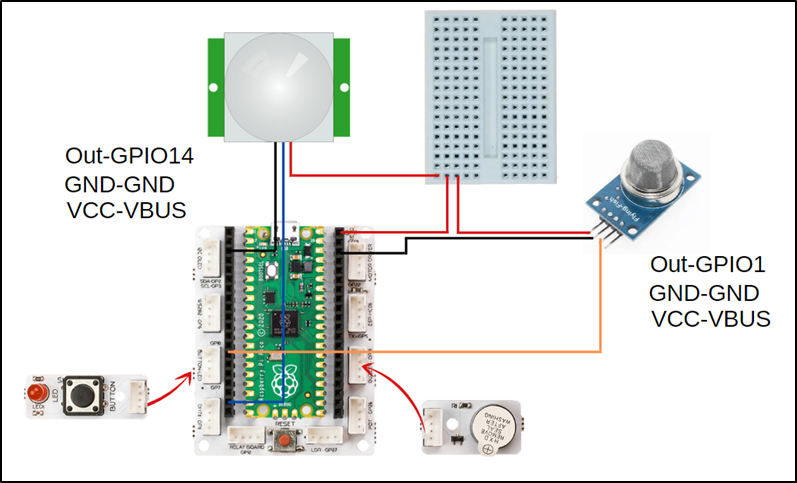

###########
Smart House
###########

Giriş
-------------
Bu sensör HC-SR501 , PIR sensörü olarak da ifade edilmekte, insan vücudunun yansıttığı kızılötesi dalgaların değişimlerini yakalayarak hareketi tespit etmektedirler. HC-SR501 PIR sensörü hareket algıladığında 3 saniye boyunca dijital çıkış vermektedir. Proje maketinde Picoboard, buzzer ve buton LED modülünü kullanacağız.

Projenin Detayları ve Algoritması
------------------------------

İşyerleri, fabrikalar, evlerimiz hatta hayvan barınakları… Yaşam alanlarımızı istemediğimiz davetsiz misafirlere karşı korumak için kullanılabilecek farklı elektronik sistemler bulunmaktadır. Bu sistemler ev ve iş yeri güvenlik sistemleri olarak üretilmekte ve pazarlanmaktadır. Güvenlik kameralarının ürettiği görüntülerin işlenip yorumlandığı sistemler bulunduğu gibi insan bedenini ve hareketlerinin sensörler ile tespit edip harekete geçen güvenlik sistemleri de mevcuttur. Güvenlik sistemleri bir tür alarmlı saat gibi kurulur ve belirlenen zaman diliminde tanımlanmayan bir hareketlilik algılandığında sesli ve ışıklı uyarılar verir. İşletme veya ev sahibine bildirimde bulunur ayrıca güvenlik birimlerine de otomatik bildirimlerde bulunabilmektedir. Gaz kaçağı yangın vb. durumlarda zehirlenmeleri önlemek için ev ve işyerlerinde gaz sensörleri kullanılır. Olumsuz bir durumda yüksek sesle alarm vererek ortamda yaşayan insanlar uyarılır.
PicoBricks ile HC-SR501 ve MQ-2 gaz sensörü kullanarak maket bir akıllı ev projesi hazırlayacağız. 

Tüm parçalar maketin içinde olmalı. Picobricks başladığında alarm sisteminin devreye girmesi için butona basılması gerekmektedir. Butona basıldıktan sonra elin maketi içinden çekilmesi için 3 saniye bekleme koymalıyız. 3 saniyenin sonunda kırmız LED yanar ve alarm sistemi devreye girer. Alarm sistemi devredeyken bir hareket algıladığında kırmızı LED yanıp sönmeye başlar ve buzzer’dan alarm sesi çalınır. Susturmak için Picobricks’in yeniden başlatılması gerekmelidir. MQ-2 sensörü ise sürekli devrededir. Zehirli bir gaz algıladığında ise buzzer ve kırmızı LED ile bunu bildirecektir.

Bağlantı Diyagramlarını
--------------

    

Picobricks modüllerini herhangi bir kablo bağlantısı olmadan programlayabilir ve çalıştırabilirsiniz. Modülleri karttan ayırarak kullanacaksanız modül bağlantılarını verilen konektör kablolar ile yapmalısınız.

Projenin MicroPython Kodu
--------------------------------
.. code-block::

    from machine import Pin, PWM
    from utime import sleep
    # define libraries
    PIR=Pin(14, Pin.IN)
    MQ2=Pin(1,Pin.IN)
    buzzer=PWM(Pin(20,Pin.OUT))
    redLed=Pin(7,Pin.OUT)
    button=Pin(10,Pin.IN,Pin.PULL_DOWN)
    # define output and input pins

    activated=0
    gas=0

    while True:
    if button.value()==1:
        activated=1
        gas=0 
        sleep(3)
        redLed.value(1)
        buzzer.duty_u16(0)
    if MQ2.value()==1:
        gas=1
    if activated==1:
        if PIR.value()==1:
            buzzer.duty_u16(6000)
            buzzer.freq(440)
            sleep(0.2)
            buzzer.freq(330)
            sleep(0.1)
            buzzer.freq(494)
            sleep(0.15)
            buzzer.freq(523)
            sleep(0.3)
    if gas==1:
        buzzer.duty_u16(6000)
        buzzer.freq(330)
        sleep(0.5)
        redLed.value(1)
        buzzer.freq(523)
        sleep(0.5)
        redLed.value(0)
        # LED will light and buzzer will sound when PIR detects motion or MQ2 detects toxic gas

.. tip::
  Eğer kodunuzun adını main.py olarak kaydederseniz, kodunuz her ``BOOT`` yaptığınızda çalışacaktır.
   
Projenin Arduino C Kodu
-------------------------------

.. code-block::

    void actived (){
    digitalWrite(7,1);
    while(!(digitalRead(14) == 1))
        {
    _loop();
        }
    motion_detected();
        }

    void motion_detected (){
    while(1) {
      // buzzer settings 
      tone(20,262,0.25*1000);
      delay(0.25*1000);
      tone(20,330,0.25*1000);
      delay(0.25*1000);
      tone(20,262,0.25*1000);
      delay(0.25*1000);
      tone(20,349,0.25*1000);
      delay(0.25*1000);
    // sound the buzzer when PIR detected a motion 
      _loop();
        }
        }

    void _delay(float seconds) {
    long endTime = millis() + seconds * 1000;
    while(millis() < endTime) _loop();
        }

    void _loop() {
        }

    void loop() {
    _loop();
        }

    void setup() {
  
    pinMode(10,INPUT);
    pinMode(1,INPUT);
    pinMode(20,OUTPUT);
    pinMode(7,OUTPUT);
    pinMode(14,INPUT);
    // define input and output pins
  
    while(1) {
      if(digitalRead(10) == 1){
          _delay(3);
          actived();
      }
      if(digitalRead(1) == 1){
          while(!(digitalRead(10) == 1))
          {
            _loop();
            tone(20,349,0.5*1000);
            delay(0.5*1000);
            digitalWrite(7,1);
            _delay(0.5);
            tone(20,392,0.5*1000);
            delay(0.5*1000);
            digitalWrite(7,0);
            _delay(0.5);
          }
      }
      _loop();
        }
        }

Projenin MicroBlocks Kodu
------------------------------------
+--------------+
||smart-house1||     
+--------------+

.. |smart-house1| image:: _static/smart-house1.png

.. note::
    MicroBlocks ile kodlama yapmak için yukarıdaki görseli MicroBlocks Run sekmesine sürükleyip bırakmanız yeterlidir.
  

    
