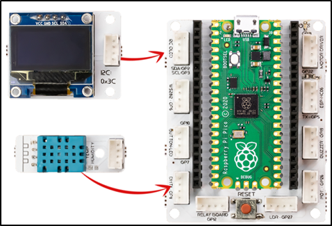
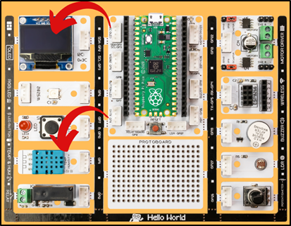
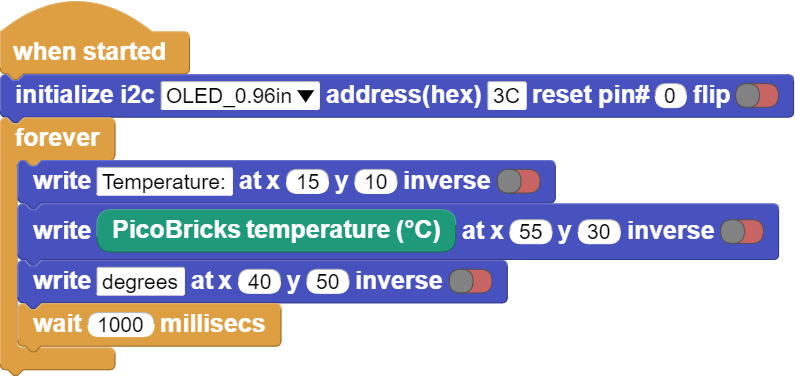

###########
Thermometer
###########

Giriş
-------------
Bu projede Picobricks ile ortam sıcaklığını OLED ekranda gösterecek bir termometre hazırlayacaksın.

Sensörler elektronik sistemlerin duyu organlarıdır. Hissetmek için derimizi, görmek için gözümüzü, duymak için kulağımızı, tatmak için dilimizi ve koklamak için burnumuzu kullanırız. Picobricks’te hali hazırda birçok duyu organı(sensör) vardır. Ayrıca yenileri de eklenebilir. Nem, sıcaklık, ışık ve daha birçok sensörü kullanarak çevreyle etkileşim sağlayabilirsiniz. Picobricks ortam sıcaklığını başka hiçbir çevre bileşenine ihtiyaç duymadan ölçebilir. Ortam sıcaklığı seralarda, kuluçka makinelerinde, ilaçların taşınmasında kullanılan ortamlarda kısaca sıcaklık değişiminin sürekli takip edilmesi gereken durumlarda kullanılmaktadır. Projelerinde sıcaklık değişimi üzerine bir işlem yapacaksan ortam sıcaklığını nasıl ölçeceğini bilmelisin.

Projenin Detayları ve Algoritması
------------------------------

Picobricks’te DHT11 modülü bulunmaktadır. Bu modül ortamdaki sıcaklık ve nem miktarını algılayarak mikrokontrolcüye veriler gönderebilmektedir. Bu bu projede Picobricks üzerindeki DHT11 sıcaklık ve nem sensörünün ölçtüğü sıcaklık değerlerini Picobricks OLED ekrana yazdırmak için gerekli kodları yazacağız.

Bağlantı Diyagramı
--------------

    

Picobricks modüllerini herhangi bir kablo bağlantısı olmadan programlayabilir ve çalıştırabilirsiniz. Modülleri karttan ayırarak kullanacaksanız modül bağlantılarını verilen konektör kablolar ile yapmalısınız.

Projenin MicroPython Kodu
--------------------------------
.. code-block::

  from machine import Pin,I2C,ADC #to acces the hardware picobricks
  from picobricks import SSD1306_I2C, DHT11 #oled library
  import utime #time library
  #to acces the hardware picobricks
  WIDTH=128
  HEIGHT=64
  #define the weight and height picobricks

  sda=machine.Pin(4)
  scl=machine.Pin(5)
  #we define sda and scl pins for inter-path communication
  i2c=machine.I2C(0, sda=sda, scl=scl, freq=2000000)#determine the frequency values
  oled=SSD1306_I2C(WIDTH, HEIGHT, i2c)
  pico_temp=DHT11(Pin(11))
  current_time=utime.time()
  while True:
    if(utime.time() - current_time > 2):
        current_time = utime.time()
        pico_temp.measure()
        oled.fill(0)#clear OLED
        oled.show()
        temperature=pico_temp.temperature
        humidity=pico_temp.humidity
        oled.text("Temperature: ",15,10)#print "Temperature: " on the OLED at x=15 y=10
        oled.text(str(int(temperature)),55,25)
        oled.text("Humidty: ", 30,40)
        oled.text(str(int(humidity)),55,55)
        oled.show()#show on OLED
        utime.sleep(0.5)#wait for a half second
   

.. tip::
  Eğer kodunuzun adını main.py olarak kaydederseniz, kodunuz her ``BOOT`` yaptığınızda çalışacaktır.
   
Projenin Arduino C Kodu
-------------------------------

.. code-block::

   #include <Wire.h>
   #include <DHT.h>
   #include "ACROBOTIC_SSD1306.h"
   #define DHTPIN 11
   #define DHTTYPE DHT11
   //define the library

   DHT dht(DHTPIN, DHTTYPE);
   float temperature;
   //define the temperature veriable

   void setup() {
   //define dht sensor and Oled screen
   Serial.begin(115200);
   dht.begin();
   Wire.begin();  
   oled.init();                      
   oled.clearDisplay(); 
      }

   void loop() {
   temperature = dht.readTemperature();
   Serial.print("Temp: ");
   Serial.println(temperature);
   oled.setTextXY(3,1);              
   oled.putString("Temperature: ");
   //print "Temperature: " on the OLED at x=3 y=1
   oled.setTextXY(4,3);              
   oled.putString(String(temperature));
   //print the value from the temperature sensor to the oled screen at x=4 y=3
   Serial.println(temperature);
   delay(100);
      }

Projenin MicroBlocks Kodu
------------------------------------
+--------------+
||thermometer2||     
+--------------+

.. note::
    MicroBlocks ile kodlama yapmak için yukarıdaki görseli MicroBlocks Run sekmesine sürükleyip bırakmanız yeterlidir.
  

    
