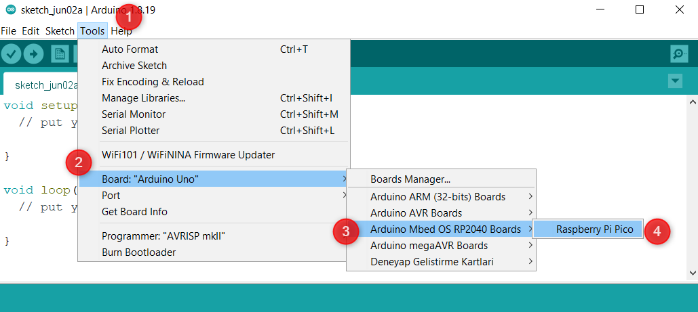
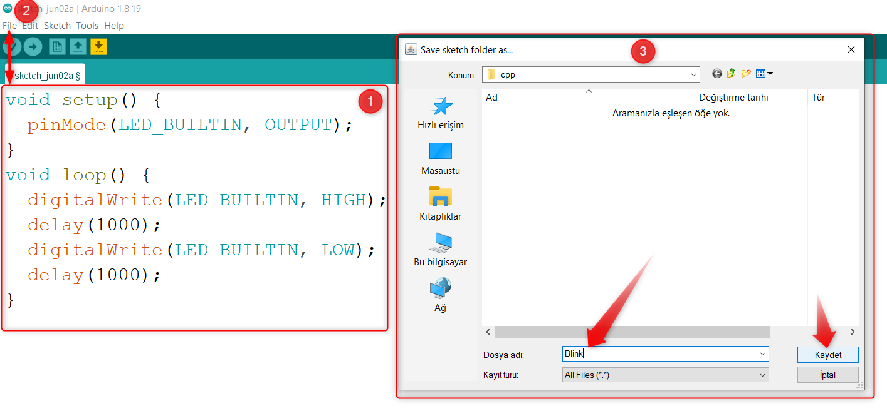

Arduino IDE
====================

Arduino IDE Kurulumu
------------------------------------------

PicoBricks size Arduino C ile kodlama imkânı sunuyor. Yaygın olarak kullanılan Arduino IDE ile Picobricks'in kalbinde yer alan Raspberry Pi Pico'yu kodlamaya başlamak oldukça kolaydır.

Arduino IDE 1.8.x kurulum dosyasını `Arduino Web Sitesinden <https://www.arduino.cc/en/software>` adresinden bilgisayarınıza indirin ve kurun.

Öncelikle Raspberry Pi Pico'yu Arduino IDE'ye eklemeniz gerekir. Arduino IDE'yi başlatın. Ardından ``Araçlar>Pano>Pano Yöneticisi'ne gidin.

.. figure:: ../_static/arduino.png
    :align: center
    :width: 720
    :figclass: align-center

1. alana ``“Raspberry Pi Pico”`` yazın. Bir süre bekledikten sonra Arduino Mbed OS RP2040 Boards seçeneğine tıklayın ve 2. alanda kur butonuna tıklayın.

.. figure:: ../_static/arduino2.png
    :align: center
    :width: 720
    :figclass: align-center

Tüm bu kurulumlar sırasında sizden isteyeceği onayları kabul etmeniz gerekmektedir. Kurulum tamamlandığında ve kapat butonuna tıkladığınızda Pico'yu Arduino IDE'ye eklemiş olacaksınız.

Arduino IDE ile Kod Yazma ve Çalıştırma
------------------------------------------

Pico'yu Arduino IDE ile kodlamak istediğinizde, ilk seferinde ``BOOTSEL tuşuna basılı tutarak`` bilgisayarınıza bağlamanız yeterlidir.

.. figure:: ../_static/arduino3.png
    :align: center
    :width: 720
    :figclass: align-center
    
    
    
Bu sayede Pico bootloader modunda bağlanacak ve bilgisayarınız tarafından harici bellek olarak tanınacaktır. Bootsel butonuna basılı tutarak Pico'yu bilgisayarınıza bağlayın. Pico'yu bilgisayarın flash belleği olarak gördükten sonra ``Tools>Board>Arduino Mbed OS RP2040 boards> Raspberry Pi Pico`` yolunu izleyerek kartınızı aktif ediniz.

     

Aşağıdaki 1 numaralı alana kodu yazın ve ``File>Save`` yolunu izleyerek ``"Blink"`` ismiyle bilgisayarınızın herhangi bir yerine kaydedin.

    
Kaydetme işleminden sonra 1. alandaki ``"Yükle"`` butonuna basarak kodu derleyip Pico'ya kaydetmemiz gerekiyor. En altta Done uploading yazısını gördüğümüzde Pico'da kodumuz çalışacak ve dahili LED 1 sn aralıklarla yanıp sönecektir. Önemli Not: Picobricks'i Arduino IDE ile kodlarken MicroPython veya MicroBlocks firmware'inden ilk geçişte BOOTSEL butonuna basarak bilgisayarınıza bağlayınız. Sonraki kod yüklemeleri için BOOTSEL tuşuna basmanız gerekmez. Keyifli projeler :)
    
.. figure:: ../_static/arduino6.png
    :align: center
    :width: 220
    :figclass: align-center

.. code-block:: bash

  void setup() {
  // put your setup code here, to run once:
  pinMode(7, OUTPUT); // initialize digital pin 7 as an output
    }
  void loop() {
    // put your main code here, to run repeatedly:
    digitalWrite(7, HIGH); //turn the LED on by making the voltage HIGH
    delay(500); //wait for a half second
    digitalWrite(7, LOW); //turn the LED on by making the voltage LOW
    delay(500); //wait for a half second
    }
