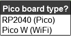
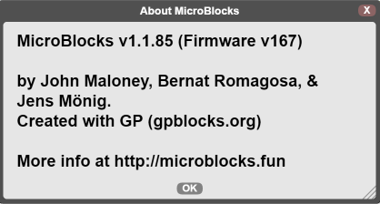

#############################################
MicroBlocks Blok Tabanlı Programlama Dili
#############################################

.. image:: /../_static/kid.gif

MicroBlocks Nedir?
--------------------

MicroBlocks, micro:bit, Adafruit Circuit Playground Express ve diğerleri gibi eğitici mikrodenetleyici kartlarıyla fiziksel hesaplamayı öğrenmek için kullanılan ücretsiz, Scratch benzeri blok programlama dilidir.
MicroBlocks canlı bir ortamdır. Bir bloğa tıklayın ve hemen panoda çalışsın. Komutları deneyin. Sensör değerlerini gerçek zamanlı olarak görün ve grafiklendirin. Artık kodun derlenmesi ve indirilmesi için beklemenize gerek yok.
Bir motoru kontrol ederken aynı anda bir animasyon görüntülemek ister misiniz? MicroBlocks, her görev için ayrı komut dosyaları yazmanıza ve bunları aynı anda çalıştırmanıza olanak tanır. Kodunuzun yazılması daha basit ve anlaşılması daha kolaydır. MicroBlocks birçok farklı panoda çalışır, ancak komut dosyalarınız taşınabilirdir. Butonlar, sensörler ve gösterge blokları, ilgili donanıma sahip tüm kartlarda aynı şekilde davranır. Kodu MicroBlocks'ta çalıştırdıktan sonra, USB bağlantısını kesebilir ve Picobricks'i farklı bir güç kaynağıyla besleyebilirsiniz. Karttaki kod otomatik olarak çalışacaktır.

Picobricks'i MicroBlocks ile programlamak için tarayıcıda  `MicroBlocks Web Sitesini <https://microblocks.fun/>`_ açalım (Google Chrome ve Edge tarayıcıları önerilir).

.. figure:: ../_static/microblocks.png
    :align: center
    :width: 720
    :figclass: align-center
    
MicroBlocks'u bir Chrome veya Edge tarayıcısında çalıştırmak için herhangi bir şey yüklemeniz gerekmez; ekranın sağ üst köşesindeki menüden ``RUN`` butonuna tıklayarak çevrimiçi düzenleyiciyi çalıştırabilirsiniz. Alternatif olarak, İndir butonuna tıklayarak işletim sisteminize uygun çevrimdışı bir sürümü indirebilir ve bilgisayarınıza kurabilirsiniz.

MicroBlocks Web editörünü tarayıcınıza kaydedebilir ve internet erişimi olmadan kullanabilirsiniz. MicroBlocks Web uygulamasını kaydetmek için tarayıcınızda MicroBlocks'u çalıştırın, ardından tarayıcınızın URL çubuğunun sağ üst köşesindeki yükle butonuna tıklayın.

.. figure:: ../_static/microblocks1.png
    :align: center
    :width: 720
    :figclass: align-center
    
IDE'ye Giriş
--------------------
    
MicroBlocks programını açtığınızda aşağıda gösterilen IDE görüntüsünü göreceksiniz. IDE bileşenlerinin açıklamasını aşağıdan inceleyebilirsiniz. IDE'nin ayrıntılı ve en güncel açıklaması için lütfen WIKI'deki Kullanıcı Kılavuzumuza bakın.

.. figure:: ../_static/microblocks3.png
    :align: center
    :width: 720
    :figclass: align-center

- ``Menu Bar:`` Bu bölümde soldan sağa doğru ilk buton programın dil seçeneğini değiştirmemizi sağlıyor. İkinci buton MicroBlocks'un çalışma ayarlarını ve firmware güncelleme seçimini görebileceğimiz menü iken üçüncü buton File ile ilgili seçenekleri sunuyor. Dördüncü buton, verileri çizmek için grafik bloğu tarafından kullanılan bir grafik penceresini açarken, en sağdaki beşinci buton, USB arabirimi aracılığıyla Picobricks'e bağlanmak için kullanılır.

- ``Block Categories:`` Bu alan, MicroBlocks'ta programlama için kullanılan blok kategorilerini içerir. Kategoriler farklı renkler kullanılarak gruplandırılmıştır. Kategoriler seçildikçe bloklar paletinde (Alan 3) ilgili bloklar listelenecektir.

- ``Blocks Palette:`` Blok kategorileri alanında seçimler yapıldıkça bu alanda belirli fonksiyonları olan bloklar listelenir. Bu alandaki bloklar 4 numaralı Scripting alanına sürüklenerek kod yazılır.

- ``Scripting Area:`` Tüm kodlama aktivitelerinin yapıldığı alandır. Kullanıcılar, komut dosyaları ve özel bloklar (işlevler) oluşturmak için blokları bu alana sürükleyip bırakır.

- ``Start/Stop Buttons:`` Bu alan, MicroBlocks programlarını kontrol etmek için kullanılan Start ve Stop olmak üzere iki simge içerir.

- ``Library List:`` Bu alanın içeriği, kullanıcının komutları ve mikro cihazlarının gereksinimlerine bağlı olarak yüklenen çeşitli kütüphaneleri sunar. 

MicBlocks-PicoBricks Bağlantı ve Çalıştırma
------------------------------------------------
* Yazılımı Çevrimdışı Düzenleyicide Bağlama ve Güncelleme 

Picobricks'i çevrimdışı editörüne bağlamak için, Raspberry Pi Pico üzerinde ``BOOTSEL butonunu basılı tutarken`` USB kablosu ile kartı bilgisayarınıza bağlamanız gerekir.

.. figure:: ../_static/arduino3.png
    :align: center
    :width: 420
    :figclass: align-center
    
MicroBlocks çevrimdışı editörünü açın ve MicroBlocks menüsünden MicroBlocks butonuna (dişli simgesi) tıklayın, ardından cihaz yazılımını güncelle seçeneğine tıklayın.

.. figure:: ../_static/microblocks2.png
    :align: center
    :width: 420
    :figclass: align-center
    
    
RP2040(Pico) öğesini seçin. Kurulumu yalnızca birkaç saniye sürecek ve bittiğinde, MicroBlocks otomatik olarak Picobricks'e bağlanacaktır.

- Çevrimiçi Editörde Bağlantı ve Güncelleme

Picobricks'i çevrimiçi editöre bağlamak için fazladan birkaç adım gereklidir. Güvenlik nedeniyle tarayıcı, kullanıcıya sormadan kartın USB sürücüsüne erişemez. Önce menüden MicroBlocks butonuna (dişli simgesi) tıklayın, ardından kartta yazılımı güncelle seçeneğine tıklayın ve açılan listeden RP2040 (Pico) seçeneğine tıklayarak kart tipini seçin.
	
Kart seçildiğinde, aşağıdaki Yazılım Yükleme penceresi açılacaktır.

Şimdi Pico üzerindeki BOOTSEL butonunu basılı tutarken kartı bilgisayarınıza bağlayın.

.. figure:: ../_static/microblocks5.png
    :align: center
    :width: 220
    :figclass: align-center

Görüntülenen mesajdaki "Tamam" butonuna tıklayın ve vm_pico.uf2 adlı yazılım dosyası seçili olarak RPI-RP2 sürücüsüne konumlandırılan sistem dosyası yöneticisi penceresini otomatik olarak açacaktır.

Kaydet butonuna tıklayın, aygıt yazılımı güncellemesi tamamlanacaktır.

.. figure:: ../_static/microblocks6.png
    :align: center
    :width: 720
    :figclass: align-center
    
- Normal işlemler için bağlanma (Yazma ve Düzenleme programları):

Bağlan butonuna tıklandığında mikro cihazların takılı olduğu sistem USB portları görüntülenecektir. Bu pencerede önce Pico cihazını seçip ardından Bağlan butonlarına tıklayarak Picobricks'i MicroBlocks'a bağlayabilirsiniz. Bağlantı başarılı olduğunda, USB simgesinin arkasında yeşil bir daire görünecektir.

.. figure:: ../_static/microblocks18.png
    :align: center
    :width: 720
    :figclass: align-center
    
 MicroBlocks, gerçek zamanlı bir kodlama editörüdür. Kodu yazdıktan sonra derleme ve karta yükleme işlemi yoktur. Kod bloklarına tıkladığınızda kod çalışacaktır.

PicoBricks modüllerinden herhangi birini kullanmak için öncelikle PicoBricks kitaplığını Microblocks düzenleyicisine aktarmanız gerekir. Bunun için Add Library butonuna basmanız gerekmektedir.

.. figure:: ../_static/microblocks8.png
    :align: center
    :width: 720
    :figclass: align-center

Dosya Aç penceresinde, desteklenen cihazların listesini açmak için Kitler ve Panolar butonuna tıklayın. Açılır listeden PicoBricks'e ve ardından Aç butonuna tıklayın.

.. figure:: ../_static/microblocks9.png
    :align: center
    :width: 720
    :figclass: align-center
    
Her şey yolunda giderse, PicoBricks kitaplığı ve kod blokları, Kod blokları panelinde görüntülenecektir. Tüm Proje örneklerinde, PicoBricks ile başlayan bir blok adı gördüğünüzde, PicoBricks Kitaplığı menüsünde yer alacaktır.

.. figure:: ../_static/microblocks10.png
    :align: center
    :width: 520
    :figclass: align-center

PicoBricks Aygıt Yazılımı
-------------------

PicoBricks Aygıt Yazılımını daha önce güncellediyseniz, USB simgesine tıklayarak bağlanabilirsiniz. MicroBlocks'u Picobricks'e ilk kez bağlayacaksanız bölüm 1.1.2'deki adımları takip edebilirsiniz. 

IDE'nin veya Pico Firmware'in yeni bir sürümü olup olmadığını zaman zaman kontrol etmek iyi bir fikirdir. Menüde MicroBlocks Seçenekleri (dişli simgesi)/hakkında öğesini seçerek çalıştırdığınız sürümü doğrulayabilirsiniz. Aşağıdaki gibi bir ekran görmelisiniz:

