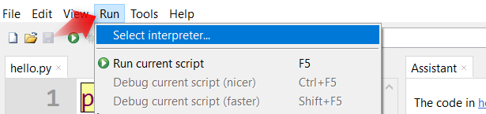

#############################################
Başlangıç Seviyesi İçin Thonny (MicroPython) IDE
#############################################

    
    
Thonny IDE Kurulumu
----------------

Raspberry Pi Pico, PicoBricks'in kalbindedir. Thonny, Pico kartını ve PicoBricks'i kodlamak için harika bir seçimdir. `Thonny Websitesini <https://thonny.org/>`_ ziyaret edebilirsin. Uygun versiyonu seçin ve bilgisayarınıza indirin. Ardından kurulumu gerçekleştirin. Thonny IDE'yi “ $ pip install thonny “ komutunu kullanarak da yükleyebilirsiniz.

.. code-block::

  $ pip install thonny

.. figure:: ../_static/thonny.png
    :align: center
    :width: 420
    :figclass: align-center
    
Thonny IDE Arayüzü
-----------------------

.. figure:: ../_static/thonny1.png
    :align: center
    :width: 920
    :figclass: align-center
    
    
A: Boş bir komut dosyası açın.
B: Mevcut bir  kod dosyası açabilirsiniz.
C: Üzerinde çalıştığınız kod dosyasındaki değişiklikleri kaydedebilirsiniz.
D: Belirttiğiniz yorumlama ortamında yazdığınız kodu çalıştırır.
E: Kodunuzdaki hataları kontrol edebilirsiniz.
F: Hata ayıklamak için kod satırlarını çalıştırabilirsiniz.
G: Hata ayıklama sırasında kod satırındaki komutlar arasında gezinebilirsiniz.
H: Hata ayıklamadan çıkabilirsiniz.
I: Hata ayıklama modundan çalışma moduna geçebilirsiniz.
J: Kodun yürütülmesini durdurabilirsiniz.

MicroPython Aygıt Yazılımını Raspberry Pi Pico'ya Yükleyin
-------------------------------------------------

Raspberry Pi Pico'nun yazacağımız MicroPython kodunu anlaması için ona özel bir işletim sistemi kurmamız gerekiyor. Biz buna aygıt yazılımı diyoruz. Thonny editörünü açın ve Çalıştır menüsünden Tercüman seç'e tıklayın.

    
1. alanda gösterilen listeden Raspberry Pi Pico'yu seçin. 2. alanı resimdeki gibi bırakın, 3. alana tıklayın.

.. figure:: ../_static/thonny2.png
    :align: center
    :width: 520
    :figclass: align-center
    
Üzerindeki ``BOOTSEL butonuna'' basılı tutarak Pico'yu bir kablo ile bilgisayarınızın USB portuna bağlayın.

.. figure:: ../_static/arduino3.png
    :align: center
    :width: 520
    :figclass: align-center
    
Yükle butonu etkinleştirildikten sonra butonu bırakabilirsiniz. "Yükle butonuna" basın ve aygıt yazılımının yüklenmesini bekleyin.

.. figure:: ../_static/thonny4.png
    :align: center
    :width: 520
    :figclass: align-center
    

Kurulum tamamlandıktan sonra, kurulumu tamamlamak için Kapat butonuna tıklayın. 

Raspberry Pi Pico'da Kod Yükleme ve Çalıştırma 
------------------------------------------------- 

Pico'nun kablosunu doğrudan bilgisayarın USB bağlantı noktasına takın. Bootsel butonuna basılı tutmanız gerekmez. Thonny'deki Çalıştır menüsünden ``Tercüman seç'` seçeneğini seçin. 1. bölümde Raspberry Pi Pico'nun seçili olduğundan emin olunuz. Tamam butonuna tıklayarak pencereyi kapatınız.

.. figure:: ../_static/thonny5.png
    :align: center
    :width: 520
    :figclass: align-center

Görünüm menüsünden Dosyalar seçeneğini etkinleştirin. Ekranın sol tarafına uzun bir dosya gezgini sekmesi yerleştirilecektir. 1. bölümde Raspberry Pi Pico'yu görüyorsanız Thonny Pico'ya sorunsuz bir şekilde bağlanmış demektir, kodunuzu yazmaya, kaydetmeye ve çalıştırmaya hazırsınız demektir. 

Thonny'de yazdığınız MicroPython kodu, Raspberry Pi Pico ve benzeri mikro kontrol kartları için düzenlenmiş kütüphanelerden oluşuyor ve MicroPython olarak adlandırılıyor. Sözdizimi ve neredeyse tüm kitaplıklar MicroPython ile aynı şekilde çalışır.
Yazılım dünyasının ``"merhaba dünya"`` uygulaması, fiziksel programlamaya ``"blink"`` uygulamasıdır. 1. alanda gösterilen kodu yazın. 2. alandaki kaydet butonuna tıklayın. Thonny, 3. alandaki pencerede size kodunuzu bilgisayarınızın çalışma dizinine mi yoksa Pico'nun belleğine mi kaydetmek istediğinizi soracaktır. Bilgisayarınızı seçerseniz, ortaya çıkan dosya 4. alanda, Pico'yu seçerseniz, ortaya çıkan dosya alanda görünecektir.

.. figure:: ../_static/thonny6.png
    :align: center
    :width: 520
    :figclass: align-center
    
Kayıt penceresinden Raspberry Pi Pico'yu seçin, Dosya Adı alanına ``“blink.py”`` yazın ve Tamam butonuna tıklayın. ``"blink.py"`` dosyasını Pico'nun dosya gezgininde gördükten sonra tıklayın. klavyedeki F5 tuşuna veya araç çubuğundaki yeşil Çalıştır butonuna basın ve kod dosyası Pico tarafından çalıştırılacaktır. Pico üzerindeki dahili LED'in 1 saniye aralıklarla yanıp söndüğünü görüyorsanız, ilk kodunuzu başarıyla yazıp çalıştırmışsınız demektir. Tebrikler :)

.. note::
   Yazdığınız kodun Pico açılır açılmaz çalıştır komutu vermeden çalışmasını istiyorsanız, kodunuzu Pico'nun ana dizinine ``"main.py"`` adıyla kaydetmelisiniz.

